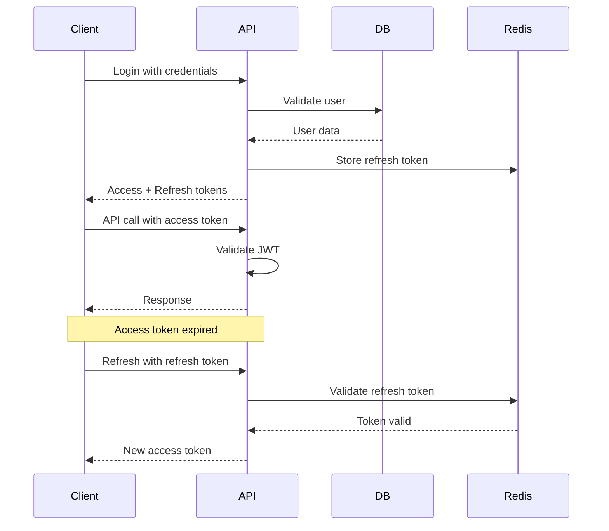

# Architectural Overview & Design Decisions

## 🏗️ System Architecture

The AppEx Affiliation Portal follows a **microservices-oriented monolith** pattern, providing the benefits of microservices while maintaining operational simplicity for a lean team.

```
┌─────────────────────────────────────────────────────────────────────┐
│                        Frontend Layer                              │
├─────────────────────────────────────────────────────────────────────┤
│  React 18 + TypeScript │ TanStack Query │ Zustand │ Tailwind CSS   │
└─────────────────────────────────────────────────────────────────────┘
                                    │
                                    ▼ HTTP/HTTPS + JWT
┌─────────────────────────────────────────────────────────────────────┐
│                        Backend API Layer                           │
├─────────────────────────────────────────────────────────────────────┤
│  Node.js + Express │ BullMQ Jobs │ Rate Limiting │ CORS            │
└─────────────────────────────────────────────────────────────────────┘
                                    │
                                    ▼ Connection Pool
┌─────────────────────────────────────────────────────────────────────┐
│                        Data Layer                                   │
├─────────────────────────────────────────────────────────────────────┤
│  PostgreSQL 15 │ PgBouncer │ Redis (Job Queue) │ Cloudinary        │
└─────────────────────────────────────────────────────────────────────┘
                                    │
                                    ▼ APIs/Webhooks
┌─────────────────────────────────────────────────────────────────────┐
│                    External Services                               │
├─────────────────────────────────────────────────────────────────────┤
│  Gmail SMTP │ Paynow │ Africa's Talking │ Railway (Hosting)       │
└─────────────────────────────────────────────────────────────────────┘
```

## 📋 Architectural Decision Records (ADRs)

### ADR-001: Monorepo Structure with Turborepo

**Status**: Accepted  
**Date**: 2024-01-15  
**Decision**: Adopt monorepo structure using Turborepo for build orchestration

**Context**:
- Multiple packages need to share TypeScript types
- Frontend and backend validation schemas must stay in sync
- Development team prefers single-repository workflow
- Need efficient caching for builds and tests

**Decision**:
```json
{
  "name": "appex-affiliation-portal",
  "packages": [
    "apps/web",           // React frontend
    "apps/api",           // Node.js backend
    "packages/types",     // Shared TypeScript types
    "packages/config",    // Shared configuration
    "packages/ui"         // Shared UI components
  ]
}
```

**Consequences**:
- ✅ Single source of truth for type definitions
- ✅ Shared build pipeline with caching
- ✅ Easier cross-package refactoring
- ❌ Larger repository size
- ❌ More complex CI/CD setup

### ADR-002: Dual-Token JWT Authentication

**Status**: Accepted  
**Date**: 2024-01-20  
**Decision**: Implement dual-token pattern with access and refresh tokens

**Context**:
- Need balance between security and user experience
- Traditional JWT with long expiry increases risk
- Short-lived tokens require frequent re-authentication
- Zimbabwe's mobile internet can be unreliable

**Decision**:
```typescript
interface TokenPair {
  accessToken: {
    token: string;
    expiresIn: 900; // 15 minutes
    type: 'access';
  };
  refreshToken: {
    token: string;
    expiresIn: 604800; // 7 days
    type: 'refresh';
    familyId: string; // For token revocation
  };
}
```

**Consequences**:
- ✅ Reduced attack surface with short-lived access tokens
- ✅ Better user experience with refresh tokens
- ✅ Ability to revoke all sessions for a user
- ❌ More complex token management
- ❌ Additional database storage for refresh tokens

### ADR-003: Africa's Talking over Twilio

**Status**: Accepted  
**Date**: 2024-02-01  
**Decision**: Use Africa's Talking for SMS services instead of Twilio

**Context**:
- Need reliable SMS delivery in Zimbabwe
- Twilio has inconsistent delivery rates in ZW
- Africa's Talking has direct carrier agreements
- Pricing is more competitive for local market

**Decision**:
```typescript
const smsProvider = {
  service: 'africas-talking',
  features: [
    'Direct carrier agreements in ZW',
    'Local shortcode support',
    'Delivery receipts',
    'USSD integration capability'
  ],
  pricing: 'Per SMS, no monthly minimum'
};
```

**Consequences**:
- ✅ Better delivery rates in Zimbabwe
- ✅ Lower operational costs
- ✅ Local support and expertise
- ❌ Vendor lock-in to regional provider
- ❌ Limited global coverage

### ADR-004: PostgreSQL with Connection Pooling

**Status**: Accepted  
**Date**: 2024-02-10  
**Decision**: Use PostgreSQL with PgBouncer for connection management

**Context**:
- Need ACID compliance for financial transactions
- Railway's horizontal scaling can overwhelm database
- Connection overhead impacts performance
- Need robust backup and point-in-time recovery

**Decision**:
```yaml
database:
  engine: postgresql 15
  connection_pooling: pgbouncer
  max_connections: 100
  pool_mode: transaction
  backup_strategy: continuous_wal
```

**Consequences**:
- ✅ Strong consistency guarantees
- ✅ Excellent performance with connection pooling
- ✅ Mature tooling and monitoring
- ❌ Requires database expertise
- ❌ Higher infrastructure cost

### ADR-005: BullMQ for Background Jobs

**Status**: Accepted  
**Date**: 2024-02-15  
**Decision**: Use BullMQ with Redis for asynchronous job processing

**Context**:
- Need to generate PDF certificates asynchronously
- Email sending should not block API responses
- Commission calculations can be resource-intensive
- Need job retry mechanisms and monitoring

**Decision**:
```typescript
const jobQueues = {
  'email-sending': { concurrency: 10, retryLimit: 3 },
  'pdf-generation': { concurrency: 2, retryLimit: 2 },
  'commission-calculation': { concurrency: 5, retryLimit: 1 },
  'webhook-processing': { concurrency: 20, retryLimit: 5 }
};
```

**Consequences**:
- ✅ Improved API response times
- ✅ Robust error handling and retries
- ✅ Job monitoring and metrics
- ❌ Additional Redis dependency
- ❌ More complex deployment

## 🔧 Technology Stack Rationale

### Frontend Technology Choices

| Technology | Reason for Choice | Alternatives Considered |
|------------|-------------------|-------------------------|
| React 18 | Component reusability, large ecosystem | Vue.js, Svelte |
| TypeScript | Type safety, better developer experience | JavaScript, Flow |
| TanStack Query | Server state management, caching | SWR, Redux Toolkit Query |
| Zustand | Simple client state management | Redux, MobX |
| Tailwind CSS | Rapid UI development, consistency | Styled Components, Emotion |

### Backend Technology Choices

| Technology | Reason for Choice | Alternatives Considered |
|------------|-------------------|-------------------------|
| Node.js | JavaScript ecosystem, fast development | Python, Go, Java |
| Express.js | Mature, extensive middleware | Fastify, Koa |
| PostgreSQL | ACID compliance, JSON support | MySQL, MongoDB |
| BullMQ | Robust job queue, Redis backend | Agenda, Bee Queue |
| Nodemailer | Email sending, multiple transports | SendGrid SDK, Mailgun |

### Infrastructure Choices

| Service | Reason for Choice | Alternatives Considered |
|---------|-------------------|-------------------------|
| Railway | Simple deployment, managed PostgreSQL | AWS, DigitalOcean, Heroku |
| Cloudinary | Image optimization, CDN | AWS S3 + CloudFront |
| Gmail SMTP | Reliable email delivery | SendGrid, Mailgun |
| Paynow | Zimbabwean payment processor | PayPal, Stripe |

## 🏛️ System Design Patterns

### 1. Repository Pattern

```typescript
// Abstract base repository
abstract class BaseRepository<T> {
  constructor(protected db: Pool) {}
  
  abstract create(data: Partial<T>): Promise<T>;
  abstract findById(id: string): Promise<T | null>;
  abstract update(id: string, data: Partial<T>): Promise<T>;
  abstract delete(id: string): Promise<void>;
}

// Concrete implementation
class AffiliateRepository extends BaseRepository<Affiliate> {
  async create(data: Partial<Affiliate>): Promise<Affiliate> {
    const query = `INSERT INTO affiliates (...) VALUES (...) RETURNING *`;
    const result = await this.db.query(query, Object.values(data));
    return result.rows[0];
  }
}
```

### 2. Service Layer Pattern

```typescript
class AffiliateService {
  constructor(
    private affiliateRepo: AffiliateRepository,
    private emailService: EmailService,
    private commissionService: CommissionService
  ) {}
  
  async createAffiliate(data: CreateAffiliateDto): Promise<Affiliate> {
    const affiliate = await this.affiliateRepo.create(data);
    await this.emailService.sendWelcomeEmail(affiliate.email);
    return affiliate;
  }
}
```

### 3. Command Query Responsibility Segregation (CQRS)

```typescript
// Command side - writes
class AffiliateCommandHandler {
  async handle(command: CreateAffiliateCommand): Promise<void> {
    // Validation and business logic
    await this.affiliateRepository.create(command.data);
  }
}

// Query side - reads
class AffiliateQueryHandler {
  async handle(query: GetAffiliateQuery): Promise<AffiliateDto> {
    return await this.affiliateRepository.findById(query.id);
  }
}
```

## 🔒 Security Architecture

### Authentication Flow



### Authorization Model

```typescript
interface Permission {
  resource: string;
  action: 'create' | 'read' | 'update' | 'delete';
  condition?: string;
}

interface Role {
  name: string;
  permissions: Permission[];
}

const roleHierarchy = {
  'reseller': ['read_own_profile'],
  'trainer': ['read_own_profile', 'create_referral'],
  'super_affiliate': ['read_own_profile', 'create_referral', 'view_commissions'],
  'admin': ['*'], // All permissions
  'super_admin': ['*'] // All permissions + user management
};
```

## 📊 Performance Considerations

### Database Optimization

1. **Indexing Strategy**
   - Primary keys on all tables
   - Composite indexes for frequent query patterns
   - Partial indexes for filtered queries

2. **Query Optimization**
   - Prepared statements for repeated queries
   - Connection pooling with PgBouncer
   - Read replicas for reporting queries

3. **Caching Strategy**
   - Redis for session storage
   - Application-level caching for reference data
   - CDN for static assets

### API Performance

1. **Response Time Targets**
   - Authentication endpoints: <200ms
   - Data retrieval endpoints: <300ms
   - File upload endpoints: <2s

2. **Rate Limiting**
   - Authentication: 5 requests/minute
   - General API: 100 requests/minute
   - File uploads: 10 requests/minute

## 🚀 Scalability Architecture

### Horizontal Scaling

```yaml
# Railway deployment configuration
services:
  web:
    scaling:
      min_instances: 2
      max_instances: 10
      target_cpu: 70%
      target_memory: 80%
  
  worker:
    scaling:
      min_instances: 1
      max_instances: 5
      target_cpu: 80%
```

### Database Scaling

1. **Read Replicas**: For reporting and analytics
2. **Connection Pooling**: PgBouncer with transaction pooling
3. **Partitioning**: Time-based partitioning for large tables

---

**Next**: [API Reference](../api/reference.md) → Complete REST API documentation
