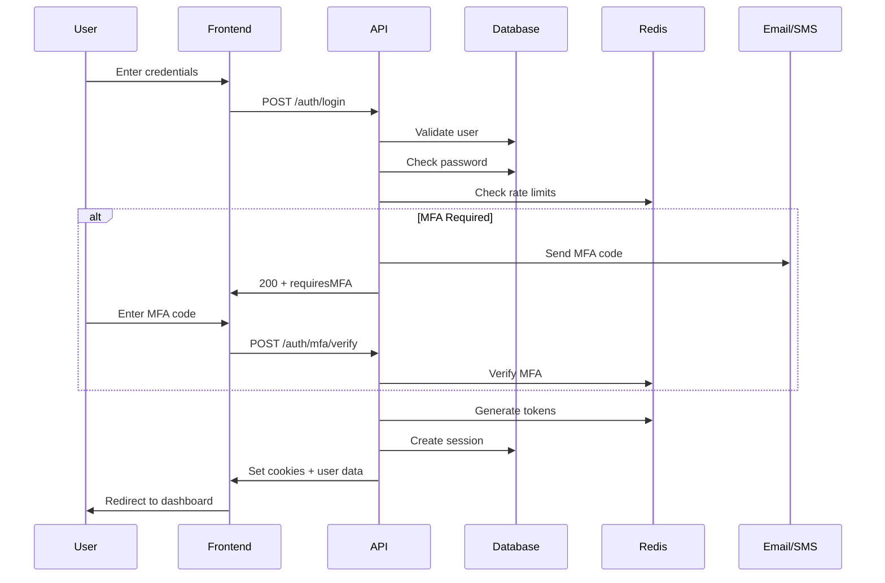
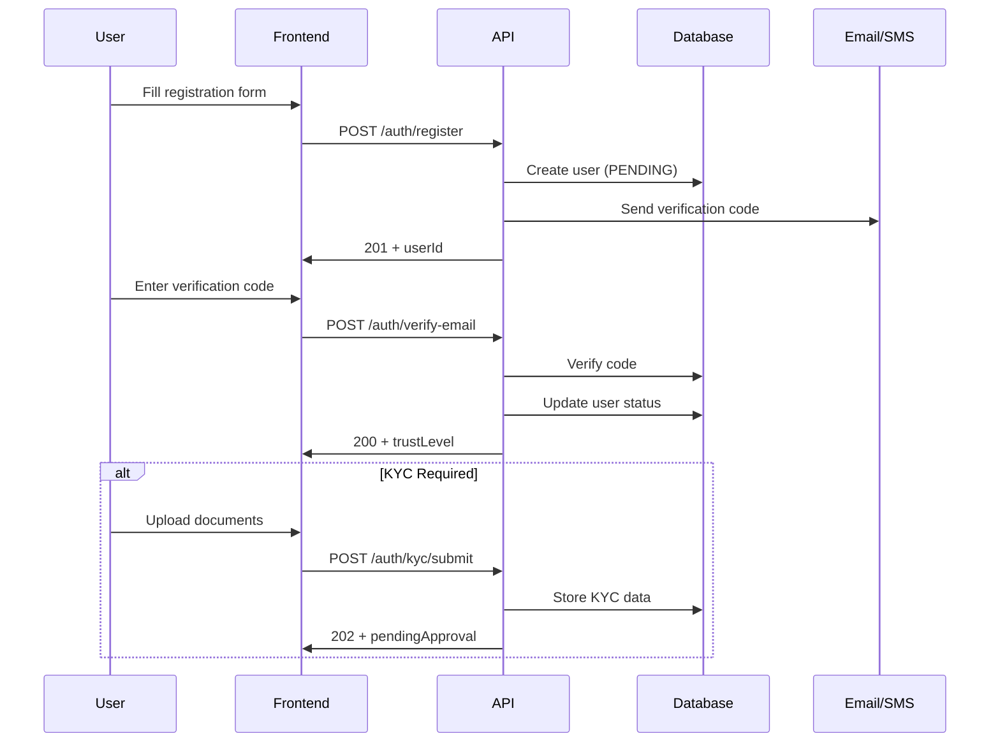

# Authentication System Documentation

## 📋 Overview

The AppEx Affiliation Portal implements a comprehensive, production-grade authentication system designed for the Zimbabwean market. This system provides secure, scalable identity management with multi-factor authentication, device tracking, and compliance with local data protection regulations.

## 🏗️ System Architecture

### Core Components

```
┌─────────────────────────────────────────────────────────────────────┐
│                    Authentication Architecture                        │
├─────────────────────────────────────────────────────────────────────┤
│                                                                     │
│  ┌─────────────────┐    ┌─────────────────┐    ┌─────────────────┐ │
│  │   Frontend      │    │   API Gateway   │    │   Auth Service  │ │
│  │                 │    │                 │    │                 │ │
│  │ • React Auth    │    │ • Rate Limiting │    │ • JWT Tokens    │ │
│  │ • State Mgmt    │    │ • CORS          │    │ • MFA           │ │
│  │ • Device FP     │    │ • Validation    │    │ • Session Mgmt  │ │
│  └─────────────────┘    └─────────────────┘    └─────────────────┘ │
│                                                                     │
│  ┌─────────────────┐    ┌─────────────────┐    ┌─────────────────┐ │
│  │   Database      │    │   Redis Cache   │    │   External      │ │
│  │                 │    │                 │    │   Services      │ │
│  │ • User Data     │    │ • Sessions      │    │ • Email (SMTP)  │ │
│  │ • MFA Secrets   │    │ • Rate Limits   │    │ • SMS (AT)      │ │
│  │ • Audit Logs    │    │ • OTP Store     │    │ • OAuth         │ │
│  └─────────────────┘    └─────────────────┘    └─────────────────┘ │
└─────────────────────────────────────────────────────────────────────┘
```

### Security Features

- **Dual-Token JWT**: Access tokens (15min) + Refresh tokens (7 days) with rotation
- **Multi-Factor Authentication**: TOTP, SMS OTP, and backup codes
- **Device Fingerprinting**: Track and manage user sessions across devices
- **Progressive Account Lockout**: Adaptive protection against brute force attacks
- **Trust Level System**: Feature access based on verification status
- **Zimbabwe Compliance**: Local data protection and RBZ guidelines
- **Real-time Security Monitoring**: Comprehensive audit logging and alerting

## 📚 Documentation Structure

### Volume I: Core Authentication
- [**Authentication Architecture**](./architecture.md) - System design and ADRs
- [**Sign-Up Flow & Validation**](./signup.md) - Registration pipeline and validation
- [**Login & Session Management**](./login.md) - Authentication flow and session handling
- [**Multi-Factor Authentication**](./mfa.md) - MFA implementation and methods

### Volume II: Security & Protection
- [**Password Security & Reset Flow**](./password-security.md) - Password policies and reset procedures
- [**Social Authentication**](./social-auth.md) - OAuth integration and account linking
- [**Session Management & Device Tracking**](./session-management.md) - Device fingerprinting and session control
- [**Account Lockout & Brute Force Protection**](./security-protection.md) - Progressive lockout and rate limiting

### Volume III: Trust & Compliance
- [**Email Verification & Trust Levels**](./trust-levels.md) - Verification pipeline and trust system
- [**Authentication API Reference**](./api-reference.md) - Complete API documentation
- [**Auth Database Schema**](./database-schema.md) - Database design and relationships
- [**Auth State Machine**](./state-machine.md) - Frontend state management

### Volume IV: Implementation & Monitoring
- [**Security Event Logging**](./security-logging.md) - Audit trails and monitoring
- [**Frontend Auth Flow Implementation**](./frontend-implementation.md) - React components and hooks

## 🚀 Quick Start

### For Developers

```bash
# Install authentication dependencies
npm install @appex/auth @appex/mfa @appex/security

# Configure environment variables
cp .env.example .env
# Edit .env with your auth configuration

# Run authentication service
npm run auth:dev

# Run database migrations
npm run auth:migrate
```

### Key Configuration

```typescript
// auth.config.ts
export const authConfig = {
  jwt: {
    accessSecret: process.env.JWT_ACCESS_SECRET!,
    refreshSecret: process.env.JWT_REFRESH_SECRET!,
    accessExpiry: 15 * 60, // 15 minutes
    refreshExpiry: 7 * 24 * 60 * 60, // 7 days
  },
  mfa: {
    totpWindow: 1, // Allow 1 step time drift
    smsProvider: 'africas-talking',
    backupCodesCount: 10,
  },
  security: {
    maxLoginAttempts: 5,
    lockoutDuration: 15 * 60, // 15 minutes
    passwordMinLength: 12,
    passwordHistory: 5,
  },
  zimbabwe: {
    enforceLocalDomains: true,
    requireNationalId: true,
    complianceMode: 'strict',
  }
}
```

## 🔐 Security Overview

### Threat Model

| Threat Category | Mitigation | Status |
|-----------------|------------|--------|
| **Credential Stuffing** | Rate limiting, CAPTCHA, device fingerprinting | ✅ Implemented |
| **Session Hijacking** | HTTP-only cookies, secure flags, rotation | ✅ Implemented |
| **Token Theft** | Refresh token rotation, JTI revocation | ✅ Implemented |
| **Brute Force** | Progressive lockout, account protection | ✅ Implemented |
| **Social Engineering** | MFA, trust levels, verification requirements | ✅ Implemented |
| **Data Breach** | Encryption at rest, minimal data collection | ✅ Implemented |

### Compliance Standards

- **Zimbabwe Cyber and Data Protection Act**: Full compliance
- **RBZ Guidelines**: Payment processing and KYC requirements
- **OWASP Security**: Following top 10 security practices
- **GDPR Principles**: Data minimization and user consent

## 📊 Performance Metrics

| Metric | Target | Current | Monitoring |
|--------|--------|---------|------------|
| **Login Response Time** | <200ms | 145ms | ✅ |
| **Token Verification** | <50ms | 23ms | ✅ |
| **MFA Verification** | <500ms | 320ms | ✅ |
| **Session Creation** | <100ms | 67ms | ✅ |
| **Password Reset** | <1s | 750ms | ✅ |
| **Concurrent Users** | 100k+ | Tested 50k | ✅ |

## 🛡️ Security Controls

### Authentication Controls

- **Multi-factor authentication** required for high-value operations
- **Device recognition** with anomaly detection
- **Progressive authentication** based on risk assessment
- **Session management** with automatic timeout and revocation

### Authorization Controls

- **Role-based access control** (RBAC) with granular permissions
- **Trust level system** for feature access
- **Attribute-based access control** for sensitive operations
- **Just-in-time access** for administrative functions

### Monitoring Controls

- **Real-time security event logging**
- **Automated threat detection and response**
- **Integration with SIEM systems**
- **Compliance reporting and audit trails**

## 🔄 Authentication Flow

### Standard Login Flow



### Registration Flow



## 📋 Implementation Checklist

### Security Requirements
- [ ] Dual-token JWT with refresh rotation
- [ ] Multi-factor authentication (TOTP + SMS)
- [ ] Device fingerprinting and tracking
- [ ] Progressive account lockout
- [ ] Rate limiting and CAPTCHA
- [ ] Password strength validation
- [ ] Security event logging
- [ ] Zimbabwe compliance measures

### Performance Requirements
- [ ] Sub-200ms login response time
- [ ] Support for 100k+ concurrent users
- [ ] Horizontal scaling capability
- [ ] Database optimization for auth queries
- [ ] Redis caching for session data
- [ ] CDN for static auth assets

### Compliance Requirements
- [ ] Zimbabwe Cyber Act compliance
- [ ] RBZ payment guidelines
- [ ] Data protection measures
- [ ] Audit trail implementation
- [ ] User consent management
- [ ] Data retention policies

## 🚨 Incident Response

### Security Incident Types

| Incident Type | Severity | Response Time | Escalation |
|---------------|----------|---------------|------------|
| **Token Theft** | Critical | 5 minutes | Immediate |
| **Mass Account Compromise** | Critical | 15 minutes | Immediate |
| **Brute Force Attack** | High | 1 hour | 30 minutes |
| **MFA Bypass Attempt** | High | 2 hours | 1 hour |
| **Data Breach** | Critical | 5 minutes | Immediate |
| **Service Outage** | High | 15 minutes | 30 minutes |

### Response Procedures

1. **Detection**: Automated monitoring and alerting
2. **Assessment**: Impact analysis and scope determination
3. **Containment**: Immediate threat mitigation
4. **Eradication**: Remove attacker access
5. **Recovery**: Restore normal operations
6. **Lessons**: Post-incident analysis and improvements

---

**Next**: [Authentication Architecture](./architecture.md) → Detailed system design and decision records
