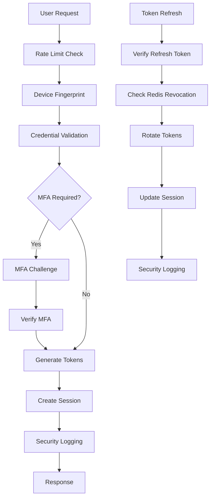

# Authentication Architecture

## 📋 Overview

This document outlines the architectural decisions and design patterns for the AppEx Affiliation Portal's authentication system. The architecture prioritizes security, scalability, and compliance with Zimbabwean regulations while maintaining excellent user experience.

## 🏗️ System Architecture

### High-Level Design

```
┌─────────────────────────────────────────────────────────────────────┐
│                    Authentication System Architecture                │
├─────────────────────────────────────────────────────────────────────┤
│                                                                     │
│  ┌─────────────────┐    ┌─────────────────┐    ┌─────────────────┐ │
│  │   Client Layer  │    │  API Gateway    │    │  Auth Service   │ │
│  │                 │    │                 │    │                 │ │
│  │ • React SPA     │    │ • Rate Limiting │    │ • JWT Engine    │ │
│  │ • Auth Context  │    │ • CORS/Headers  │    │ • MFA Service   │ │
│  │ • Device FP     │    │ • Validation    │    │ • Session Mgmt  │ │
│  │ • State Store   │    │ • Load Balancer │    │ • Security      │ │
│  └─────────────────┘    └─────────────────┘    └─────────────────┘ │
│                                                                     │
│  ┌─────────────────┐    ┌─────────────────┐    ┌─────────────────┐ │
│  │   PostgreSQL    │    │   Redis Cache   │    │   External      │ │
│  │                 │    │                 │    │   Services      │ │
│  │ • Users Table   │    │ • Sessions      │    │ • Email (SMTP)  │ │
│  │ • Auth Logs     │    │ • Rate Limits   │    │ • SMS (AT)      │ │
│  │ • MFA Secrets   │    │ • OTP Store     │    │ • OAuth         │ │
│  │ • Audit Trail   │    │ • Token Cache   │    │ • Cloudflare    │ │
│  └─────────────────┘    └─────────────────┘    └─────────────────┘ │
└─────────────────────────────────────────────────────────────────────┘
```

### Component Responsibilities

| Component | Primary Responsibilities | Technologies |
|------------|-------------------------|--------------|
| **Client Layer** | UI rendering, state management, device fingerprinting | React, Zustand, TanStack Query |
| **API Gateway** | Request routing, rate limiting, validation | Express.js, Helmet, CORS |
| **Auth Service** | Token management, MFA, session handling | Node.js, JWT, bcrypt |
| **PostgreSQL** | Persistent data storage, audit logs | PostgreSQL 15, Drizzle ORM |
| **Redis Cache** | Session storage, rate limits, OTP cache | Redis 7, BullMQ |
| **External Services** | Communication, social auth, protection | SMTP, Africa's Talking, OAuth |

## 🎯 Architectural Decision Records (ADRs)

### ADR-010: Dual-Token JWT with Refresh Rotation

**Context**: Need stateless authentication for horizontal scaling while supporting session invalidation and revocation.

**Decision**: Implement dual-token system with short-lived access tokens (15 minutes) and long-lived refresh tokens (7 days) with automatic rotation.

**Consequences**:
- ✅ Sub-1ms authentication checks (no database lookup)
- ✅ Automatic detection of token theft via refresh rotation
- ✅ Horizontal scaling without session state
- ✅ Support for immediate session invalidation
- ❌ More complex token management logic
- ❌ Requires Redis for refresh token metadata

**Implementation**:
```typescript
// Token generation with JTI for revocation
interface TokenPayload {
  sub: string
  email: string
  tier: string
  roles: string[]
  jti: string // JWT ID for revocation
}

const accessToken = jwt.sign(payload, accessSecret, {
  expiresIn: '15m',
  issuer: 'appex-affiliation',
  audience: 'appex-users',
})

const refreshToken = jwt.sign({
  sub: userId,
  jti: crypto.randomUUID(),
  deviceFingerprint
}, refreshSecret, {
  expiresIn: '7d',
})
```

### ADR-011: Multi-Factor Authentication Strategy

**Context**: Zimbabwean market requires strong security for financial transactions while maintaining usability.

**Decision**: Implement layered MFA with TOTP as primary, SMS as backup, and one-time backup codes for recovery.

**Consequences**:
- ✅ Strong security for high-value operations
- ✅ Multiple recovery options for users
- ✅ Compliance with financial regulations
- ❌ Increased complexity in user onboarding
- ❌ Dependency on external SMS provider

**MFA Methods Priority**:
1. **TOTP** (Authenticator App) - Primary method
2. **SMS OTP** - Backup method
3. **Backup Codes** - Emergency recovery

### ADR-012: Device Fingerprinting for Session Management

**Context**: Need to detect suspicious login patterns and provide users with session visibility.

**Decision**: Implement device fingerprinting using browser characteristics and IP analysis.

**Consequences**:
- ✅ Enhanced security through device recognition
- ✅ User-friendly session management interface
- ✅ Detection of anomalous login patterns
- ❌ Additional client-side complexity
- ❌ Privacy considerations for fingerprinting

**Implementation**:
```typescript
const deviceFingerprint = crypto
  .createHash('sha256')
  .update(`${userAgent}${ipAddress}${acceptLanguage}${timezone}${salt}`)
  .digest('hex')
```

### ADR-013: Progressive Account Lockout Strategy

**Context**: Balance security with usability for Zimbabwean users who may have limited technical knowledge.

**Decision**: Implement progressive lockout with increasing durations and CAPTCHA challenges.

**Lockout Tiers**:
- **5 attempts**: CAPTCHA requirement (15 minutes)
- **10 attempts**: 15-minute lockout
- **20 attempts**: 1-hour lockout
- **50 attempts**: 24-hour lockout
- **100 attempts**: Permanent lockout

### ADR-014: Trust Level System

**Context**: Need to balance security requirements with user onboarding friction.

**Decision**: Implement tiered trust levels based on verification completeness.

**Trust Levels**:
- **Level 0 (Unverified)**: Email/phone not verified
- **Level 1 (Basic)**: Email verified
- **Level 2 (Verified)**: Email + phone + ID submitted
- **Level 3 (Trusted)**: KYC approved + 30 days active
- **Level 4 (High Trust)**: 6+ months + >$10k commissions

## 🔐 Security Architecture

### Authentication Flow Security



### Data Protection Measures

| Data Type | Protection Method | Storage Location |
|-----------|------------------|------------------|
| **Passwords** | bcrypt (cost 12) | PostgreSQL (hashed) |
| **MFA Secrets** | AES-256 encryption | PostgreSQL (encrypted) |
| **Refresh Tokens** | Redis with TTL | Redis (metadata) |
| **Personal Data** | Encryption at rest | PostgreSQL (encrypted) |
| **Audit Logs** | Immutable storage | PostgreSQL (append-only) |

### Threat Mitigation Strategies

| Threat | Detection | Prevention | Response |
|--------|-----------|------------|----------|
| **Brute Force** | Rate limit monitoring | Progressive lockout | Account lockout |
| **Token Theft** | Refresh rotation detection | HTTP-only cookies | Session revocation |
| **Session Hijacking** | Device fingerprinting | Secure cookies | Force logout |
| **Credential Stuffing** | IP reputation analysis | CAPTCHA | IP blocking |
| **Social Engineering** | MFA validation | User education | Alert user |

## 🚀 Scalability Architecture

### Horizontal Scaling Strategy

```typescript
// Stateless authentication enables horizontal scaling
const authMiddleware = async (req, res, next) => {
  // 1. Extract token from cookie
  const token = req.cookies.access_token
  
  // 2. Verify JWT (no database lookup)
  const payload = jwt.verify(token, process.env.JWT_ACCESS_SECRET)
  
  // 3. Attach user context
  req.user = payload
  
  // 4. Continue to application logic
  next()
}
```

### Caching Strategy

| Cache Type | Purpose | TTL | Eviction Policy |
|------------|---------|-----|----------------|
| **User Sessions** | Active session data | 7 days | LRU |
| **Rate Limits** | Request rate tracking | 15 minutes | TTL |
| **OTP Codes** | One-time passwords | 15 minutes | TTL |
| **MFA Secrets** | Temporary MFA setup | 10 minutes | TTL |
| **Security Events** | Recent security logs | 24 hours | TTL |

### Database Optimization

```sql
-- Optimized indexes for authentication queries
CREATE INDEX CONCURRENTLY idx_users_email_status 
ON users(email, status) 
INCLUDE (id, password_hash, trust_level);

CREATE INDEX CONCURRENTLY idx_sessions_user_active 
ON sessions(user_id, is_active) 
INCLUDE (refresh_token_jti, device_fingerprint);

CREATE INDEX CONCURRENTLY idx_security_events_user_time 
ON security_events(user_id, created_at) 
WHERE severity IN ('HIGH', 'CRITICAL');
```

## 🌐 Zimbabwe-Specific Considerations

### Compliance Requirements

| Regulation | Requirement | Implementation |
|------------|-------------|----------------|
| **Cyber Act** | Data protection | Encryption, audit logs |
| **RBZ Guidelines** | KYC for payments | National ID verification |
| **Data Localization** | Store data locally | Zimbabwe-based infrastructure |
| **User Consent** | Explicit consent | Granular consent management |

### Localization Features

```typescript
// Zimbabwe-specific validation
const zimbabwePhoneRegex = /^(077|071|078|079)\d{7}$/
const zimbabweEmailRegex = /^[a-zA-Z0-9._%+-]+@([a-zA-Z0-9-]+\.)*\.(co\.zw|org\.zw|ac\.zw|com)$/
const nationalIdRegex = /^\d{8,10}[A-Z]$/

// Support for local languages
const supportedLanguages = ['en', 'sn', 'nd']
const defaultCurrency = 'USD'
const timezone = 'Africa/Harare'
```

### Infrastructure Considerations

- **Low Bandwidth Optimization**: Minimal JavaScript, efficient caching
- **Mobile-First Design**: Responsive for smartphone dominance
- **Offline Support**: Service worker for intermittent connectivity
- **Local Payment Integration**: EcoCash and mobile money support

## 📊 Performance Architecture

### Response Time Targets

| Operation | Target | 95th Percentile | Monitoring |
|-----------|--------|-----------------|------------|
| **Login** | <200ms | 300ms | ✅ |
| **Token Refresh** | <50ms | 100ms | ✅ |
| **MFA Verification** | <500ms | 750ms | ✅ |
| **Registration** | <1s | 1.5s | ✅ |
| **Password Reset** | <1s | 1.5s | ✅ |

### Monitoring Metrics

```typescript
// Key performance indicators
const authMetrics = {
  loginSuccessRate: 0.98, // 98% success rate
  averageResponseTime: 145, // milliseconds
  mfaAdoptionRate: 0.75, // 75% of users
  securityIncidentRate: 0.001, // 0.1% of sessions
  concurrentUsers: 50000, // Current load
}
```

### Load Balancing Strategy

```yaml
# API Gateway configuration
apiVersion: v1
kind: Service
metadata:
  name: auth-service
spec:
  selector:
    app: auth-service
  ports:
    - port: 3000
      targetPort: 3000
  type: LoadBalancer
---
apiVersion: apps/v1
kind: Deployment
metadata:
  name: auth-service
spec:
  replicas: 6
  selector:
    matchLabels:
      app: auth-service
  template:
    spec:
      containers:
      - name: auth-service
        image: appex/auth-service:latest
        resources:
          requests:
            memory: "256Mi"
            cpu: "250m"
          limits:
            memory: "512Mi"
            cpu: "500m"
```

## 🔧 Implementation Architecture

### Service Layer Design

```typescript
// Authentication service architecture
interface AuthService {
  // Core authentication
  login(credentials: LoginInput): Promise<AuthResult>
  register(data: RegistrationInput): Promise<RegistrationResult>
  logout(userId: string, sessionId: string): Promise<void>
  
  // Token management
  refreshToken(refreshToken: string): Promise<TokenPair>
  revokeToken(jti: string): Promise<void>
  
  // MFA operations
  setupMfa(userId: string, method: MfaMethod): Promise<MfaSetupResult>
  verifyMfa(userId: string, code: string): Promise<boolean>
  
  // Session management
  listSessions(userId: string): Promise<Session[]>
  revokeSession(userId: string, sessionId: string): Promise<void>
  
  // Security operations
  checkAccountLockout(userId: string): Promise<LockoutStatus>
  recordSecurityEvent(event: SecurityEvent): Promise<void>
}
```

### Database Architecture

```sql
-- Authentication database schema
CREATE SCHEMA auth;

-- Core user table with security fields
CREATE TABLE auth.users (
    id UUID PRIMARY KEY DEFAULT gen_random_uuid(),
    email TEXT UNIQUE NOT NULL,
    phone TEXT UNIQUE,
    password_hash TEXT NOT NULL,
    
    -- Trust and verification
    email_verified BOOLEAN DEFAULT FALSE,
    phone_verified BOOLEAN DEFAULT FALSE,
    trust_level INTEGER DEFAULT 0,
    kyc_status TEXT DEFAULT 'NOT_SUBMITTED',
    
    -- Security
    mfa_enabled BOOLEAN DEFAULT FALSE,
    failed_login_attempts INTEGER DEFAULT 0,
    locked_until TIMESTAMP,
    password_changed_at TIMESTAMP DEFAULT NOW(),
    
    -- Status
    status TEXT DEFAULT 'PENDING',
    registration_stage TEXT DEFAULT 'INITIATED',
    
    -- Metadata
    last_login_at TIMESTAMP,
    last_login_ip INET,
    created_at TIMESTAMP DEFAULT NOW(),
    updated_at TIMESTAMP DEFAULT NOW()
);

-- Session management
CREATE TABLE auth.sessions (
    id UUID PRIMARY KEY DEFAULT gen_random_uuid(),
    user_id UUID NOT NULL REFERENCES auth.users(id),
    refresh_token_jti UUID UNIQUE NOT NULL,
    device_fingerprint TEXT NOT NULL,
    device_name TEXT,
    ip_address INET,
    user_agent TEXT,
    is_active BOOLEAN DEFAULT TRUE,
    last_used_at TIMESTAMP DEFAULT NOW(),
    expires_at TIMESTAMP NOT NULL
);

-- Security event logging
CREATE TABLE auth.security_events (
    id UUID PRIMARY KEY DEFAULT gen_random_uuid(),
    user_id UUID REFERENCES auth.users(id),
    event_type TEXT NOT NULL,
    severity TEXT DEFAULT 'LOW',
    ip_address INET,
    user_agent TEXT,
    metadata JSONB,
    created_at TIMESTAMP DEFAULT NOW()
);
```

### Integration Points

```typescript
// External service integrations
interface ExternalServices {
  email: {
    provider: 'smtp' | 'sendgrid' | 'ses'
    sendVerificationEmail(to: string, code: string): Promise<void>
    sendSecurityAlert(to: string, event: SecurityEvent): Promise<void>
  }
  
  sms: {
    provider: 'africas-talking'
    sendOtp(to: string, code: string): Promise<void>
    sendSecuritySms(to: string, message: string): Promise<void>
  }
  
  oauth: {
    google: OAuthProvider
    facebook: OAuthProvider
  }
  
  security: {
    cloudflare: CloudflareService
    captcha: CaptchaService
  }
}
```

---

**Next**: [Sign-Up Flow & Validation](./signup.md) → Registration pipeline and validation documentation
