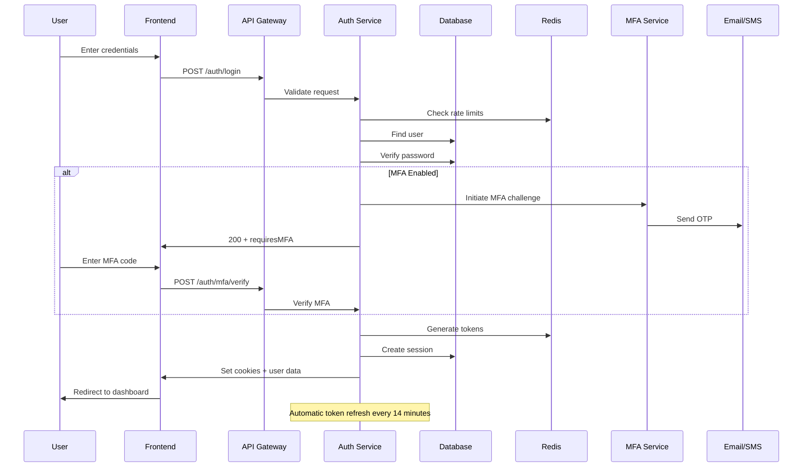

# Login & Session Management

## 📋 Overview

The AppEx Affiliation Portal implements a secure, scalable login system with device fingerprinting, multi-factor authentication, and comprehensive session management. This system is designed to handle 100k+ concurrent users while maintaining sub-200ms response times.

## 🔐 Login Architecture

### Authentication Flow



### Login Request Schema

```typescript
// shared/types/auth.ts
export const LoginSchema = z.object({
  email: z.string().email('Invalid email format'),
  password: z.string().min(1, 'Password is required'),
  
  // Optional device information
  deviceName: z.string().optional(),
  deviceType: z.enum(['desktop', 'mobile', 'tablet']).default('desktop'),
  
  // MFA support
  otp: z.string().optional(),
  mfaSessionId: z.string().optional(),
  
  // Remember me functionality
  rememberMe: z.boolean().default(false),
  
  // Location and device context
  timezone: z.string().optional(),
  language: z.string().default('en')
})

export type LoginInput = z.infer<typeof LoginSchema>

export interface LoginResult {
  user: {
    id: string
    email: string
    fullName: string
    affiliateTier: string
    roles: string[]
    trustLevel: number
    mfaEnabled: boolean
  }
  requiresMfa?: boolean
  mfaSessionId?: string
  availableMethods?: string[]
  expiresIn: number
  isNewDevice?: boolean
  suspiciousActivity?: boolean
}
```

## 🔧 Login Implementation

### Login Handler

```typescript
// api/src/routes/auth/login.ts
import { PrismaClient } from '@prisma/client'
import bcrypt from 'bcrypt'
import jwt from 'jsonwebtoken'
import crypto from 'crypto'
import { z } from 'zod'
import { logSecurityEvent } from '@/services/security-logging.service'
import { generateTokens, createSession } from '@/services/session.service'

const prisma = new PrismaClient()

export const loginHandler = async (req: Request, res: Response) => {
  const startTime = Date.now()
  const clientFingerprint = req.headers['x-device-fingerprint'] as string
  
  try {
    // Parse and validate input
    const { email, password, deviceName, otp, mfaSessionId, rememberMe } = LoginSchema.parse(req.body)
    
    // Rate limiting check (5 attempts per 15 minutes per IP)
    const rateKey = `login:${req.ip}`
    const attempts = await redis.incr(rateKey)
    if (attempts === 1) await redis.expire(rateKey, 900) // 15 minutes
    if (attempts > 5) {
      await logSecurityEvent({
        eventType: 'LOGIN_RATE_LIMIT_EXCEEDED',
        ipAddress: req.ip,
        userAgent: req.headers['user-agent'],
        metadata: { attempts, email }
      })
      
      return res.status(429).json({ 
        error: 'TOO_MANY_ATTEMPTS', 
        message: 'Too many login attempts. Please try again in 15 minutes.' 
      })
    }
    
    // Find user with comprehensive data
    const user = await prisma.user.findUnique({
      where: { email: email.toLowerCase() },
      include: {
        mfaMethods: { where: { isActive: true } },
        sessions: {
          where: { isActive: true },
          select: { deviceFingerprint: true, lastUsedAt: true }
        }
      }
    })
    
    if (!user) {
      await logSecurityEvent({
        eventType: 'LOGIN_FAILED_USER_NOT_FOUND',
        ipAddress: req.ip,
        userAgent: req.headers['user-agent'],
        metadata: { email }
      })
      return res.status(401).json({ error: 'INVALID_CREDENTIALS' })
    }
    
    // Check account status
    if (user.status !== 'ACTIVE') {
      if (user.lockedUntil && user.lockedUntil > new Date()) {
        const remainingSeconds = Math.ceil((user.lockedUntil.getTime() - Date.now()) / 1000)
        return res.status(423).json({
          error: 'ACCOUNT_LOCKED',
          message: 'Account is temporarily locked',
          remainingSeconds,
          lockReason: user.lockReason
        })
      }
      
      if (user.status === 'PERMANENTLY_LOCKED') {
        return res.status(423).json({
          error: 'ACCOUNT_PERMANENTLY_LOCKED',
          message: 'Account has been permanently locked. Please contact support.'
        })
      }
      
      if (user.status === 'SUSPENDED') {
        return res.status(423).json({
          error: 'ACCOUNT_SUSPENDED',
          message: 'Account is suspended. Please contact support.'
        })
      }
    }
    
    // Verify password
    const passwordValid = await bcrypt.compare(password, user.passwordHash)
    if (!passwordValid) {
      // Increment failed login counter
      await prisma.user.update({
        where: { id: user.id },
        data: { failedLoginAttempts: { increment: 1 } }
      })
      
      // Check for account lockout
      const newFailedAttempts = user.failedLoginAttempts + 1
      if (newFailedAttempts >= 10) {
        await lockAccount(user.id, 'BRUTE_FORCE')
      }
      
      await logSecurityEvent({
        userId: user.id,
        eventType: 'LOGIN_FAILED_INVALID_PASSWORD',
        ipAddress: req.ip,
        userAgent: req.headers['user-agent'],
        metadata: { attempts: newFailedAttempts }
      })
      
      return res.status(401).json({ error: 'INVALID_CREDENTIALS' })
    }
    
    // Reset failed attempts on successful password
    await prisma.user.update({
      where: { id: user.id },
      data: { 
        failedLoginAttempts: 0,
        lastLoginAt: new Date(),
        lastLoginIp: req.ip
      }
    })
    
    // Generate device fingerprint
    const deviceFingerprint = crypto
      .createHash('sha256')
      .update(`${req.headers['user-agent']}${req.ip}${clientFingerprint}${process.env.DEVICE_FINGERPRINT_SALT}`)
      .digest('hex')
    
    // Check if this is a new device
    const existingSession = user.sessions.find(
      session => session.deviceFingerprint === deviceFingerprint
    )
    
    const isNewDevice = !existingSession
    
    // Check for suspicious activity
    const suspiciousActivity = await detectSuspiciousActivity(user.id, deviceFingerprint, req.ip)
    
    // MFA Challenge if enabled
    if (user.mfaEnabled && !otp) {
      const mfaSession = await initiateMfaChallenge(user.id, deviceFingerprint)
      
      await logSecurityEvent({
        userId: user.id,
        eventType: 'MFA_CHALLENGE_INITIATED',
        ipAddress: req.ip,
        userAgent: req.headers['user-agent'],
        metadata: { 
          isNewDevice,
          suspiciousActivity,
          mfaSessionId: mfaSession.id
        }
      })
      
      return res.status(200).json({
        requiresMfa: true,
        mfaSessionId: mfaSession.id,
        availableMethods: user.mfaMethods.map(m => m.methodType),
        isNewDevice,
        suspiciousActivity
      })
    }
    
    // Verify MFA if provided
    if (user.mfaEnabled && otp) {
      const verified = await verifyMfaOtp(user.id, otp, mfaSessionId, deviceFingerprint)
      if (!verified) {
        await logSecurityEvent({
          userId: user.id,
          eventType: 'MFA_VERIFICATION_FAILED',
          ipAddress: req.ip,
          userAgent: req.headers['user-agent'],
          metadata: { mfaSessionId }
        })
        
        return res.status(401).json({ error: 'INVALID_MFA_CODE' })
      }
    }
    
    // Generate token pair
    const tokens = await generateTokens({
      userId: user.id,
      email: user.email,
      tier: user.affiliateTier,
      roles: user.roles,
      trustLevel: user.trustLevel,
      deviceFingerprint
    })
    
    // Create or update session
    const session = await createSession({
      userId: user.id,
      refreshTokenJti: tokens.refreshTokenJti,
      deviceFingerprint,
      deviceName: deviceName || 'Unknown Device',
      ipAddress: req.ip,
      userAgent: req.headers['user-agent'],
      isNewDevice,
      rememberMe
    })
    
    // Set HTTP-only cookies
    const cookieOptions = {
      httpOnly: true,
      secure: process.env.NODE_ENV === 'production',
      sameSite: 'strict' as const,
      domain: process.env.COOKIE_DOMAIN || '.appex.co.zw'
    }
    
    res.cookie('access_token', tokens.accessToken, {
      ...cookieOptions,
      maxAge: 15 * 60 * 1000 // 15 minutes
    })
    
    res.cookie('refresh_token', tokens.refreshToken, {
      ...cookieOptions,
      maxAge: rememberMe ? 30 * 24 * 3600 * 1000 : 7 * 24 * 3600 * 1000, // 30 days or 7 days
      path: '/auth/refresh'
    })
    
    // Log successful login
    await logSecurityEvent({
      userId: user.id,
      eventType: 'LOGIN_SUCCESS',
      ipAddress: req.ip,
      userAgent: req.headers['user-agent'],
      metadata: {
        deviceFingerprint,
        isNewDevice,
        suspiciousActivity,
        processingTime: Date.now() - startTime
      }
    })
    
    // Send security alert for new device
    if (isNewDevice) {
      await emailQueue.add('send-new-device-alert', {
        to: user.email,
        deviceInfo: {
          deviceName: deviceName || 'Unknown Device',
          ipAddress: req.ip,
          userAgent: req.headers['user-agent'],
          location: await getLocationFromIp(req.ip)
        }
      })
    }
    
    res.json({
      user: {
        id: user.id,
        email: user.email,
        fullName: user.fullName,
        affiliateTier: user.affiliateTier,
        roles: user.roles,
        trustLevel: user.trustLevel,
        mfaEnabled: user.mfaEnabled
      },
      expiresIn: 900, // 15 minutes
      isNewDevice,
      suspiciousActivity
    })
    
  } catch (error) {
    if (error instanceof z.ZodError) {
      return res.status(400).json({
        error: 'VALIDATION_ERROR',
        message: 'Invalid input data',
        details: error.errors
      })
    }
    
    console.error('Login error:', error)
    await logSecurityEvent({
      eventType: 'LOGIN_ERROR',
      ipAddress: req.ip,
      userAgent: req.headers['user-agent'],
      metadata: { error: error.message }
    })
    
    res.status(500).json({
      error: 'INTERNAL_ERROR',
      message: 'Login failed. Please try again.'
    })
  }
}

// Detect suspicious login activity
async function detectSuspiciousActivity(userId: string, deviceFingerprint: string, ipAddress: string): Promise<boolean> {
  const recentLogins = await prisma.securityEvent.findMany({
    where: {
      userId,
      eventType: 'LOGIN_SUCCESS',
      createdAt: { gte: new Date(Date.now() - 24 * 60 * 60 * 1000) } // Last 24 hours
    },
    select: { ipAddress: true, metadata: true },
    orderBy: { createdAt: 'desc' },
    take: 10
  })
  
  // Check for multiple IP addresses in short time
  const uniqueIps = new Set(recentLogins.map(login => login.ipAddress))
  if (uniqueIps.size > 3) return true
  
  // Check for geolocation anomalies
  const currentLocation = await getLocationFromIp(ipAddress)
  const previousLocations = recentLogins.map(login => login.metadata?.location).filter(Boolean)
  
  if (previousLocations.length > 0) {
    const distance = calculateDistance(currentLocation, previousLocations[0])
    if (distance > 1000) return true // More than 1000km from previous login
  }
  
  // Check for impossible travel time
  const lastLogin = recentLogins[0]
  if (lastLogin) {
    const timeDiff = Date.now() - lastLogin.createdAt.getTime()
    const distance = calculateDistance(currentLocation, lastLogin.metadata?.location)
    const requiredTime = (distance / 900) * 3600 * 1000 // Assuming 900km/h max speed
    
    if (timeDiff < requiredTime) return true
  }
  
  return false
}
```

## 🔄 Token Refresh System

### Refresh Token Handler

```typescript
// api/src/routes/auth/refresh.ts
export const refreshHandler = async (req: Request, res: Response) => {
  const refreshToken = req.cookies.refresh_token
  const clientFingerprint = req.headers['x-device-fingerprint'] as string
  
  if (!refreshToken) {
    return res.status(401).json({ error: 'NO_REFRESH_TOKEN' })
  }
  
  try {
    // Verify refresh token
    const payload = jwt.verify(refreshToken, process.env.JWT_REFRESH_SECRET!) as {
      sub: string
      jti: string
      deviceFingerprint: string
    }
    
    const { sub: userId, jti: oldJti, deviceFingerprint: tokenFingerprint } = payload
    
    // Check if refresh token is revoked (Redis lookup)
    const revoked = await redis.get(`revoked:${oldJti}`)
    if (revoked) {
      // Token reuse detected! This could be a theft attempt
      await handleTokenTheft(userId, oldJti, tokenFingerprint, req.ip)
      
      await logSecurityEvent({
        userId,
        eventType: 'TOKEN_THEFT_DETECTED',
        severity: 'CRITICAL',
        ipAddress: req.ip,
        userAgent: req.headers['user-agent'],
        metadata: { oldJti, tokenFingerprint }
      })
      
      return res.status(401).json({ error: 'TOKEN_REVOKED' })
    }
    
    // Check if token exists in Redis (valid session)
    const storedToken = await redis.get(`refresh:${oldJti}`)
    if (!storedToken) {
      return res.status(401).json({ error: 'INVALID_SESSION' })
    }
    
    // Verify device fingerprint matches
    const currentFingerprint = crypto
      .createHash('sha256')
      .update(`${req.headers['user-agent']}${req.ip}${clientFingerprint}${process.env.DEVICE_FINGERPRINT_SALT}`)
      .digest('hex')
    
    if (tokenFingerprint !== currentFingerprint) {
      await logSecurityEvent({
        userId,
        eventType: 'DEVICE_MISMATCH',
        severity: 'HIGH',
        ipAddress: req.ip,
        userAgent: req.headers['user-agent'],
        metadata: { expectedFingerprint: tokenFingerprint, actualFingerprint: currentFingerprint }
      })
      
      return res.status(401).json({ error: 'DEVICE_MISMATCH' })
    }
    
    // Get current user data
    const user = await prisma.user.findUnique({
      where: { id: userId },
      select: {
        id: true,
        email: true,
        fullName: true,
        affiliateTier: true,
        roles: true,
        trustLevel: true,
        status: true,
        mfaEnabled: true
      }
    })
    
    if (!user || user.status !== 'ACTIVE') {
      return res.status(401).json({ error: 'USER_INACTIVE' })
    }
    
    // Atomic: Revoke old token and generate new one
    // Use Redis transaction to prevent race conditions
    const multi = redis.multi()
    multi.setex(`revoked:${oldJti}`, 7 * 24 * 3600, 'rotated') // Keep for 7 days
    multi.del(`refresh:${oldJti}`)
    await multi.exec()
    
    // Generate new token pair
    const tokens = await generateTokens({
      userId: user.id,
      email: user.email,
      tier: user.affiliateTier,
      roles: user.roles,
      trustLevel: user.trustLevel,
      deviceFingerprint: currentFingerprint
    })
    
    // Store new refresh token
    await redis.setex(
      `refresh:${tokens.refreshTokenJti}`,
      7 * 24 * 3600,
      JSON.stringify({
        userId,
        deviceFingerprint: currentFingerprint,
        rotatedFrom: oldJti,
        rotatedAt: new Date().toISOString()
      })
    )
    
    // Update session in database
    await prisma.session.updateMany({
      where: { refreshTokenJti: oldJti },
      data: { 
        refreshTokenJti: tokens.refreshTokenJti,
        lastUsedAt: new Date()
      }
    })
    
    // Set new cookies
    const cookieOptions = {
      httpOnly: true,
      secure: process.env.NODE_ENV === 'production',
      sameSite: 'strict' as const,
      domain: process.env.COOKIE_DOMAIN || '.appex.co.zw'
    }
    
    res.cookie('access_token', tokens.accessToken, {
      ...cookieOptions,
      maxAge: 15 * 60 * 1000
    })
    
    res.cookie('refresh_token', tokens.refreshToken, {
      ...cookieOptions,
      maxAge: 7 * 24 * 3600 * 1000,
      path: '/auth/refresh'
    })
    
    res.json({ 
      success: true,
      user: {
        id: user.id,
        email: user.email,
        fullName: user.fullName,
        affiliateTier: user.affiliateTier,
        roles: user.roles,
        trustLevel: user.trustLevel,
        mfaEnabled: user.mfaEnabled
      }
    })
    
  } catch (error) {
    if (error.name === 'TokenExpiredError') {
      return res.status(401).json({ error: 'REFRESH_TOKEN_EXPIRED' })
    }
    if (error.name === 'JsonWebTokenError') {
      return res.status(401).json({ error: 'INVALID_TOKEN' })
    }
    
    console.error('Token refresh error:', error)
    res.status(500).json({ error: 'REFRESH_FAILED' })
  }
}

// Handle token theft detection
async function handleTokenTheft(userId: string, stolenJti: string, deviceFingerprint: string, ipAddress: string): Promise<void> {
  // Revoke all refresh tokens for this user
  const sessions = await prisma.session.findMany({
    where: { userId },
    select: { refreshTokenJti: true }
  })
  
  const pipeline = redis.pipeline()
  for (const session of sessions) {
    if (session.refreshTokenJti) {
      pipeline.setex(`revoked:${session.refreshTokenJti}`, 7 * 24 * 3600, 'theft_detected')
      pipeline.del(`refresh:${session.refreshTokenJti}`)
    }
  }
  await pipeline.exec()
  
  // Deactivate all sessions
  await prisma.session.updateMany({
    where: { userId },
    data: { isActive: false }
  })
  
  // Force password reset
  await prisma.user.update({
    where: { id: userId },
    data: { 
      status: 'SUSPENDED',
      lockReason: 'SECURITY_VIOLATION_TOKEN_THEFT'
    }
  })
  
  // Send security alert
  const user = await prisma.user.findUnique({
    where: { id: userId },
    select: { email: true, fullName: true }
  })
  
  if (user) {
    await emailQueue.add('send-security-alert', {
      to: user.email,
      alertType: 'TOKEN_THEFT',
      deviceInfo: {
        deviceFingerprint,
        ipAddress,
        timestamp: new Date().toISOString()
      }
    })
  }
}
```

## 📱 Session Management

### Session Listing Handler

```typescript
// api/src/routes/auth/sessions.ts
export const listSessionsHandler = async (req: Request, res: Response) => {
  const userId = req.user.id
  
  const sessions = await prisma.session.findMany({
    where: { 
      userId,
      isActive: true 
    },
    select: {
      id: true,
      deviceName: true,
      deviceFingerprint: true,
      ipAddress: true,
      userAgent: true,
      lastUsedAt: true,
      createdAt: true,
      expiresAt: true
    },
    orderBy: { lastUsedAt: 'desc' }
  })
  
  // Enrich with geolocation and device analysis
  const enrichedSessions = await Promise.all(
    sessions.map(async (session) => {
      const location = await getLocationFromIp(session.ipAddress)
      const deviceInfo = parseUserAgent(session.userAgent)
      const isCurrentSession = session.deviceFingerprint === req.deviceFingerprint
      
      return {
        ...session,
        location,
        deviceInfo,
        isCurrentSession,
        riskLevel: assessSessionRisk(session, location, deviceInfo)
      }
    })
  )
  
  res.json({ sessions: enrichedSessions })
}

// Revoke specific session
export const revokeSessionHandler = async (req: Request, res: Response) => {
  const { sessionId } = req.params
  const userId = req.user.id
  
  const session = await prisma.session.findFirst({
    where: {
      id: sessionId,
      userId,
      isActive: true
    }
  })
  
  if (!session) {
    return res.status(404).json({ error: 'SESSION_NOT_FOUND' })
  }
  
  // Revoke refresh token in Redis
  if (session.refreshTokenJti) {
    await redis.setex(`revoked:${session.refreshTokenJti}`, 7 * 24 * 3600, 'user_revoked')
    await redis.del(`refresh:${session.refreshTokenJti}`)
  }
  
  // Mark session as inactive
  await prisma.session.update({
    where: { id: sessionId },
    data: { isActive: false }
  })
  
  // Log security event
  await logSecurityEvent({
    userId,
    eventType: 'SESSION_REVOKED',
    ipAddress: req.ip,
    userAgent: req.headers['user-agent'],
    metadata: { 
      sessionId, 
      deviceName: session.deviceName,
      revokedFrom: req.ip
    }
  })
  
  res.json({ success: true })
}

// Revoke all other sessions (keep current)
export const revokeAllOtherSessionsHandler = async (req: Request, res: Response) => {
  const userId = req.user.id
  const currentFingerprint = req.deviceFingerprint
  
  const otherSessions = await prisma.session.findMany({
    where: {
      userId,
      isActive: true,
      deviceFingerprint: { not: currentFingerprint }
    }
  })
  
  // Batch revoke all other sessions
  const pipeline = redis.pipeline()
  for (const session of otherSessions) {
    if (session.refreshTokenJti) {
      pipeline.setex(`revoked:${session.refreshTokenJti}`, 7 * 24 * 3600, 'user_revoked_all')
      pipeline.del(`refresh:${session.refreshTokenJti}`)
    }
  }
  await pipeline.exec()
  
  await prisma.session.updateMany({
    where: {
      userId,
      deviceFingerprint: { not: currentFingerprint }
    },
    data: { isActive: false }
  })
  
  // Log security event
  await logSecurityEvent({
    userId,
    eventType: 'ALL_SESSIONS_REVOKED',
    ipAddress: req.ip,
    userAgent: req.headers['user-agent'],
    metadata: { 
      revokedCount: otherSessions.length,
      keptSession: currentFingerprint
    }
  })
  
  res.json({ success: true, revokedCount: otherSessions.length })
}
```

## 🔒 Security Features

### Device Fingerprinting

```typescript
// middleware/deviceFingerprint.ts
export const deviceFingerprintMiddleware = (req: Request, res: Response, next: NextFunction) => {
  // Collect browser and device signals
  const signals = {
    userAgent: req.headers['user-agent'],
    acceptLanguage: req.headers['accept-language'],
    acceptEncoding: req.headers['accept-encoding'],
    platform: req.headers['sec-ch-ua-platform'],
    mobile: req.headers['sec-ch-ua-mobile'],
    architecture: req.headers['sec-ch-ua-arch'],
    model: req.headers['sec-ch-ua-model'],
    ipAddress: req.ip,
    timezone: req.headers['timezone'] || 'unknown'
  }
  
  // Create fingerprint hash
  const fingerprint = crypto
    .createHash('sha256')
    .update(JSON.stringify(signals) + process.env.DEVICE_FINGERPRINT_SALT)
    .digest('hex')
  
  req.deviceFingerprint = fingerprint
  req.deviceSignals = signals
  
  // Add fingerprint to response headers for client-side verification
  res.setHeader('X-Device-Fingerprint', fingerprint)
  
  next()
}

// Client-side fingerprint collection
export const collectClientFingerprint = (): string => {
  const canvas = document.createElement('canvas')
  const ctx = canvas.getContext('2d')
  ctx.textBaseline = 'top'
  ctx.font = '14px Arial'
  ctx.fillText('Device fingerprint', 2, 2)
  
  const fingerprint = {
    userAgent: navigator.userAgent,
    language: navigator.language,
    platform: navigator.platform,
    cookieEnabled: navigator.cookieEnabled,
    doNotTrack: navigator.doNotTrack,
    screen: `${screen.width}x${screen.height}`,
    colorDepth: screen.colorDepth,
    timezone: Intl.DateTimeFormat().resolvedOptions().timeZone,
    canvas: canvas.toDataURL(),
    webgl: getWebGLFingerprint(),
    fonts: detectFonts(),
    plugins: Array.from(navigator.plugins).map(p => p.name).join(',')
  }
  
  return btoa(JSON.stringify(fingerprint))
}
```

### Suspicious Activity Detection

```typescript
// services/security/suspicious-activity.service.ts
export class SuspiciousActivityDetector {
  
  static async analyzeLoginAttempt(userId: string, loginData: LoginAttemptData): Promise<{
    riskScore: number
    riskFactors: string[]
    recommendations: string[]
  }> {
    const riskFactors: string[] = []
    const recommendations: string[] = []
    let riskScore = 0
    
    // Analyze IP reputation
    const ipReputation = await this.analyzeIpReputation(loginData.ipAddress)
    if (ipReputation.isSuspicious) {
      riskFactors.push('SUSPICIOUS_IP')
      riskScore += 30
      recommendations.push('Require additional verification')
    }
    
    // Analyze geolocation
    const locationAnalysis = await this.analyzeGeolocation(userId, loginData.ipAddress)
    if (locationAnalysis.isAnomalous) {
      riskFactors.push('GEOLOCATION_ANOMALY')
      riskScore += 25
      recommendations.push('Send location verification email')
    }
    
    // Analyze time patterns
    const timeAnalysis = await this.analyzeTimePatterns(userId, loginData.timestamp)
    if (timeAnalysis.isUnusual) {
      riskFactors.push('UNUSUAL_TIME')
      riskScore += 15
      recommendations.push('Consider time-based verification')
    }
    
    // Analyze device patterns
    const deviceAnalysis = await this.analyzeDevicePatterns(userId, loginData.deviceFingerprint)
    if (deviceAnalysis.isNewDevice) {
      riskFactors.push('NEW_DEVICE')
      riskScore += 20
      recommendations.push('Require MFA for new device')
    }
    
    // Analyze velocity
    const velocityAnalysis = await this.analyzeLoginVelocity(userId, loginData.timestamp)
    if (velocityAnalysis.isHighVelocity) {
      riskFactors.push('HIGH_VELOCITY')
      riskScore += 35
      recommendations.push('Implement rate limiting')
    }
    
    return {
      riskScore,
      riskFactors,
      recommendations
    }
  }
  
  private static async analyzeIpReputation(ipAddress: string): Promise<{
    isSuspicious: boolean
    reputation: number
    threats: string[]
  }> {
    // Integration with IP reputation services
    // For Zimbabwe, we might use local threat intelligence
    
    const knownMalicious = await this.checkKnownMaliciousIps(ipAddress)
    const vpnOrProxy = await this.checkVpnOrProxy(ipAddress)
    const torExit = await this.checkTorExitNode(ipAddress)
    
    return {
      isSuspicious: knownMalicious || vpnOrProxy || torExit,
      reputation: knownMalicious ? 0 : vpnOrProxy ? 30 : torExit ? 20 : 80,
      threats: [
        ...(knownMalicious ? ['MALICIOUS'] : []),
        ...(vpnOrProxy ? ['VPN'] : []),
        ...(torExit ? ['TOR'] : [])
      ]
    }
  }
  
  private static async analyzeGeolocation(userId: string, ipAddress: string): Promise<{
    isAnomalous: boolean
    currentLocation: Location
    previousLocations: Location[]
    distance: number
  }> {
    const currentLocation = await getLocationFromIp(ipAddress)
    const previousLogins = await prisma.securityEvent.findMany({
      where: {
        userId,
        eventType: 'LOGIN_SUCCESS',
        createdAt: { gte: new Date(Date.now() - 30 * 24 * 60 * 60 * 1000) } // Last 30 days
      },
      select: { metadata: true },
      orderBy: { createdAt: 'desc' },
      take: 10
    })
    
    const previousLocations = previousLogins
      .map(login => login.metadata?.location)
      .filter(Boolean)
    
    if (previousLocations.length === 0) {
      return {
        isAnomalous: false,
        currentLocation,
        previousLocations: [],
        distance: 0
      }
    }
    
    const distances = previousLocations.map(prev => 
      calculateDistance(currentLocation, prev)
    )
    
    const maxDistance = Math.max(...distances)
    const isAnomalous = maxDistance > 1000 // More than 1000km from previous locations
    
    return {
      isAnomalous,
      currentLocation,
      previousLocations,
      distance: maxDistance
    }
  }
}

interface LoginAttemptData {
  ipAddress: string
  deviceFingerprint: string
  timestamp: Date
  userAgent: string
}
```

## 📊 Session Analytics

### Session Monitoring Dashboard

```typescript
// services/session-analytics.service.ts
export class SessionAnalytics {
  
  static async getSessionMetrics(timeframe: 'hour' | 'day' | 'week' | 'month' = 'day'): Promise<SessionMetrics> {
    const now = new Date()
    const startDate = this.getStartDate(timeframe, now)
    
    const [
      totalSessions,
      activeSessions,
      newSessions,
      mfaSessions,
      suspiciousSessions,
      topLocations,
      topDevices
    ] = await Promise.all([
      this.getTotalSessions(startDate, now),
      this.getActiveSessions(),
      this.getNewSessions(startDate, now),
      this.getMfaSessions(startDate, now),
      this.getSuspiciousSessions(startDate, now),
      this.getTopLocations(startDate, now),
      this.getTopDevices(startDate, now)
    ])
    
    return {
      timeframe,
      totalSessions,
      activeSessions,
      newSessions,
      mfaSessions,
      suspiciousSessions,
      topLocations,
      topDevices,
      averageSessionDuration: await this.getAverageSessionDuration(startDate, now),
      loginSuccessRate: await this.getLoginSuccessRate(startDate, now)
    }
  }
  
  static async getRealTimeSessionStats(): Promise<RealTimeStats> {
    const [
      currentActiveUsers,
      recentLogins,
      failedLogins,
      mfaChallenges
    ] = await Promise.all([
      redis.scard('active_users'),
      redis.lrange('recent_logins', 0, 9),
      redis.lrange('failed_logins', 0, 9),
      redis.lrange('mfa_challenges', 0, 9)
    ])
    
    return {
      activeUsers: currentActiveUsers,
      recentLogins: recentLogins.map(JSON.parse),
      failedLogins: failedLogins.map(JSON.parse),
      mfaChallenges: mfaChallenges.map(JSON.parse),
      serverLoad: await this.getServerLoad(),
      responseTime: await this.getAverageResponseTime()
    }
  }
}

interface SessionMetrics {
  timeframe: string
  totalSessions: number
  activeSessions: number
  newSessions: number
  mfaSessions: number
  suspiciousSessions: number
  topLocations: Array<{ location: string; count: number }>
  topDevices: Array<{ device: string; count: number }>
  averageSessionDuration: number
  loginSuccessRate: number
}

interface RealTimeStats {
  activeUsers: number
  recentLogins: Array<{ userId: string; timestamp: string; location: string }>
  failedLogins: Array<{ email: string; timestamp: string; reason: string }>
  mfaChallenges: Array<{ userId: string; timestamp: string; method: string }>
  serverLoad: number
  responseTime: number
}
```

## 📋 Login & Session Checklist

### Security Requirements
- [ ] Rate limiting on login attempts
- [ ] Progressive account lockout
- [ ] Device fingerprinting
- [ ] Suspicious activity detection
- [ ] Token rotation with theft detection
- [ ] Secure cookie configuration
- [ ] Comprehensive audit logging

### Performance Requirements
- [ ] Sub-200ms login response time
- [ ] Sub-50ms token verification
- [ ] Support for 100k+ concurrent sessions
- [ ] Redis caching for session data
- [ ] Database query optimization
- [ ] Load balancing for auth services

### User Experience Requirements
- [ ] Intuitive login interface
- [ ] Clear error messages
- [ ] Multi-language support
- [ ] Mobile-responsive design
- [ ] Session management interface
- [ ] Security notifications

---

**Next**: [Multi-Factor Authentication](./mfa.md) → MFA implementation and methods documentation
