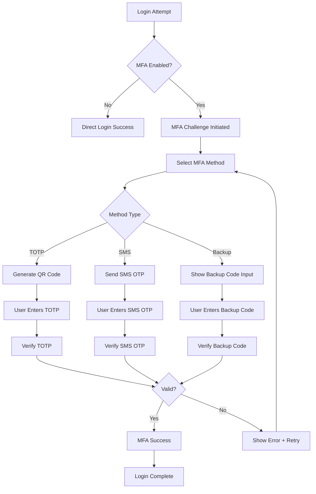

# Multi-Factor Authentication (MFA)

## 📋 Overview

The AppEx Affiliation Portal implements a comprehensive multi-factor authentication system that provides multiple layers of security while maintaining usability for the Zimbabwean market. The system supports TOTP, SMS OTP, and backup codes with flexible configuration options.

## 🏗️ MFA Architecture

### MFA Flow Diagram



### Supported MFA Methods

| Method | Security Level | User Experience | Zimbabwe Suitability | Implementation |
|--------|----------------|------------------|---------------------|----------------|
| **TOTP** | High | Excellent | Good | Speakeasy + QR codes |
| **SMS OTP** | Medium | Good | Excellent | Africa's Talking API |
| **Backup Codes** | High | Fair | Good | 10 single-use codes |
| **Email OTP** | Low-Medium | Good | Good | SMTP delivery |

### MFA Configuration Schema

```typescript
// shared/types/mfa.ts
export const MfaSetupSchema = z.object({
  method: z.enum(['TOTP', 'SMS', 'BACKUP_CODES']),
  
  // TOTP specific
  secret: z.string().optional(),
  
  // SMS specific
  phoneNumber: z.string().regex(/^(077|071|078|079)\d{7}$/).optional(),
  
  // Backup codes specific
  codesCount: z.number().min(5).max(20).default(10),
  
  // Common settings
  isPrimary: z.boolean().default(false),
  isActive: z.boolean().default(true),
  
  // Security settings
  requireMfaForLogin: z.boolean().default(true),
  requireMfaForSensitive: z.boolean().default(true),
  trustedDeviceDuration: z.number().default(30) // days
})

export const MfaVerificationSchema = z.object({
  code: z.string(),
  method: z.enum(['TOTP', 'SMS', 'BACKUP_CODES']),
  sessionId: z.string(),
  rememberDevice: z.boolean().default(false)
})

export type MfaSetupInput = z.infer<typeof MfaSetupSchema>
export type MfaVerificationInput = z.infer<typeof MfaVerificationSchema>
```

## 🔧 MFA Implementation

### TOTP Setup Handler

```typescript
// api/src/routes/auth/mfa/setup-totp.ts
import speakeasy from 'speakeasy'
import QRCode from 'qrcode'
import crypto from 'crypto'
import { PrismaClient } from '@prisma/client'

const prisma = new PrismaClient()

export const setupTotpHandler = async (req: Request, res: Response) => {
  const userId = req.user.id
  
  try {
    // Check if TOTP is already enabled
    const existingTotp = await prisma.mfaMethod.findFirst({
      where: {
        userId,
        methodType: 'TOTP',
        isActive: true
      }
    })
    
    if (existingTotp) {
      return res.status(400).json({
        error: 'TOTP_ALREADY_ENABLED',
        message: 'TOTP is already enabled for your account'
      })
    }
    
    // Generate TOTP secret
    const secret = speakeasy.generateSecret({
      name: `AppexAffiliate:${req.user.email}`,
      issuer: 'AppEx Affiliation Portal',
      length: 20
    })
    
    // Store secret temporarily (not activated yet)
    await redis.setex(
      `mfa_pending:${userId}`,
      600, // 10 minutes
      JSON.stringify({
        secret: secret.base32,
        methodType: 'TOTP',
        createdAt: new Date().toISOString()
      })
    )
    
    // Generate QR code as data URI
    const qrCode = await QRCode.toDataURL(secret.otpauth_url!, {
      width: 256,
      margin: 2,
      color: {
        dark: '#000000',
        light: '#FFFFFF'
      }
    })
    
    // Generate backup codes
    const backupCodes = await generateBackupCodes(userId)
    
    // Log MFA setup initiation
    await logSecurityEvent({
      userId,
      eventType: 'MFA_SETUP_INITIATED',
      metadata: { method: 'TOTP' }
    })
    
    res.json({
      secret: secret.base32,
      qrCode,
      manualEntryKey: secret.base32,
      backupCodes,
      instructions: {
        step1: 'Scan the QR code with your authenticator app',
        step2: 'Or manually enter the key in your app',
        step3: 'Enter the 6-digit code to verify setup',
        step4: 'Save your backup codes in a secure location'
      },
      supportedApps: [
        'Google Authenticator',
        'Microsoft Authenticator',
        'Authy',
        '1Password',
        'LastPass Authenticator'
      ]
    })
    
  } catch (error) {
    console.error('TOTP setup error:', error)
    res.status(500).json({
      error: 'SETUP_FAILED',
      message: 'Failed to setup TOTP. Please try again.'
    })
  }
}

export const verifyAndEnableTotpHandler = async (req: Request, res: Response) => {
  const userId = req.user.id
  const { otp, secret } = req.body
  
  try {
    // Get pending setup data
    const pendingData = await redis.get(`mfa_pending:${userId}`)
    if (!pendingData) {
      return res.status(400).json({
        error: 'SETUP_EXPIRED',
        message: 'Setup session expired. Please start over.'
      })
    }
    
    const setupData = JSON.parse(pendingData)
    
    // Verify OTP
    const verified = speakeasy.totp.verify({
      secret: secret || setupData.secret,
      encoding: 'base32',
      token: otp,
      window: 1, // Allow 1 step time drift (30 seconds)
      time: Math.floor(Date.now() / 1000)
    })
    
    if (!verified) {
      await logSecurityEvent({
        userId,
        eventType: 'MFA_SETUP_FAILED',
        metadata: { method: 'TOTP', reason: 'INVALID_OTP' }
      })
      
      return res.status(400).json({
        error: 'INVALID_OTP',
        message: 'Invalid verification code. Please try again.'
      })
    }
    
    // Enable MFA for user
    await prisma.$transaction([
      // Update user
      prisma.user.update({
        where: { id: userId },
        data: {
          mfaEnabled: true,
          mfaEnabledAt: new Date()
        }
      }),
      
      // Create MFA method record
      prisma.mfaMethod.create({
        data: {
          userId,
          methodType: 'TOTP',
          isActive: true,
          isPrimary: true,
          secret: encrypt(setupData.secret), // Encrypt at rest
          lastUsedAt: new Date(),
          setupCompletedAt: new Date()
        }
      })
    ])
    
    // Clear pending setup data
    await redis.del(`mfa_pending:${userId}`)
    
    // Log successful MFA setup
    await logSecurityEvent({
      userId,
      eventType: 'MFA_ENABLED',
      metadata: { method: 'TOTP' }
    })
    
    // Send confirmation email
    await emailQueue.add('send-mfa-enabled-notification', {
      to: req.user.email,
      method: 'TOTP',
      setupTime: new Date().toISOString()
    })
    
    res.json({
      success: true,
      message: 'TOTP authentication enabled successfully',
      nextSteps: [
        'Save your backup codes securely',
        'Test your authenticator app',
        'Configure trusted devices if needed'
      ]
    })
    
  } catch (error) {
    console.error('TOTP verification error:', error)
    res.status(500).json({
      error: 'VERIFICATION_FAILED',
      message: 'Failed to verify TOTP setup.'
    })
  }
}
```

### SMS OTP Handler

```typescript
// api/src/routes/auth/mfa/setup-sms.ts
export const setupSmsMfaHandler = async (req: Request, res: Response) => {
  const userId = req.user.id
  const { phoneNumber } = req.body
  
  try {
    // Validate phone number (Zimbabwe format)
    if (!/^(077|071|078|079)\d{7}$/.test(phoneNumber)) {
      return res.status(400).json({
        error: 'INVALID_PHONE',
        message: 'Invalid Zimbabwean phone number format'
      })
    }
    
    // Check if SMS MFA is already enabled
    const existingSms = await prisma.mfaMethod.findFirst({
      where: {
        userId,
        methodType: 'SMS',
        isActive: true
      }
    })
    
    if (existingSms) {
      return res.status(400).json({
        error: 'SMS_MFA_ALREADY_ENABLED',
        message: 'SMS MFA is already enabled for your account'
      })
    }
    
    // Generate verification OTP
    const otp = crypto.randomInt(100000, 999999).toString()
    
    // Store OTP temporarily
    await redis.setex(
      `mfa_sms_verify:${userId}`,
      600, // 10 minutes
      JSON.stringify({
        phoneNumber,
        otp: await bcrypt.hash(otp, 10),
        createdAt: new Date().toISOString()
      })
    )
    
    // Send OTP via SMS
    await smsQueue.add('send-mfa-sms', {
      to: phoneNumber,
      otp,
      template: 'MFA_SETUP',
      language: req.user.preferredLanguage || 'en'
    }, {
      attempts: 3,
      backoff: { type: 'exponential', delay: 2000 }
    })
    
    // Log MFA SMS setup initiation
    await logSecurityEvent({
      userId,
      eventType: 'MFA_SMS_SETUP_INITIATED',
      metadata: { phoneNumber }
    })
    
    res.json({
      message: 'Verification code sent to your phone',
      phoneNumber: maskPhoneNumber(phoneNumber),
      expiresIn: 600, // 10 minutes
      nextStep: 'verify_sms_otp'
    })
    
  } catch (error) {
    console.error('SMS MFA setup error:', error)
    res.status(500).json({
      error: 'SMS_SETUP_FAILED',
      message: 'Failed to setup SMS MFA. Please try again.'
    })
  }
}

export const verifyAndEnableSmsMfaHandler = async (req: Request, res: Response) => {
  const userId = req.user.id
  const { otp } = req.body
  
  try {
    // Get verification data
    const verifyData = await redis.get(`mfa_sms_verify:${userId}`)
    if (!verifyData) {
      return res.status(400).json({
        error: 'VERIFICATION_EXPIRED',
        message: 'Verification code expired. Please request a new one.'
      })
    }
    
    const data = JSON.parse(verifyData)
    
    // Verify OTP
    const isValid = await bcrypt.compare(otp, data.otp)
    if (!isValid) {
      await logSecurityEvent({
        userId,
        eventType: 'MFA_SMS_SETUP_FAILED',
        metadata: { reason: 'INVALID_OTP' }
      })
      
      return res.status(400).json({
        error: 'INVALID_OTP',
        message: 'Invalid verification code'
      })
    }
    
    // Enable SMS MFA
    await prisma.$transaction([
      prisma.user.update({
        where: { id: userId },
        data: {
          mfaEnabled: true,
          mfaEnabledAt: new Date(),
          phoneVerified: true,
          phoneVerifiedAt: new Date()
        }
      }),
      
      prisma.mfaMethod.create({
        data: {
          userId,
          methodType: 'SMS',
          isActive: true,
          phoneNumber: data.phoneNumber,
          isPrimary: false, // TOTP is usually primary
          setupCompletedAt: new Date()
        }
      })
    ])
    
    // Clear verification data
    await redis.del(`mfa_sms_verify:${userId}`)
    
    // Log successful SMS MFA setup
    await logSecurityEvent({
      userId,
      eventType: 'MFA_SMS_ENABLED',
      metadata: { phoneNumber: data.phoneNumber }
    })
    
    res.json({
      success: true,
      message: 'SMS MFA enabled successfully',
      phoneNumber: maskPhoneNumber(data.phoneNumber)
    })
    
  } catch (error) {
    console.error('SMS MFA verification error:', error)
    res.status(500).json({
      error: 'SMS_VERIFICATION_FAILED',
      message: 'Failed to verify SMS MFA setup.'
    })
  }
}
```

### Backup Codes Generation

```typescript
// api/src/routes/auth/mfa/backup-codes.ts
export const generateBackupCodesHandler = async (req: Request, res: Response) => {
  const userId = req.user.id
  
  try {
    // Check if user has MFA enabled
    const user = await prisma.user.findUnique({
      where: { id: userId },
      select: { mfaEnabled: true }
    })
    
    if (!user?.mfaEnabled) {
      return res.status(400).json({
        error: 'MFA_NOT_ENABLED',
        message: 'Please enable MFA before generating backup codes'
      })
    }
    
    // Generate new backup codes
    const codes = await generateBackupCodes(userId)
    
    // Log backup codes generation
    await logSecurityEvent({
      userId,
      eventType: 'BACKUP_CODES_GENERATED',
      metadata: { codesCount: codes.length }
    })
    
    res.json({
      backupCodes: codes,
      instructions: [
        'Save these codes in a secure location',
        'Each code can only be used once',
        'Generate new codes if you suspect compromise',
        'These codes expire when you generate new ones'
      ],
      warning: 'These codes will not be shown again. Save them securely!'
    })
    
  } catch (error) {
    console.error('Backup codes generation error:', error)
    res.status(500).json({
      error: 'BACKUP_CODES_GENERATION_FAILED',
      message: 'Failed to generate backup codes'
    })
  }
}

// Generate secure backup codes
async function generateBackupCodes(userId: string): Promise<string[]> {
  const codes: string[] = []
  const hashedCodes: string[] = []
  
  // Generate 10 backup codes (8 characters each, alphanumeric)
  for (let i = 0; i < 10; i++) {
    const code = crypto.randomBytes(4).toString('hex').toUpperCase()
    codes.push(code)
    hashedCodes.push(await bcrypt.hash(code, 10))
  }
  
  // Store hashed codes in database
  await prisma.$transaction([
    // Deactivate existing backup codes
    prisma.backupCode.updateMany({
      where: { userId },
      data: { isActive: false }
    }),
    
    // Create new backup codes
    prisma.backupCode.createMany({
      data: hashedCodes.map((hash, index) => ({
        userId,
        codeHash: hash,
        codeIndex: index,
        isActive: true,
        createdAt: new Date()
      }))
    })
  ])
  
  return codes
}

export const verifyBackupCodeHandler = async (req: Request, res: Response) => {
  const userId = req.user.id
  const { code } = req.body
  
  try {
    // Get active backup codes for user
    const backupCodes = await prisma.backupCode.findMany({
      where: {
        userId,
        isActive: true
      },
      orderBy: { createdAt: 'desc' }
    })
    
    // Verify backup code
    let verifiedCode = null
    for (const backupCode of backupCodes) {
      if (await bcrypt.compare(code, backupCode.codeHash)) {
        verifiedCode = backupCode
        break
      }
    }
    
    if (!verifiedCode) {
      await logSecurityEvent({
        userId,
        eventType: 'BACKUP_CODE_VERIFICATION_FAILED',
        metadata: { attempts: backupCodes.length }
      })
      
      return res.status(400).json({
        error: 'INVALID_BACKUP_CODE',
        message: 'Invalid backup code'
      })
    }
    
    // Mark backup code as used
    await prisma.backupCode.update({
      where: { id: verifiedCode.id },
      data: { 
        isActive: false,
        usedAt: new Date()
      }
    })
    
    // Check if user has remaining backup codes
    const remainingCodes = await prisma.backupCode.count({
      where: {
        userId,
        isActive: true
      }
    })
    
    // Log backup code usage
    await logSecurityEvent({
      userId,
      eventType: 'BACKUP_CODE_USED',
      metadata: { 
        codeIndex: verifiedCode.codeIndex,
        remainingCodes
      }
    })
    
    // Send warning if low on backup codes
    if (remainingCodes <= 2) {
      await emailQueue.add('send-backup-codes-low-warning', {
        to: req.user.email,
        remainingCodes
      })
    }
    
    res.json({
      success: true,
      remainingCodes,
      warning: remainingCodes <= 2 ? 
        'You have few backup codes remaining. Consider generating new ones.' : 
        undefined
    })
    
  } catch (error) {
    console.error('Backup code verification error:', error)
    res.status(500).json({
      error: 'BACKUP_CODE_VERIFICATION_FAILED',
      message: 'Failed to verify backup code'
    })
  }
}
```

## 🔐 MFA Challenge System

### MFA Challenge Initiation

```typescript
// services/mfa/challenge.service.ts
export class MfaChallengeService {
  
  static async initiateChallenge(userId: string, deviceFingerprint: string): Promise<MfaChallenge> {
    const user = await prisma.user.findUnique({
      where: { id: userId },
      include: {
        mfaMethods: {
          where: { isActive: true },
          orderBy: { isPrimary: 'desc' }
        }
      }
    })
    
    if (!user || !user.mfaEnabled) {
      throw new Error('MFA not enabled for user')
    }
    
    // Check if this is a trusted device
    const isTrustedDevice = await this.checkTrustedDevice(userId, deviceFingerprint)
    
    if (isTrustedDevice) {
      // Skip MFA for trusted devices
      return {
        id: 'trusted-device',
        userId,
        required: false,
        availableMethods: [],
        expiresAt: new Date(Date.now() + 24 * 60 * 60 * 1000) // 24 hours
      }
    }
    
    // Create MFA challenge session
    const challengeId = crypto.randomUUID()
    const expiresAt = new Date(Date.now() + 10 * 60 * 1000) // 10 minutes
    
    await redis.setex(
      `mfa_challenge:${challengeId}`,
      600,
      JSON.stringify({
        userId,
        deviceFingerprint,
        attempts: 0,
        maxAttempts: 3,
        createdAt: new Date().toISOString(),
        expiresAt: expiresAt.toISOString()
      })
    )
    
    // Determine available methods
    const availableMethods = user.mfaMethods.map(method => method.methodType)
    
    // If only one method, auto-initiate
    if (availableMethods.length === 1) {
      await this.initiateMethod(challengeId, availableMethods[0], user)
    }
    
    return {
      id: challengeId,
      userId,
      required: true,
      availableMethods,
      expiresAt,
      isTrustedDevice: false
    }
  }
  
  static async verifyChallenge(
    challengeId: string, 
    code: string, 
    method: string,
    deviceFingerprint: string
  ): Promise<MfaVerificationResult> {
    // Get challenge data
    const challengeData = await redis.get(`mfa_challenge:${challengeId}`)
    if (!challengeData) {
      throw new Error('Challenge expired or invalid')
    }
    
    const challenge = JSON.parse(challengeData)
    
    // Check attempts
    if (challenge.attempts >= challenge.maxAttempts) {
      await redis.del(`mfa_challenge:${challengeId}`)
      throw new Error('Too many verification attempts')
    }
    
    // Verify code based on method
    let isValid = false
    try {
      switch (method) {
        case 'TOTP':
          isValid = await this.verifyTotpCode(challenge.userId, code)
          break
        case 'SMS':
          isValid = await this.verifySmsCode(challenge.userId, code)
          break
        case 'BACKUP_CODES':
          isValid = await this.verifyBackupCode(challenge.userId, code)
          break
        default:
          throw new Error('Unsupported MFA method')
      }
    } catch (error) {
      console.error('MFA verification error:', error)
      isValid = false
    }
    
    if (!isValid) {
      // Increment attempts
      challenge.attempts++
      await redis.setex(
        `mfa_challenge:${challengeId}`,
        600,
        JSON.stringify(challenge)
      )
      
      throw new Error(`Invalid ${method} code`)
    }
    
    // Mark challenge as completed
    await redis.del(`mfa_challenge:${challengeId}`)
    
    // Update last used timestamp for method
    await prisma.mfaMethod.updateMany({
      where: {
        userId: challenge.userId,
        methodType: method
      },
      data: {
        lastUsedAt: new Date()
      }
    })
    
    return {
      success: true,
      method,
      userId: challenge.userId,
      verifiedAt: new Date()
    }
  }
  
  private static async checkTrustedDevice(userId: string, deviceFingerprint: string): Promise<boolean> {
    const trustedDevice = await prisma.trustedDevice.findFirst({
      where: {
        userId,
        deviceFingerprint,
        expiresAt: { gt: new Date() }
      }
    })
    
    return !!trustedDevice
  }
  
  private static async initiateMethod(challengeId: string, method: string, user: any): Promise<void> {
    switch (method) {
      case 'SMS':
        const smsMethod = user.mfaMethods.find(m => m.methodType === 'SMS')
        if (smsMethod) {
          const otp = crypto.randomInt(100000, 999999).toString()
          
          await redis.setex(
            `mfa_sms:${challengeId}`,
            600,
            JSON.stringify({
              otp: await bcrypt.hash(otp, 10),
              phoneNumber: smsMethod.phoneNumber,
              createdAt: new Date().toISOString()
            })
          )
          
          await smsQueue.add('send-mfa-challenge-sms', {
            to: smsMethod.phoneNumber,
            otp,
            challengeId
          })
        }
        break
        
      case 'TOTP':
        // TOTP doesn't need initiation - user just enters code from app
        break
        
      case 'BACKUP_CODES':
        // Backup codes don't need initiation
        break
    }
  }
}

interface MfaChallenge {
  id: string
  userId: string
  required: boolean
  availableMethods: string[]
  expiresAt: Date
  isTrustedDevice?: boolean
}

interface MfaVerificationResult {
  success: boolean
  method: string
  userId: string
  verifiedAt: Date
}
```

### Trusted Device Management

```typescript
// api/src/routes/auth/mfa/trusted-devices.ts
export const addTrustedDeviceHandler = async (req: Request, res: Response) => {
  const userId = req.user.id
  const { deviceName, duration = 30 } = req.body // Default 30 days
  
  try {
    const deviceFingerprint = req.deviceFingerprint
    
    // Check if device is already trusted
    const existingDevice = await prisma.trustedDevice.findFirst({
      where: {
        userId,
        deviceFingerprint,
        expiresAt: { gt: new Date() }
      }
    })
    
    if (existingDevice) {
      return res.status(400).json({
        error: 'DEVICE_ALREADY_TRUSTED',
        message: 'This device is already trusted'
      })
    }
    
    // Add trusted device
    await prisma.trustedDevice.create({
      data: {
        userId,
        deviceFingerprint,
        deviceName: deviceName || 'Unknown Device',
        expiresAt: new Date(Date.now() + duration * 24 * 60 * 60 * 1000),
        ipAddress: req.ip,
        userAgent: req.headers['user-agent']
      }
    })
    
    // Log trusted device addition
    await logSecurityEvent({
      userId,
      eventType: 'TRUSTED_DEVICE_ADDED',
      metadata: { deviceName, duration }
    })
    
    res.json({
      success: true,
      message: 'Device added to trusted devices',
      expiresAt: new Date(Date.now() + duration * 24 * 60 * 60 * 1000)
    })
    
  } catch (error) {
    console.error('Add trusted device error:', error)
    res.status(500).json({
      error: 'ADD_TRUSTED_DEVICE_FAILED',
      message: 'Failed to add trusted device'
    })
  }
}

export const listTrustedDevicesHandler = async (req: Request, res: Response) => {
  const userId = req.user.id
  
  try {
    const trustedDevices = await prisma.trustedDevice.findMany({
      where: {
        userId,
        expiresAt: { gt: new Date() }
      },
      select: {
        id: true,
        deviceName: true,
        ipAddress: true,
        userAgent: true,
        createdAt: true,
        expiresAt: true,
        lastUsedAt: true
      },
      orderBy: { lastUsedAt: 'desc' }
    })
    
    // Enrich with location and device info
    const enrichedDevices = await Promise.all(
      trustedDevices.map(async (device) => ({
        ...device,
        location: await getLocationFromIp(device.ipAddress),
        deviceInfo: parseUserAgent(device.userAgent),
        isCurrentDevice: device.deviceFingerprint === req.deviceFingerprint
      }))
    )
    
    res.json({ trustedDevices: enrichedDevices })
    
  } catch (error) {
    console.error('List trusted devices error:', error)
    res.status(500).json({
      error: 'LIST_TRUSTED_DEVICES_FAILED',
      message: 'Failed to list trusted devices'
    })
  }
}

export const removeTrustedDeviceHandler = async (req: Request, res: Response) => {
  const userId = req.user.id
  const { deviceId } = req.params
  
  try {
    const device = await prisma.trustedDevice.findFirst({
      where: {
        id: deviceId,
        userId
      }
    })
    
    if (!device) {
      return res.status(404).json({
        error: 'DEVICE_NOT_FOUND',
        message: 'Trusted device not found'
      })
    }
    
    // Remove trusted device
    await prisma.trustedDevice.delete({
      where: { id: deviceId }
    })
    
    // Log trusted device removal
    await logSecurityEvent({
      userId,
      eventType: 'TRUSTED_DEVICE_REMOVED',
      metadata: { deviceName: device.deviceName }
    })
    
    res.json({
      success: true,
      message: 'Trusted device removed successfully'
    })
    
  } catch (error) {
    console.error('Remove trusted device error:', error)
    res.status(500).json({
      error: 'REMOVE_TRUSTED_DEVICE_FAILED',
      message: 'Failed to remove trusted device'
    })
  }
}
```

## 📊 MFA Analytics & Monitoring

### MFA Usage Analytics

```typescript
// services/mfa/analytics.service.ts
export class MfaAnalytics {
  
  static async getMfaMetrics(timeframe: 'day' | 'week' | 'month' = 'day'): Promise<MfaMetrics> {
    const now = new Date()
    const startDate = this.getStartDate(timeframe, now)
    
    const [
      totalMfaUsers,
      mfaByMethod,
      mfaVerificationAttempts,
      mfaSuccessRate,
      trustedDeviceUsage,
      backupCodeUsage
    ] = await Promise.all([
      this.getTotalMfaUsers(),
      this.getMfaByMethod(startDate, now),
      this.getMfaVerificationAttempts(startDate, now),
      this.getMfaSuccessRate(startDate, now),
      this.getTrustedDeviceUsage(startDate, now),
      this.getBackupCodeUsage(startDate, now)
    ])
    
    return {
      timeframe,
      totalMfaUsers,
      mfaByMethod,
      verificationAttempts: mfaVerificationAttempts,
      successRate: mfaSuccessRate,
      trustedDeviceUsage,
      backupCodeUsage,
      averageSetupTime: await this.getAverageSetupTime(startDate, now)
    }
  }
  
  static async getMfaAdoptionRate(): Promise<number> {
    const totalActiveUsers = await prisma.user.count({
      where: { status: 'ACTIVE' }
    })
    
    const mfaEnabledUsers = await prisma.user.count({
      where: { 
        status: 'ACTIVE',
        mfaEnabled: true
      }
    })
    
    return totalActiveUsers > 0 ? mfaEnabledUsers / totalActiveUsers : 0
  }
  
  static async getMfaSecurityEvents(): Promise<SecurityEvent[]> {
    return await prisma.securityEvent.findMany({
      where: {
        eventType: {
          in: [
            'MFA_ENABLED', 'MFA_DISABLED', 'MFA_SETUP_FAILED',
            'MFA_VERIFICATION_FAILED', 'BACKUP_CODE_USED',
            'TRUSTED_DEVICE_ADDED', 'TRUSTED_DEVICE_REMOVED'
          ]
        },
        createdAt: { gte: new Date(Date.now() - 7 * 24 * 60 * 60 * 1000) } // Last 7 days
      },
      include: {
        user: {
          select: { email: true, fullName: true }
        }
      },
      orderBy: { createdAt: 'desc' },
      take: 50
    })
  }
}

interface MfaMetrics {
  timeframe: string
  totalMfaUsers: number
  mfaByMethod: Array<{ method: string; count: number }>
  verificationAttempts: number
  successRate: number
  trustedDeviceUsage: number
  backupCodeUsage: number
  averageSetupTime: number
}
```

### MFA Security Monitoring

```typescript
// services/mfa/security-monitoring.service.ts
export class MfaSecurityMonitor {
  
  static async detectMfaAnomalies(): Promise<MfaAnomaly[]> {
    const anomalies: MfaAnomaly[] = []
    
    // Check for rapid MFA failures
    const rapidFailures = await this.detectRapidMfaFailures()
    anomalies.push(...rapidFailures)
    
    // Check for backup code depletion
    const backupCodeDepletion = await this.detectBackupCodeDepletion()
    anomalies.push(...backupCodeDepletion)
    
    // Check for unusual MFA patterns
    const unusualPatterns = await this.detectUnusualMfaPatterns()
    anomalies.push(...unusualPatterns)
    
    return anomalies
  }
  
  private static async detectRapidMfaFailures(): Promise<MfaAnomaly[]> {
    const anomalies: MfaAnomaly[] = []
    
    // Find users with multiple MFA failures in short time
    const recentFailures = await prisma.securityEvent.groupBy({
      by: ['userId'],
      where: {
        eventType: 'MFA_VERIFICATION_FAILED',
        createdAt: { gte: new Date(Date.now() - 60 * 60 * 1000) } // Last hour
      },
      _count: { eventType: true },
      having: {
        eventType: { _count: { gt: 5 } }
      }
    })
    
    for (const failure of recentFailures) {
      anomalies.push({
        type: 'RAPID_MFA_FAILURES',
        severity: 'HIGH',
        userId: failure.userId,
        count: failure._count.eventType,
        description: `User has ${failure._count.eventType} MFA failures in the last hour`,
        recommendation: 'Consider temporary account lockout or contact user'
      })
    }
    
    return anomalies
  }
  
  private static async detectBackupCodeDepletion(): Promise<MfaAnomaly[]> {
    const anomalies: MfaAnomaly[] = []
    
    // Find users with low backup codes
    const lowBackupCodes = await prisma.backupCode.groupBy({
      by: ['userId'],
      where: {
        isActive: true
      },
      _count: { id: true },
      having: {
        id: { _count: { lte: 2 } }
      }
    })
    
    for (const user of lowBackupCodes) {
      anomalies.push({
        type: 'LOW_BACKUP_CODES',
        severity: 'MEDIUM',
        userId: user.userId,
        count: user._count.id,
        description: `User has only ${user._count.id} backup codes remaining`,
        recommendation: 'Send reminder to generate new backup codes'
      })
    }
    
    return anomalies
  }
}

interface MfaAnomaly {
  type: string
  severity: 'LOW' | 'MEDIUM' | 'HIGH' | 'CRITICAL'
  userId: string
  count: number
  description: string
  recommendation: string
}
```

## 📋 MFA Configuration

### Environment Variables

```bash
# MFA Configuration
MFA_TOTP_ISSUER=AppEx Affiliation Portal
MFA_TOTP_WINDOW=1
MFA_SMS_PROVIDER=africas-talking
MFA_SMS_TEMPLATE_ID=MFA_VERIFICATION
MFA_BACKUP_CODES_COUNT=10
MFA_TRUSTED_DEVICE_DURATION=30
MFA_MAX_ATTEMPTS=3
MFA_CHALLENGE_TIMEOUT=600

# Security
MFA_ENCRYPTION_KEY=your-encryption-key
DEVICE_FINGERPRINT_SALT=your-fingerprint-salt
```

### Database Schema for MFA

```sql
-- MFA Methods table
CREATE TABLE mfa_methods (
    id UUID PRIMARY KEY DEFAULT gen_random_uuid(),
    user_id UUID NOT NULL REFERENCES users(id) ON DELETE CASCADE,
    method_type TEXT NOT NULL, -- TOTP, SMS, BACKUP_CODES
    is_active BOOLEAN DEFAULT TRUE,
    is_primary BOOLEAN DEFAULT FALSE,
    
    -- Method-specific data
    secret TEXT, -- Encrypted TOTP secret
    phone_number TEXT, -- For SMS method
    
    -- Metadata
    last_used_at TIMESTAMP,
    setup_completed_at TIMESTAMP DEFAULT NOW(),
    created_at TIMESTAMP DEFAULT NOW(),
    
    UNIQUE(user_id, method_type)
);

-- Backup Codes table
CREATE TABLE backup_codes (
    id UUID PRIMARY KEY DEFAULT gen_random_uuid(),
    user_id UUID NOT NULL REFERENCES users(id) ON DELETE CASCADE,
    code_hash TEXT NOT NULL,
    code_index INTEGER NOT NULL,
    is_active BOOLEAN DEFAULT TRUE,
    used_at TIMESTAMP,
    created_at TIMESTAMP DEFAULT NOW()
);

-- Trusted Devices table
CREATE TABLE trusted_devices (
    id UUID PRIMARY KEY DEFAULT gen_random_uuid(),
    user_id UUID NOT NULL REFERENCES users(id) ON DELETE CASCADE,
    device_fingerprint TEXT NOT NULL,
    device_name TEXT,
    ip_address INET,
    user_agent TEXT,
    expires_at TIMESTAMP NOT NULL,
    last_used_at TIMESTAMP DEFAULT NOW(),
    created_at TIMESTAMP DEFAULT NOW(),
    
    UNIQUE(user_id, device_fingerprint)
);

-- Indexes for performance
CREATE INDEX idx_mfa_methods_user_active ON mfa_methods(user_id, is_active);
CREATE INDEX idx_backup_codes_user_active ON backup_codes(user_id, is_active);
CREATE INDEX idx_trusted_devices_user_expires ON trusted_devices(user_id, expires_at);
```

## 📋 MFA Implementation Checklist

### Security Requirements
- [ ] TOTP with time window tolerance
- [ ] SMS OTP with rate limiting
- [ ] Backup codes with single-use enforcement
- [ ] Trusted device management
- [ ] MFA challenge session management
- [ ] Comprehensive audit logging

### Usability Requirements
- [ ] Multiple MFA method support
- [ ] Clear setup instructions
- [ ] QR code generation for TOTP
- [ ] Backup code recovery options
- [ ] Trusted device convenience
- [ ] Multi-language support

### Integration Requirements
- [ ] Africa's Talking SMS integration
- [ ] Email notification system
- [ ] Security event logging
- [ ] Analytics and monitoring
- [ ] Rate limiting and abuse prevention
- [ ] Zimbabwe compliance considerations

---

**Next**: [Password Security & Reset Flow](./password-security.md) → Password policies and reset procedures documentation
