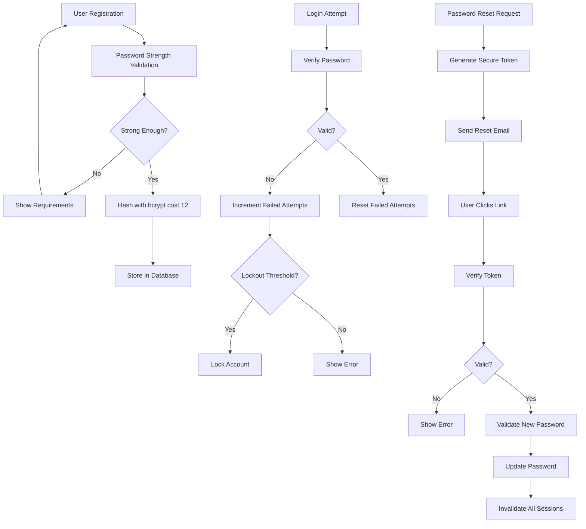

# Password Security & Reset Flow

## 📋 Overview

The AppEx Affiliation Portal implements a comprehensive password security system that follows OWASP guidelines and Zimbabwean compliance requirements. This system includes strong password policies, secure reset flows, and protection against common password attacks.

## 🔐 Password Security Architecture

### Password Security Flow



### Password Security Requirements

| Requirement | Specification | Rationale |
|-------------|----------------|-----------|
| **Minimum Length** | 12 characters | Prevents brute force attacks |
| **Complexity** | Uppercase, lowercase, numbers, special characters | Increases entropy |
| **Hashing** | bcrypt with cost factor 12 | Slow hashing prevents attacks |
| **Salt** | Per-password salt | Prevents rainbow table attacks |
| **History** | Prevent reuse of last 5 passwords | Prevents password cycling |
| **Expiry** | Optional 90-day expiry for high-risk accounts | Reduces exposure time |
| **Breach Check** | Against HaveIBeenPwned API | Prevents compromised passwords |

## 🔧 Password Implementation

### Password Validation Service

```typescript
// services/password/password-validator.service.ts
import bcrypt from 'bcrypt'
import crypto from 'crypto'

export class PasswordValidator {
  
  static async validatePasswordStrength(password: string, userId?: string): Promise<PasswordValidationResult> {
    const requirements: string[] = []
    const feedback: string[] = []
    let score = 0
    
    // Length requirement
    if (password.length >= 12) {
      score++
    } else {
      requirements.push('At least 12 characters')
      feedback.push('Password should be at least 12 characters long')
    }
    
    // Uppercase letter
    if (/[A-Z]/.test(password)) {
      score++
    } else {
      requirements.push('At least one uppercase letter')
      feedback.push('Include at least one uppercase letter (A-Z)')
    }
    
    // Lowercase letter
    if (/[a-z]/.test(password)) {
      score++
    } else {
      requirements.push('At least one lowercase letter')
      feedback.push('Include at least one lowercase letter (a-z)')
    }
    
    // Number
    if (/[0-9]/.test(password)) {
      score++
    } else {
      requirements.push('At least one number')
      feedback.push('Include at least one number (0-9)')
    }
    
    // Special character
    if (/[^A-Za-z0-9]/.test(password)) {
      score++
    } else {
      requirements.push('At least one special character')
      feedback.push('Include at least one special character (!@#$%^&*)')
    }
    
    // Check against common passwords
    const isCommon = await this.checkCommonPassword(password)
    if (isCommon) {
      score = 0
      feedback.push('This password is too common. Please choose a more unique password.')
    }
    
    // Check for personal information
    if (userId) {
      const containsPersonalInfo = await this.checkPersonalInfo(password, userId)
      if (containsPersonalInfo) {
        score = Math.max(0, score - 1)
        feedback.push('Password should not contain personal information')
      }
    }
    
    // Check for dictionary words
    const containsDictionaryWords = await this.checkDictionaryWords(password)
    if (containsDictionaryWords) {
      score = Math.max(0, score - 1)
      feedback.push('Avoid using common words or patterns')
    }
    
    // Calculate entropy
    const entropy = this.calculateEntropy(password)
    if (entropy < 60) {
      feedback.push('Password has low entropy. Consider adding more variety')
    }
    
    const isValid = score >= 4 && !isCommon && entropy >= 60
    
    return {
      isValid,
      score,
      strength: this.getStrengthLevel(score),
      requirements,
      feedback,
      entropy
    }
  }
  
  private static async checkCommonPassword(password: string): Promise<boolean> {
    // Check against HaveIBeenPwned API
    try {
      const hash = crypto.createHash('sha1').update(password).digest('hex').toUpperCase()
      const prefix = hash.substring(0, 5)
      const suffix = hash.substring(5)
      
      const response = await fetch(`https://api.pwnedpasswords.com/range/${prefix}`)
      const data = await response.text()
      
      return data.split('\n').some(line => line.startsWith(suffix))
    } catch (error) {
      console.error('Failed to check HaveIBeenPwned:', error)
      // Fallback to local common password list
      const commonPasswords = [
        'password', '123456', 'qwerty', 'password123', 'admin',
        'zimbabwe', 'harare', '2023', '2024', '123456789',
        'welcome', 'monkey', 'dragon', 'master', 'sunshine'
      ]
      return commonPasswords.includes(password.toLowerCase())
    }
  }
  
  private static async checkPersonalInfo(password: string, userId: string): Promise<boolean> {
    const user = await prisma.user.findUnique({
      where: { id: userId },
      select: {
        email: true,
        fullName: true,
        phone: true,
        nationalId: true,
        businessName: true
      }
    })
    
    if (!user) return false
    
    const personalInfo = [
      user.email.split('@')[0],
      ...user.fullName.split(' '),
      user.phone?.substring(3), // Remove country code
      user.nationalId?.substring(0, 8), // Remove check digit
      user.businessName
    ].filter(Boolean)
    
    const passwordLower = password.toLowerCase()
    
    return personalInfo.some(info => 
      info && passwordLower.includes(info.toLowerCase())
    )
  }
  
  private static async checkDictionaryWords(password: string): Promise<boolean> {
    // Simple dictionary word check (can be enhanced with proper dictionary)
    const commonWords = [
      'welcome', 'password', 'admin', 'user', 'login',
      'zimbabwe', 'harare', 'bulawayo', 'affiliation',
      'portal', 'business', 'money', 'cash'
    ]
    
    const passwordLower = password.toLowerCase()
    
    return commonWords.some(word => passwordLower.includes(word))
  }
  
  private static calculateEntropy(password: string): number {
    let charsetSize = 0
    
    if (/[a-z]/.test(password)) charsetSize += 26
    if (/[A-Z]/.test(password)) charsetSize += 26
    if (/[0-9]/.test(password)) charsetSize += 10
    if (/[^A-Za-z0-9]/.test(password)) charsetSize += 32
    
    return password.length * Math.log2(charsetSize)
  }
  
  private static getStrengthLevel(score: number): 'WEAK' | 'FAIR' | 'GOOD' | 'STRONG' {
    if (score <= 2) return 'WEAK'
    if (score <= 3) return 'FAIR'
    if (score <= 4) return 'GOOD'
    return 'STRONG'
  }
}

interface PasswordValidationResult {
  isValid: boolean
  score: number
  strength: 'WEAK' | 'FAIR' | 'GOOD' | 'STRONG'
  requirements: string[]
  feedback: string[]
  entropy: number
}
```

### Password Hashing Service

```typescript
// services/password/password-hashing.service.ts
import bcrypt from 'bcrypt'

export class PasswordHashingService {
  
  private static readonly BCRYPT_COST = 12
  
  static async hashPassword(password: string): Promise<string> {
    try {
      const salt = await bcrypt.genSalt(this.BCRYPT_COST)
      return await bcrypt.hash(password, salt)
    } catch (error) {
      console.error('Password hashing error:', error)
      throw new Error('Failed to hash password')
    }
  }
  
  static async verifyPassword(password: string, hash: string): Promise<boolean> {
    try {
      return await bcrypt.compare(password, hash)
    } catch (error) {
      console.error('Password verification error:', error)
      return false
    }
  }
  
  static async checkPasswordHistory(userId: string, newPassword: string): Promise<boolean> {
    const recentPasswords = await prisma.passwordHistory.findMany({
      where: { userId },
      orderBy: { createdAt: 'desc' },
      take: 5
    })
    
    for (const oldPassword of recentPasswords) {
      const isReused = await this.verifyPassword(newPassword, oldPassword.passwordHash)
      if (isReused) {
        return false // Password was reused
      }
    }
    
    return true // Password is not in recent history
  }
  
  static async savePasswordHistory(userId: string, passwordHash: string): Promise<void> {
    await prisma.passwordHistory.create({
      data: {
        userId,
        passwordHash
      }
    })
    
    // Clean up old password history (keep only last 5)
    const oldPasswords = await prisma.passwordHistory.findMany({
      where: { userId },
      orderBy: { createdAt: 'desc' },
      skip: 5,
      select: { id: true }
    })
    
    if (oldPasswords.length > 0) {
      await prisma.passwordHistory.deleteMany({
        where: {
          id: { in: oldPasswords.map(p => p.id) }
        }
      })
    }
  }
}
```

## 🔄 Password Reset Flow

### Password Reset Request

```typescript
// api/src/routes/auth/password/reset-request.ts
export const forgotPasswordHandler = async (req: Request, res: Response) => {
  const { email } = req.body
  
  try {
    // Normalize email
    const normalizedEmail = email.toLowerCase().trim()
    
    // Always return success to prevent user enumeration
    const user = await prisma.user.findUnique({
      where: { email: normalizedEmail },
      select: {
        id: true,
        email: true,
        fullName: true,
        status: true,
        lastPasswordResetAt: true
      }
    })
    
    if (!user || user.status !== 'ACTIVE') {
      // Generic response for security
      return res.json({
        message: 'If an account exists with this email, you will receive password reset instructions.',
        nextStep: 'check_email'
      })
    }
    
    // Rate limiting check (3 requests per hour per email)
    const rateKey = `password_reset:${normalizedEmail}`
    const attempts = await redis.incr(rateKey)
    if (attempts === 1) await redis.expire(rateKey, 3600) // 1 hour
    if (attempts > 3) {
      await logSecurityEvent({
        userId: user.id,
        eventType: 'PASSWORD_RESET_RATE_LIMIT_EXCEEDED',
        ipAddress: req.ip,
        userAgent: req.headers['user-agent'],
        metadata: { email: normalizedEmail, attempts }
      })
      
      return res.json({
        message: 'If an account exists with this email, you will receive password reset instructions.',
        nextStep: 'check_email'
      })
    }
    
    // Check if there's a recent password reset request
    const recentReset = await prisma.passwordReset.findFirst({
      where: {
        user: { email: normalizedEmail },
        createdAt: { gte: new Date(Date.now() - 15 * 60 * 1000) }, // Last 15 minutes
        used: false
      }
    })
    
    if (recentReset) {
      return res.json({
        message: 'A password reset email has already been sent recently. Please check your email or wait before requesting again.',
        nextStep: 'check_email'
      })
    }
    
    // Generate secure reset token
    const resetToken = crypto.randomBytes(32).toString('hex')
    const resetTokenHash = await bcrypt.hash(resetToken, 10)
    
    // Store reset token with 1 hour expiry
    const expiresAt = new Date(Date.now() + 60 * 60 * 1000)
    
    await prisma.passwordReset.create({
      data: {
        userId: user.id,
        tokenHash: resetTokenHash,
        expiresAt,
        ipAddress: req.ip,
        userAgent: req.headers['user-agent']
      }
    })
    
    // Create reset link
    const resetLink = `${process.env.FRONTEND_URL}/reset-password?token=${resetToken}&email=${encodeURIComponent(normalizedEmail)}`
    
    // Send password reset email
    await emailQueue.add('send-password-reset-email', {
      to: user.email,
      resetLink,
      userName: user.fullName.split(' ')[0],
      ipAddress: req.ip,
      expiresIn: '1 hour',
      language: user.preferredLanguage || 'en'
    }, {
      attempts: 3,
      backoff: { type: 'exponential', delay: 2000 }
    })
    
    // Log password reset request
    await logSecurityEvent({
      userId: user.id,
      eventType: 'PASSWORD_RESET_REQUESTED',
      ipAddress: req.ip,
      userAgent: req.headers['user-agent'],
      metadata: { 
        email: normalizedEmail,
        expiresIn: '1 hour'
      }
    })
    
    res.json({
      message: 'If an account exists with this email, you will receive password reset instructions.',
      nextStep: 'check_email',
      expiresIn: '1 hour'
    })
    
  } catch (error) {
    console.error('Password reset request error:', error)
    
    // Still return generic message for security
    res.json({
      message: 'If an account exists with this email, you will receive password reset instructions.',
      nextStep: 'check_email'
    })
  }
}
```

### Password Reset Confirmation

```typescript
// api/src/routes/auth/password/reset-confirm.ts
export const resetPasswordHandler = async (req: Request, res: Response) => {
  const { token, email, newPassword, confirmPassword } = req.body
  
  try {
    // Validate input
    if (newPassword !== confirmPassword) {
      return res.status(400).json({
        error: 'PASSWORDS_MISMATCH',
        message: 'Passwords do not match'
      })
    }
    
    // Validate new password strength
    const passwordValidation = await PasswordValidator.validatePasswordStrength(newPassword)
    if (!passwordValidation.isValid) {
      return res.status(400).json({
        error: 'WEAK_PASSWORD',
        message: 'Password does not meet security requirements',
        requirements: passwordValidation.requirements,
        feedback: passwordValidation.feedback
      })
    }
    
    // Find valid reset request
    const resetRequest = await prisma.passwordReset.findFirst({
      where: {
        user: { email: email.toLowerCase() },
        expiresAt: { gt: new Date() },
        used: false
      },
      include: { user: true }
    })
    
    if (!resetRequest) {
      await logSecurityEvent({
        eventType: 'PASSWORD_RESET_INVALID_TOKEN',
        ipAddress: req.ip,
        userAgent: req.headers['user-agent'],
        metadata: { email }
      })
      
      return res.status(400).json({
        error: 'INVALID_OR_EXPIRED_TOKEN',
        message: 'Reset token is invalid or has expired'
      })
    }
    
    // Verify reset token
    const tokenValid = await bcrypt.compare(token, resetRequest.tokenHash)
    if (!tokenValid) {
      await logSecurityEvent({
        userId: resetRequest.userId,
        eventType: 'PASSWORD_RESET_INVALID_TOKEN',
        ipAddress: req.ip,
        userAgent: req.headers['user-agent'],
        metadata: { attempts: 1 }
      })
      
      return res.status(400).json({
        error: 'INVALID_TOKEN',
        message: 'Invalid reset token'
      })
    }
    
    // Check password history
    const passwordHistoryValid = await PasswordHashingService.checkPasswordHistory(
      resetRequest.userId, 
      newPassword
    )
    
    if (!passwordHistoryValid) {
      return res.status(400).json({
        error: 'PASSWORD_REUSE',
        message: 'You cannot reuse any of your last 5 passwords'
      })
    }
    
    // Hash new password
    const newPasswordHash = await PasswordHashingService.hashPassword(newPassword)
    
    // Get user's active sessions for invalidation
    const activeSessions = await prisma.session.findMany({
      where: {
        userId: resetRequest.userId,
        isActive: true
      },
      select: { refreshTokenJti: true }
    })
    
    // Perform atomic password reset
    await prisma.$transaction([
      // Update user password
      prisma.user.update({
        where: { id: resetRequest.userId },
        data: {
          passwordHash: newPasswordHash,
          passwordChangedAt: new Date(),
          lastPasswordResetAt: new Date(),
          failedLoginAttempts: 0,
          lockedUntil: null, // Unlock account if locked
          lockReason: null
        }
      }),
      
      // Save to password history
      prisma.passwordHistory.create({
        data: {
          userId: resetRequest.userId,
          passwordHash: newPasswordHash
        }
      }),
      
      // Mark reset token as used
      prisma.passwordReset.update({
        where: { id: resetRequest.id },
        data: { 
          used: true, 
          usedAt: new Date(),
          ipAddress: req.ip
        }
      }),
      
      // Invalidate all existing sessions
      prisma.session.updateMany({
        where: { userId: resetRequest.userId },
        data: { isActive: false }
      })
    ])
    
    // Revoke all refresh tokens in Redis
    const pipeline = redis.pipeline()
    for (const session of activeSessions) {
      if (session.refreshTokenJti) {
        pipeline.setex(`revoked:${session.refreshTokenJti}`, 7 * 24 * 3600, 'password_reset')
        pipeline.del(`refresh:${session.refreshTokenJti}`)
      }
    }
    await pipeline.exec()
    
    // Log successful password reset
    await logSecurityEvent({
      userId: resetRequest.userId,
      eventType: 'PASSWORD_RESET_COMPLETED',
      ipAddress: req.ip,
      userAgent: req.headers['user-agent'],
      metadata: {
        passwordStrength: passwordValidation.strength,
        sessionsInvalidated: activeSessions.length
      }
    })
    
    // Send confirmation email
    await emailQueue.add('send-password-reset-confirmation', {
      to: resetRequest.user.email,
      userName: resetRequest.user.fullName.split(' ')[0],
      resetTime: new Date().toISOString(),
      ipAddress: req.ip,
      language: resetRequest.user.preferredLanguage || 'en'
    })
    
    // Send security alert if suspicious
    const isSuspicious = await detectSuspiciousReset(resetRequest.userId, req.ip)
    if (isSuspicious) {
      await emailQueue.add('send-security-alert', {
        to: resetRequest.user.email,
        alertType: 'PASSWORD_RESET',
        details: {
          ipAddress: req.ip,
          location: await getLocationFromIp(req.ip),
          userAgent: req.headers['user-agent']
        }
      })
    }
    
    res.json({
      success: true,
      message: 'Password reset successful. Please login with your new password.',
      nextStep: 'login'
    })
    
  } catch (error) {
    console.error('Password reset error:', error)
    res.status(500).json({
      error: 'RESET_FAILED',
      message: 'Password reset failed. Please try again.'
    })
  }
}

// Detect suspicious password reset activity
async function detectSuspiciousReset(userId: string, ipAddress: string): Promise<boolean> {
  const recentLogins = await prisma.securityEvent.findMany({
    where: {
      userId,
      eventType: 'LOGIN_SUCCESS',
      createdAt: { gte: new Date(Date.now() - 24 * 60 * 60 * 1000) } // Last 24 hours
    },
    select: { ipAddress: true },
    orderBy: { createdAt: 'desc' },
    take: 5
  })
  
  const previousIps = recentLogins.map(login => login.ipAddress)
  
  // Suspicious if reset IP doesn't match recent login IPs
  return !previousIps.includes(ipAddress) && previousIps.length > 0
}
```

### Password Change Handler

```typescript
// api/src/routes/auth/password/change.ts
export const changePasswordHandler = async (req: Request, res: Response) => {
  const userId = req.user.id
  const { currentPassword, newPassword, confirmPassword } = req.body
  
  try {
    // Validate input
    if (newPassword !== confirmPassword) {
      return res.status(400).json({
        error: 'PASSWORDS_MISMATCH',
        message: 'New passwords do not match'
      })
    }
    
    // Get current user
    const user = await prisma.user.findUnique({
      where: { id: userId },
      select: {
        passwordHash: true,
        email: true,
        fullName: true,
        lastPasswordChangeAt: true
      }
    })
    
    if (!user) {
      return res.status(404).json({
        error: 'USER_NOT_FOUND',
        message: 'User not found'
      })
    }
    
    // Verify current password
    const currentPasswordValid = await PasswordHashingService.verifyPassword(
      currentPassword, 
      user.passwordHash
    )
    
    if (!currentPasswordValid) {
      await logSecurityEvent({
        userId,
        eventType: 'PASSWORD_CHANGE_FAILED',
        ipAddress: req.ip,
        userAgent: req.headers['user-agent'],
        metadata: { reason: 'INVALID_CURRENT_PASSWORD' }
      })
      
      return res.status(400).json({
        error: 'INVALID_CURRENT_PASSWORD',
        message: 'Current password is incorrect'
      })
    }
    
    // Check if new password is same as current
    const sameAsCurrent = await PasswordHashingService.verifyPassword(
      newPassword, 
      user.passwordHash
    )
    
    if (sameAsCurrent) {
      return res.status(400).json({
        error: 'SAME_PASSWORD',
        message: 'New password must be different from current password'
      })
    }
    
    // Validate new password strength
    const passwordValidation = await PasswordValidator.validatePasswordStrength(newPassword, userId)
    if (!passwordValidation.isValid) {
      return res.status(400).json({
        error: 'WEAK_PASSWORD',
        message: 'New password does not meet security requirements',
        requirements: passwordValidation.requirements,
        feedback: passwordValidation.feedback
      })
    }
    
    // Check password history
    const passwordHistoryValid = await PasswordHashingService.checkPasswordHistory(
      userId, 
      newPassword
    )
    
    if (!passwordHistoryValid) {
      return res.status(400).json({
        error: 'PASSWORD_REUSE',
        message: 'You cannot reuse any of your last 5 passwords'
      })
    }
    
    // Hash new password
    const newPasswordHash = await PasswordHashingService.hashPassword(newPassword)
    
    // Update password
    await prisma.$transaction([
      prisma.user.update({
        where: { id: userId },
        data: {
          passwordHash: newPasswordHash,
          passwordChangedAt: new Date(),
          lastPasswordChangeAt: new Date()
        }
      }),
      
      prisma.passwordHistory.create({
        data: {
          userId,
          passwordHash: newPasswordHash
        }
      })
    ])
    
    // Log successful password change
    await logSecurityEvent({
      userId,
      eventType: 'PASSWORD_CHANGED',
      ipAddress: req.ip,
      userAgent: req.headers['user-agent'],
      metadata: {
        passwordStrength: passwordValidation.strength,
        entropy: passwordValidation.entropy
      }
    })
    
    // Send confirmation email
    await emailQueue.add('send-password-change-notification', {
      to: user.email,
      userName: user.fullName.split(' ')[0],
      changeTime: new Date().toISOString(),
      ipAddress: req.ip,
      language: user.preferredLanguage || 'en'
    })
    
    res.json({
      success: true,
      message: 'Password changed successfully',
      strength: passwordValidation.strength
    })
    
  } catch (error) {
    console.error('Password change error:', error)
    res.status(500).json({
      error: 'CHANGE_FAILED',
      message: 'Password change failed. Please try again.'
    })
  }
}
```

## 📊 Password Security Analytics

### Password Strength Analytics

```typescript
// services/password/password-analytics.service.ts
export class PasswordAnalytics {
  
  static async getPasswordStrengthMetrics(): Promise<PasswordMetrics> {
    const [
      totalUsers,
      weakPasswords,
      strongPasswords,
      averageEntropy,
      passwordHistoryUsage,
      recentPasswordChanges
    ] = await Promise.all([
      this.getTotalUsers(),
      this.getWeakPasswordCount(),
      this.getStrongPasswordCount(),
      this.getAveragePasswordEntropy(),
      this.getPasswordHistoryUsage(),
      this.getRecentPasswordChanges()
    ])
    
    return {
      totalUsers,
      weakPasswords,
      strongPasswords,
      weakPasswordPercentage: totalUsers > 0 ? weakPasswords / totalUsers : 0,
      strongPasswordPercentage: totalUsers > 0 ? strongPasswords / totalUsers : 0,
      averageEntropy,
      passwordHistoryUsage,
      recentPasswordChanges
    }
  }
  
  static async getPasswordResetMetrics(timeframe: 'day' | 'week' | 'month' = 'day'): Promise<PasswordResetMetrics> {
    const now = new Date()
    const startDate = this.getStartDate(timeframe, now)
    
    const [
      totalResets,
      successfulResets,
      failedResets,
      suspiciousResets,
      averageResetTime
    ] = await Promise.all([
      this.getTotalPasswordResets(startDate, now),
      this.getSuccessfulPasswordResets(startDate, now),
      this.getFailedPasswordResets(startDate, now),
      this.getSuspiciousPasswordResets(startDate, now),
      this.getAverageResetTime(startDate, now)
    ])
    
    return {
      timeframe,
      totalResets,
      successfulResets,
      failedResets,
      suspiciousResets,
      successRate: totalResets > 0 ? successfulResets / totalResets : 0,
      averageResetTime
    }
  }
  
  static async getPasswordSecurityEvents(): Promise<SecurityEvent[]> {
    return await prisma.securityEvent.findMany({
      where: {
        eventType: {
          in: [
            'PASSWORD_RESET_REQUESTED', 'PASSWORD_RESET_COMPLETED',
            'PASSWORD_CHANGED', 'PASSWORD_CHANGE_FAILED',
            'PASSWORD_RESET_RATE_LIMIT_EXCEEDED', 'PASSWORD_RESET_INVALID_TOKEN'
          ]
        },
        createdAt: { gte: new Date(Date.now() - 7 * 24 * 60 * 60 * 1000) } // Last 7 days
      },
      include: {
        user: {
          select: { email: true, fullName: true }
        }
      },
      orderBy: { createdAt: 'desc' },
      take: 50
    })
  }
}

interface PasswordMetrics {
  totalUsers: number
  weakPasswords: number
  strongPasswords: number
  weakPasswordPercentage: number
  strongPasswordPercentage: number
  averageEntropy: number
  passwordHistoryUsage: number
  recentPasswordChanges: number
}

interface PasswordResetMetrics {
  timeframe: string
  totalResets: number
  successfulResets: number
  failedResets: number
  suspiciousResets: number
  successRate: number
  averageResetTime: number
}
```

## 📧 Email Templates

### Password Reset Email Template

```html
<!-- templates/email/password-reset.html -->
<!DOCTYPE html>
<html>
<head>
    <meta charset="utf-8">
    <title>Password Reset - AppEx Affiliation Portal</title>
    <style>
        body { font-family: Arial, sans-serif; max-width: 600px; margin: 0 auto; line-height: 1.6; }
        .header { background: #dc2626; color: white; padding: 20px; text-align: center; }
        .content { padding: 20px; }
        .button { display: inline-block; background: #dc2626; color: white; padding: 12px 24px; text-decoration: none; border-radius: 4px; margin: 20px 0; }
        .warning { background: #fef3c7; border: 1px solid #f59e0b; padding: 15px; border-radius: 4px; margin: 20px 0; }
        .footer { background: #f9fafb; padding: 20px; text-align: center; font-size: 12px; color: #6b7280; }
    </style>
</head>
<body>
    <div class="header">
        <h1>AppEx Affiliation Portal</h1>
        <p>Password Reset Request</p>
    </div>
    
    <div class="content">
        <h2>Hello {{userName}},</h2>
        
        <p>We received a request to reset your password for your AppEx Affiliation Portal account.</p>
        
        <p>If you made this request, please click the button below to reset your password:</p>
        
        <div style="text-align: center;">
            <a href="{{resetLink}}" class="button">Reset Password</a>
        </div>
        
        <p><strong>This link will expire in 1 hour.</strong></p>
        
        <div class="warning">
            <strong>Security Notice:</strong>
            <ul>
                <li>The reset request was initiated from IP: {{ipAddress}}</li>
                <li>If you didn't request this reset, please ignore this email</li>
                <li>Your password will remain unchanged if you don't click the link</li>
                <li>Never share this link with anyone</li>
            </ul>
        </div>
        
        <p>If the button doesn't work, you can copy and paste this link into your browser:</p>
        <p style="word-break: break-all; background: #f3f4f6; padding: 10px; border-radius: 4px;">{{resetLink}}</p>
        
        <p>If you didn't request this password reset, please contact our support team immediately:</p>
        <p>
            📧 Email: support@appex.co.zw<br>
            📞 Phone: +263 242 123 456<br>
            📍 Address: 123 Samora Machel Ave, Harare, Zimbabwe
        </p>
    </div>
    
    <div class="footer">
        <p>© 2026 AppEx Affiliation Portal | Built for Zimbabwean entrepreneurs</p>
        <p>This is an automated message. Please do not reply to this email.</p>
    </div>
</body>
</html>
```

### Password Change Confirmation Template

```html
<!-- templates/email/password-change-confirmation.html -->
<!DOCTYPE html>
<html>
<head>
    <meta charset="utf-8">
    <title>Password Changed - AppEx Affiliation Portal</title>
    <style>
        body { font-family: Arial, sans-serif; max-width: 600px; margin: 0 auto; line-height: 1.6; }
        .header { background: #059669; color: white; padding: 20px; text-align: center; }
        .content { padding: 20px; }
        .success { background: #d1fae5; border: 1px solid #10b981; padding: 15px; border-radius: 4px; margin: 20px 0; }
        .footer { background: #f9fafb; padding: 20px; text-align: center; font-size: 12px; color: #6b7280; }
    </style>
</head>
<body>
    <div class="header">
        <h1>AppEx Affiliation Portal</h1>
        <p>Password Changed Successfully</p>
    </div>
    
    <div class="content">
        <h2>Hello {{userName}},</h2>
        
        <div class="success">
            <strong>✅ Your password has been changed successfully!</strong>
        </div>
        
        <p>Here are the details of your password change:</p>
        <ul>
            <li><strong>Time:</strong> {{changeTime}}</li>
            <li><strong>IP Address:</strong> {{ipAddress}}</li>
            <li><strong>All sessions:</strong> Have been invalidated for security</li>
        </ul>
        
        <p><strong>Important Security Information:</strong></p>
        <ul>
            <li>You have been logged out of all devices</li>
            <li>You will need to login with your new password</li>
            <li>All active sessions have been terminated</li>
            <li>If you didn't make this change, contact us immediately</li>
        </ul>
        
        <p>To login with your new password, visit:</p>
        <p><a href="https://appex.co.zw/login">https://appex.co.zw/login</a></p>
        
        <p>If you didn't change your password, please contact our security team immediately:</p>
        <p>
            📧 Email: security@appex.co.zw<br>
            📞 Phone: +263 242 123 456<br>
            📍 Address: 123 Samora Machel Ave, Harare, Zimbabwe
        </p>
    </div>
    
    <div class="footer">
        <p>© 2026 AppEx Affiliation Portal | Built for Zimbabwean entrepreneurs</p>
        <p>This is an automated message. Please do not reply to this email.</p>
    </div>
</body>
</html>
```

## 📋 Password Security Checklist

### Security Requirements
- [ ] Minimum 12-character password length
- [ ] Complexity requirements (uppercase, lowercase, numbers, special characters)
- [ ] bcrypt hashing with cost factor 12
- [ ] Password history (prevent reuse of last 5 passwords)
- [ ] Secure token generation for password resets
- [ ] Rate limiting on reset requests
- [ ] Session invalidation on password change

### Usability Requirements
- [ ] Clear password strength indicators
- [ ] Real-time password validation feedback
- [ ] Password reset via email
- [ ] Password change functionality
- [ ] Multi-language support
- [ ] Mobile-friendly interface

### Compliance Requirements
- [ ] OWASP password guidelines compliance
- [ ] Zimbabwe Cyber Act compliance
- [ ] Data protection measures
- [ ] Audit trail for password changes
- [ ] User consent for password storage
- [ ] Secure password transmission

---

**Next**: [Social Authentication](./social-auth.md) → OAuth integration and account linking documentation
