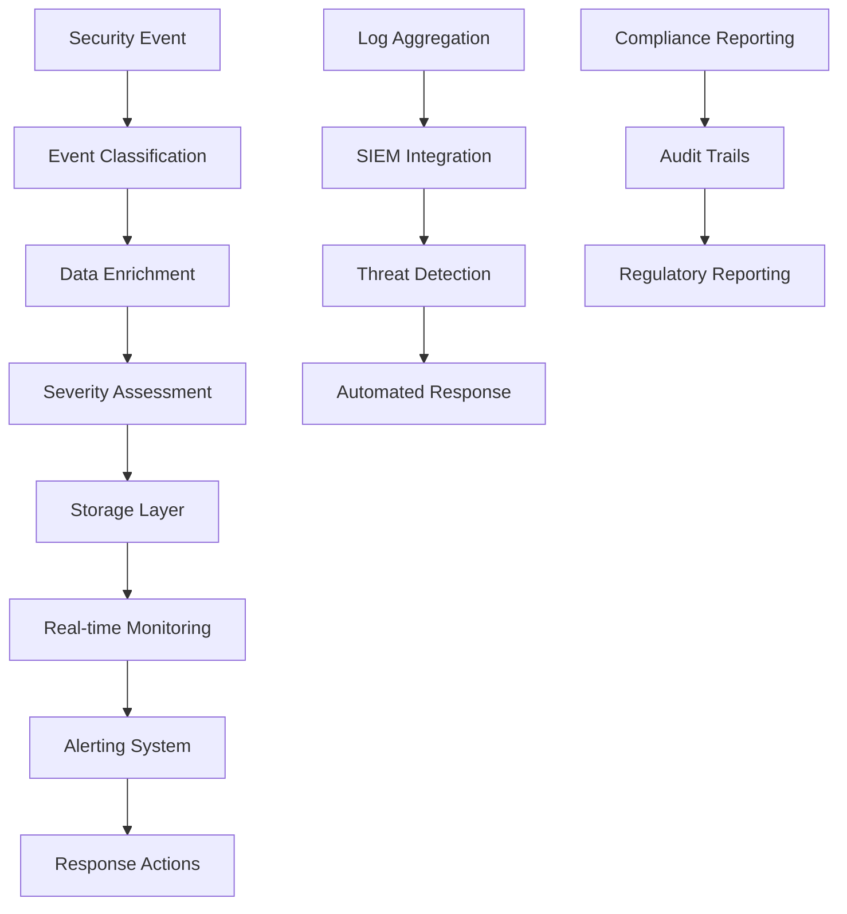

# Security Event Logging

## 📋 Overview

The AppEx Affiliation Portal implements comprehensive security event logging to monitor, detect, and respond to security threats. This system provides real-time visibility into authentication activities, compliance reporting, and forensic analysis capabilities while adhering to Zimbabwean data protection regulations.

## 🔐 Logging Architecture

### Event Logging Flow



### Event Categories

| Category | Events | Severity | Retention |
|----------|--------|----------|-----------|
| **Authentication** | Login, Logout, Token Refresh | LOW-MEDIUM | 2 years |
| **Authorization** | Access Granted, Access Denied | MEDIUM | 2 years |
| **Security Violations** | Brute Force, Suspicious Activity | HIGH-CRITICAL | 7 years |
| **Account Management** | Registration, Password Change | LOW-MEDIUM | 2 years |
| **MFA Events** | Setup, Verification, Backup Code Use | MEDIUM | 2 years |
| **Session Management** | Creation, Revocation, Device Tracking | LOW-MEDIUM | 1 year |
| **Data Access** | Sensitive Data Access, Export | MEDIUM-HIGH | 5 years |
| **System Events** | Configuration Changes, Errors | LOW-HIGH | 1 year |

## 🔧 Event Logging Implementation

### Security Event Service

```typescript
// services/security/security-logging.service.ts
import { PrismaClient } from '@prisma/client'
import crypto from 'crypto'
import { Redis } from 'ioredis'

const prisma = new PrismaClient()

export class SecurityLoggingService {
  
  static async logEvent(eventData: SecurityEventData): Promise<void> {
    try {
      // Validate event data
      const validatedEvent = this.validateEventData(eventData)
      
      // Enrich event data
      const enrichedEvent = await this.enrichEventData(validatedEvent)
      
      // Assess severity
      const severity = this.assessSeverity(enrichedEvent)
      
      // Store in database
      await this.storeEvent(enrichedEvent, severity)
      
      // Store in Redis for real-time monitoring
      await this.storeRealtimeEvent(enrichedEvent, severity)
      
      // Trigger alerts if needed
      if (severity === 'HIGH' || severity === 'CRITICAL') {
        await this.triggerAlerts(enrichedEvent, severity)
      }
      
      // Update metrics
      await this.updateMetrics(enrichedEvent, severity)
      
    } catch (error) {
      console.error('Failed to log security event:', error)
      // Fallback to local logging
      this.logToErrorLog(eventData, error)
    }
  }
  
  private static validateEventData(eventData: SecurityEventData): SecurityEventData {
    const requiredFields = ['eventType']
    
    for (const field of requiredFields) {
      if (!eventData[field as keyof SecurityEventData]) {
        throw new Error(`Missing required field: ${field}`)
      }
    }
    
    return {
      ...eventData,
      timestamp: eventData.timestamp || new Date(),
      eventId: eventData.eventId || crypto.randomUUID(),
      metadata: eventData.metadata || {}
    }
  }
  
  private static async enrichEventData(eventData: SecurityEventData): Promise<EnrichedSecurityEvent> {
    const enriched: EnrichedSecurityEvent = {
      ...eventData,
      eventId: eventData.eventId || crypto.randomUUID(),
      timestamp: eventData.timestamp || new Date(),
      
      // Add IP geolocation
      location: eventData.ipAddress ? await this.getLocationData(eventData.ipAddress) : null,
      
      // Add device analysis
      deviceInfo: eventData.userAgent ? this.analyzeDevice(eventData.userAgent) : null,
      
      // Add risk assessment
      riskScore: await this.calculateRiskScore(eventData),
      
      // Add session context
      sessionContext: eventData.userId ? await this.getSessionContext(eventData.userId) : null
    }
    
    return enriched
  }
  
  private static assessSeverity(event: EnrichedSecurityEvent): SecuritySeverity {
    // Base severity from event type
    const baseSeverity = this.getBaseSeverity(event.eventType)
    
    // Adjust based on risk score
    if (event.riskScore >= 80) return 'CRITICAL'
    if (event.riskScore >= 60) return 'HIGH'
    if (event.riskScore >= 40) return 'MEDIUM'
    
    // Adjust based on user trust level
    if (event.sessionContext?.user.trustLevel >= 4) {
      // High trust users get lower severity for some events
      if (['LOGIN_FAILED', 'MFA_FAILED'].includes(event.eventType)) {
        return this.downgradeSeverity(baseSeverity)
      }
    }
    
    return baseSeverity
  }
  
  private static async storeEvent(event: EnrichedSecurityEvent, severity: SecuritySeverity): Promise<void> {
    await prisma.securityEvent.create({
      data: {
        id: event.eventId,
        userId: event.userId,
        eventType: event.eventType,
        severity,
        ipAddress: event.ipAddress,
        userAgent: event.userAgent,
        metadata: {
          ...event.metadata,
          location: event.location,
          deviceInfo: event.deviceInfo,
          riskScore: event.riskScore,
          sessionContext: event.sessionContext
        },
        createdAt: event.timestamp
      }
    })
  }
  
  private static async storeRealtimeEvent(event: EnrichedSecurityEvent, severity: SecuritySeverity): Promise<void> {
    const redisKey = `security:events:${severity.toLowerCase()}`
    const eventData = {
      eventId: event.eventId,
      eventType: event.eventType,
      userId: event.userId,
      timestamp: event.timestamp.toISOString(),
      location: event.location,
      riskScore: event.riskScore
    }
    
    // Store in Redis list (keep last 1000 events per severity)
    await redis.lpush(redisKey, JSON.stringify(eventData))
    await redis.ltrim(redisKey, 0, 999)
    await redis.expire(redisKey, 24 * 60 * 60) // 24 hours
    
    // Store in user-specific timeline
    if (event.userId) {
      const userKey = `security:user:${event.userId}:timeline`
      await redis.lpush(userKey, JSON.stringify(eventData))
      await redis.ltrim(userKey, 0, 99) // Keep last 100 events
      await redis.expire(userKey, 7 * 24 * 60 * 60) // 7 days
    }
  }
  
  private static async triggerAlerts(event: EnrichedSecurityEvent, severity: SecuritySeverity): Promise<void> {
    const alertData = {
      eventId: event.eventId,
      eventType: event.eventType,
      severity,
      userId: event.userId,
      timestamp: event.timestamp,
      location: event.location,
      riskScore: event.riskScore,
      metadata: event.metadata
    }
    
    // Send to alerting system
    await redis.lpush('security:alerts', JSON.stringify(alertData))
    
    // Send immediate notifications for critical events
    if (severity === 'CRITICAL') {
      await this.sendCriticalAlert(alertData)
    }
    
    // Check for alert patterns
    await this.checkAlertPatterns(event)
  }
  
  private static async sendCriticalAlert(alertData: any): Promise<void> {
    // Notify security team
    await emailQueue.add('send-critical-security-alert', {
      to: process.env.SECURITY_TEAM_EMAIL!,
      alertData,
      timestamp: new Date().toISOString()
    })
    
    // Send SMS for immediate attention
    if (process.env.SECURITY_TEAM_SMS) {
      await smsQueue.add('send-critical-sms', {
        to: process.env.SECURITY_TEAM_SMS!,
        message: `CRITICAL: ${alertData.eventType} - User: ${alertData.userId} - Risk: ${alertData.riskScore}`
      })
    }
    
    // Log to critical events channel
    console.error('CRITICAL SECURITY ALERT:', JSON.stringify(alertData, null, 2))
  }
  
  private static async checkAlertPatterns(event: EnrichedSecurityEvent): Promise<void> {
    // Check for multiple failed attempts from same IP
    const ipKey = `security:pattern:failed_attempts:${event.ipAddress}`
    const failedCount = await redis.incr(ipKey)
    await redis.expire(ipKey, 300) // 5 minutes
    
    if (failedCount >= 10) {
      await this.triggerPatternAlert('MULTIPLE_FAILED_ATTEMPTS', {
        ipAddress: event.ipAddress,
        count: failedCount,
        timeframe: '5 minutes'
      })
    }
    
    // Check for rapid account creation
    if (event.eventType === 'REGISTRATION_INITIATED') {
      const regKey = `security:pattern:registrations:${event.ipAddress}`
      const regCount = await redis.incr(regKey)
      await redis.expire(regKey, 3600) // 1 hour
      
      if (regCount >= 5) {
        await this.triggerPatternAlert('RAPID_REGISTRATION', {
          ipAddress: event.ipAddress,
          count: regCount,
          timeframe: '1 hour'
        })
      }
    }
  }
  
  private static async triggerPatternAlert(pattern: string, data: any): Promise<void> {
    const alertData = {
      pattern,
      severity: 'HIGH',
      timestamp: new Date().toISOString(),
      data
    }
    
    await redis.lpush('security:pattern_alerts', JSON.stringify(alertData))
    
    // Send notification to security team
    await emailQueue.add('send-pattern-alert', {
      to: process.env.SECURITY_TEAM_EMAIL!,
      pattern,
      data
    })
  }
  
  private static async getLocationData(ipAddress: string): Promise<LocationData | null> {
    try {
      // Use IP geolocation service
      const response = await fetch(`https://ipapi.co/${ipAddress}/json/`)
      const data = await response.json()
      
      return {
        ip: ipAddress,
        country: data.country_name,
        countryCode: data.country_code,
        region: data.region,
        city: data.city,
        latitude: parseFloat(data.latitude),
        longitude: parseFloat(data.longitude),
        timezone: data.timezone,
        isProxy: data.org?.includes('proxy') || false,
        isVpn: data.org?.includes('vpn') || false
      }
    } catch (error) {
      console.error('Failed to get location data:', error)
      return null
    }
  }
  
  private static analyzeDevice(userAgent: string): DeviceInfo | null {
    const ua = userAgent.toLowerCase()
    
    return {
      browser: this.detectBrowser(ua),
      os: this.detectOS(ua),
      device: this.detectDevice(ua),
      isBot: this.isBot(ua),
      isMobile: /mobile|android|iphone|ipad/i.test(ua)
    }
  }
  
  private static async calculateRiskScore(event: SecurityEventData): Promise<number> {
    let score = 0
    
    // Base score from event type
    const eventScores: Record<string, number> = {
      'LOGIN_SUCCESS': 5,
      'LOGIN_FAILED': 20,
      'MFA_FAILED': 30,
      'ACCOUNT_LOCKED': 50,
      'TOKEN_THEFT_DETECTED': 80,
      'BRUTE_FORCE_DETECTED': 70,
      'SUSPICIOUS_ACTIVITY': 40
    }
    
    score += eventScores[event.eventType] || 10
    
    // IP reputation
    if (event.ipAddress) {
      const ipReputation = await this.getIPReputation(event.ipAddress)
      score += ipReputation.riskScore
    }
    
    // Time-based factors
    const hour = new Date().getHours()
    if (hour >= 2 && hour <= 5) {
      score += 10 // Unusual hours
    }
    
    // User trust level (if available)
    if (event.userId) {
      const user = await prisma.user.findUnique({
        where: { id: event.userId },
        select: { trustLevel: true, failedLoginAttempts: true }
      })
      
      if (user) {
        score -= user.trustLevel * 5 // Higher trust = lower risk
        score += user.failedLoginAttempts * 5 // More failures = higher risk
      }
    }
    
    return Math.max(0, Math.min(100, score))
  }
  
  private static async getSessionContext(userId: string): Promise<SessionContext | null> {
    const session = await prisma.session.findFirst({
      where: { userId, isActive: true },
      include: {
        user: {
          select: {
            trustLevel: true,
            email: true,
            fullName: true,
            mfaEnabled: true
          }
        }
      },
      orderBy: { lastUsedAt: 'desc' }
    })
    
    if (!session) return null
    
    return {
      sessionId: session.id,
      deviceFingerprint: session.deviceFingerprint,
      deviceName: session.deviceName,
      lastUsedAt: session.lastUsedAt,
      user: session.user
    }
  }
  
  private static getBaseSeverity(eventType: string): SecuritySeverity {
    const severityMap: Record<string, SecuritySeverity> = {
      'LOGIN_SUCCESS': 'LOW',
      'LOGIN_FAILED': 'MEDIUM',
      'MFA_ENABLED': 'LOW',
      'MFA_FAILED': 'MEDIUM',
      'PASSWORD_CHANGED': 'LOW',
      'ACCOUNT_LOCKED': 'HIGH',
      'TOKEN_THEFT_DETECTED': 'CRITICAL',
      'BRUTE_FORCE_DETECTED': 'CRITICAL',
      'SUSPICIOUS_ACTIVITY': 'HIGH',
      'SESSION_REVOKED': 'MEDIUM',
      'REGISTRATION_INITIATED': 'LOW',
      'EMAIL_VERIFIED': 'LOW',
      'PHONE_VERIFIED': 'LOW'
    }
    
    return severityMap[eventType] || 'LOW'
  }
  
  private static downgradeSeverity(severity: SecuritySeverity): SecuritySeverity {
    const downgradeMap: Record<SecuritySeverity, SecuritySeverity> = {
      'CRITICAL': 'HIGH',
      'HIGH': 'MEDIUM',
      'MEDIUM': 'LOW',
      'LOW': 'LOW'
    }
    
    return downgradeMap[severity]
  }
  
  private static async updateMetrics(event: EnrichedSecurityEvent, severity: SecuritySeverity): Promise<void> {
    const metricsKey = `security:metrics:${new Date().toISOString().split('T')[0]}`
    
    await redis.hincrby(metricsKey, `events:${severity.toLowerCase()}`, 1)
    await redis.hincrby(metricsKey, `events:${event.eventType.toLowerCase()}`, 1)
    await redis.expire(metricsKey, 30 * 24 * 60 * 60) // 30 days
  }
  
  private static logToErrorLog(eventData: SecurityEventData, error: any): void {
    console.error('SECURITY LOGGING ERROR:', {
      eventData,
      error: error.message,
      stack: error.stack,
      timestamp: new Date().toISOString()
    })
  }
}

interface SecurityEventData {
  eventType: string
  userId?: string
  ipAddress?: string
  userAgent?: string
  timestamp?: Date
  eventId?: string
  metadata?: Record<string, any>
}

interface EnrichedSecurityEvent extends SecurityEventData {
  eventId: string
  timestamp: Date
  location?: LocationData | null
  deviceInfo?: DeviceInfo | null
  riskScore: number
  sessionContext?: SessionContext | null
}

interface LocationData {
  ip: string
  country: string
  countryCode: string
  region: string
  city: string
  latitude: number
  longitude: number
  timezone: string
  isProxy: boolean
  isVpn: boolean
}

interface DeviceInfo {
  browser: string
  os: string
  device: string
  isBot: boolean
  isMobile: boolean
}

interface SessionContext {
  sessionId: string
  deviceFingerprint: string
  deviceName: string
  lastUsedAt: Date
  user: {
    trustLevel: number
    email: string
    fullName: string
    mfaEnabled: boolean
  }
}

type SecuritySeverity = 'LOW' | 'MEDIUM' | 'HIGH' | 'CRITICAL'
```

## 📊 Event Monitoring Dashboard

### Real-time Monitoring Service

```typescript
// services/security/monitoring.service.ts
export class SecurityMonitoringService {
  
  static async getRealtimeMetrics(): Promise<RealtimeSecurityMetrics> {
    const [
      criticalEvents,
      highEvents,
      mediumEvents,
      lowEvents,
      activeThreats,
      patternAlerts
    ] = await Promise.all([
      this.getEventCountBySeverity('CRITICAL'),
      this.getEventCountBySeverity('HIGH'),
      this.getEventCountBySeverity('MEDIUM'),
      this.getEventCountBySeverity('LOW'),
      this.getActiveThreats(),
      this.getPatternAlerts()
    ])
    
    return {
      totalEvents: criticalEvents + highEvents + mediumEvents + lowEvents,
      criticalEvents,
      highEvents,
      mediumEvents,
      lowEvents,
      activeThreats,
      patternAlerts,
      threatLevel: this.calculateThreatLevel(criticalEvents, highEvents, activeThreats),
      lastUpdated: new Date()
    }
  }
  
  static async getEventTimeline(severity?: SecuritySeverity, limit: number = 50): Promise<SecurityEvent[]> {
    const redisKey = severity ? 
      `security:events:${severity.toLowerCase()}` : 
      'security:events:all'
    
    const events = await redis.lrange(redisKey, 0, limit - 1)
    
    return events.map(event => JSON.parse(event))
  }
  
  static async getUserSecurityTimeline(userId: string, limit: number = 100): Promise<SecurityEvent[]> {
    const userKey = `security:user:${userId}:timeline`
    const events = await redis.lrange(userKey, 0, limit - 1)
    
    return events.map(event => JSON.parse(event))
  }
  
  static async getThreatAnalysis(timeframe: 'hour' | 'day' | 'week' = 'day'): Promise<ThreatAnalysis> {
    const now = new Date()
    const startDate = this.getStartDate(timeframe, now)
    
    const [
      topThreatIPs,
      topThreatEvents,
      geographicThreats,
      threatTrends
    ] = await Promise.all([
      this.getTopThreatIPs(startDate, now),
      this.getTopThreatEvents(startDate, now),
      this.getGeographicThreats(startDate, now),
      this.getThreatTrends(startDate, now)
    ])
    
    return {
      timeframe,
      topThreatIPs,
      topThreatEvents,
      geographicThreats,
      threatTrends,
      totalThreatEvents: await this.getTotalThreatEvents(startDate, now)
    }
  }
  
  private static async getEventCountBySeverity(severity: SecuritySeverity): Promise<number> {
    const redisKey = `security:events:${severity.toLowerCase()}`
    return await redis.llen(redisKey)
  }
  
  private static async getActiveThreats(): Promise<number> {
    return await redis.llen('security:alerts')
  }
  
  private static async getPatternAlerts(): Promise<number> {
    return await redis.llen('security:pattern_alerts')
  }
  
  private static calculateThreatLevel(
    criticalEvents: number, 
    highEvents: number, 
    activeThreats: number
  ): 'LOW' | 'MEDIUM' | 'HIGH' | 'CRITICAL' {
    const score = (criticalEvents * 4) + (highEvents * 2) + (activeThreats * 3)
    
    if (score >= 50) return 'CRITICAL'
    if (score >= 25) return 'HIGH'
    if (score >= 10) return 'MEDIUM'
    return 'LOW'
  }
  
  private static async getTopThreatIPs(startDate: Date, endDate: Date): Promise<Array<{ ip: string; count: number; riskScore: number }>> {
    const events = await prisma.securityEvent.groupBy({
      by: ['ipAddress'],
      where: {
        severity: { in: ['HIGH', 'CRITICAL'] },
        createdAt: { gte: startDate, lte: endDate }
      },
      _count: { id: true },
      orderBy: { _count: { id: 'desc' } },
      take: 10
    })
    
    return events.map(event => ({
      ip: event.ipAddress || 'unknown',
      count: event._count.id,
      riskScore: this.calculateIPRiskScore(event._count.id)
    }))
  }
  
  private static calculateIPRiskScore(eventCount: number): number {
    // Simple risk calculation based on event count
    if (eventCount >= 50) return 100
    if (eventCount >= 25) return 80
    if (eventCount >= 10) return 60
    if (eventCount >= 5) return 40
    return 20
  }
}

interface RealtimeSecurityMetrics {
  totalEvents: number
  criticalEvents: number
  highEvents: number
  mediumEvents: number
  lowEvents: number
  activeThreats: number
  patternAlerts: number
  threatLevel: 'LOW' | 'MEDIUM' | 'HIGH' | 'CRITICAL'
  lastUpdated: Date
}

interface ThreatAnalysis {
  timeframe: string
  topThreatIPs: Array<{ ip: string; count: number; riskScore: number }>
  topThreatEvents: Array<{ eventType: string; count: number }>
  geographicThreats: Array<{ country: string; count: number }>
  threatTrends: Array<{ date: string; count: number }>
  totalThreatEvents: number
}
```

## 🚨 Alerting System

### Alert Management Service

```typescript
// services/security/alerting.service.ts
export class SecurityAlertingService {
  
  static async processAlerts(): Promise<void> {
    try {
      // Get pending alerts
      const alerts = await this.getPendingAlerts()
      
      for (const alert of alerts) {
        await this.processAlert(alert)
      }
    } catch (error) {
      console.error('Failed to process alerts:', error)
    }
  }
  
  private static async getPendingAlerts(): Promise<SecurityAlert[]> {
    const alerts = await redis.brpop('security:alerts', 0) // Block until alert available
    return alerts ? [JSON.parse(alerts[1])] : []
  }
  
  private static async processAlert(alert: SecurityAlert): Promise<void> {
    // Check alert rules
    const shouldNotify = await this.evaluateAlertRules(alert)
    
    if (shouldNotify) {
      await this.sendAlert(alert)
    }
    
    // Store alert for audit
    await this.storeAlert(alert)
    
    // Update metrics
    await this.updateAlertMetrics(alert)
  }
  
  private static async evaluateAlertRules(alert: SecurityAlert): Promise<boolean> {
    const rules = await this.getAlertRules()
    
    for (const rule of rules) {
      if (await this.matchesRule(alert, rule)) {
        return true
      }
    }
    
    return false
  }
  
  private static async matchesRule(alert: SecurityAlert, rule: AlertRule): Promise<boolean> {
    // Check severity
    if (rule.severity && alert.severity !== rule.severity) {
      return false
    }
    
    // Check event type
    if (rule.eventTypes && !rule.eventTypes.includes(alert.eventType)) {
      return false
    }
    
    // Check time window
    if (rule.timeWindow) {
      const now = new Date()
      const alertTime = new Date(alert.timestamp)
      const timeDiff = now.getTime() - alertTime.getTime()
      
      if (timeDiff > rule.timeWindow) {
        return false
      }
    }
    
    // Check custom conditions
    if (rule.conditions) {
      for (const condition of rule.conditions) {
        if (!await this.evaluateCondition(alert, condition)) {
          return false
        }
      }
    }
    
    return true
  }
  
  private static async sendAlert(alert: SecurityAlert): Promise<void> {
    const notificationMethods = await this.getNotificationMethods(alert.severity)
    
    for (const method of notificationMethods) {
      switch (method) {
        case 'EMAIL':
          await this.sendEmailAlert(alert)
          break
        case 'SMS':
          await this.sendSMSAlert(alert)
          break
        case 'SLACK':
          await this.sendSlackAlert(alert)
          break
        case 'WEBHOOK':
          await this.sendWebhookAlert(alert)
          break
      }
    }
  }
  
  private static async sendEmailAlert(alert: SecurityAlert): Promise<void> {
    const recipients = await this.getAlertRecipients(alert.severity)
    
    for (const recipient of recipients) {
      await emailQueue.add('send-security-alert', {
        to: recipient.email,
        alertType: alert.eventType,
        severity: alert.severity,
        details: {
          timestamp: alert.timestamp,
          userId: alert.userId,
          location: alert.location,
          riskScore: alert.riskScore,
          metadata: alert.metadata
        }
      })
    }
  }
  
  private static async sendSMSAlert(alert: SecurityAlert): Promise<void> {
    if (alert.severity !== 'CRITICAL') return
    
    const recipients = await this.getSMSRecipients()
    
    const message = `SECURITY ALERT: ${alert.eventType} - Severity: ${alert.severity} - User: ${alert.userId || 'Unknown'}`
    
    for (const recipient of recipients) {
      await smsQueue.add('send-security-sms', {
        to: recipient.phone,
        message
      })
    }
  }
  
  private static async sendSlackAlert(alert: SecurityAlert): Promise<void> {
    if (!process.env.SLACK_WEBHOOK_URL) return
    
    const payload = {
      text: `Security Alert: ${alert.eventType}`,
      attachments: [{
        color: this.getSeverityColor(alert.severity),
        fields: [
          { title: 'Severity', value: alert.severity, short: true },
          { title: 'User ID', value: alert.userId || 'Unknown', short: true },
          { title: 'Risk Score', value: alert.riskScore.toString(), short: true },
          { title: 'Location', value: alert.location?.city || 'Unknown', short: true }
        ],
        timestamp: Math.floor(new Date(alert.timestamp).getTime() / 1000)
      }]
    }
    
    await fetch(process.env.SLACK_WEBHOOK_URL, {
      method: 'POST',
      headers: { 'Content-Type': 'application/json' },
      body: JSON.stringify(payload)
    })
  }
  
  private static getSeverityColor(severity: SecuritySeverity): string {
    const colors = {
      'LOW': 'good',
      'MEDIUM': 'warning',
      'HIGH': 'danger',
      'CRITICAL': '#ff0000'
    }
    
    return colors[severity] || 'good'
  }
}

interface SecurityAlert {
  eventId: string
  eventType: string
  severity: SecuritySeverity
  userId?: string
  timestamp: string
  location?: LocationData
  riskScore: number
  metadata: Record<string, any>
}

interface AlertRule {
  id: string
  name: string
  severity?: SecuritySeverity
  eventTypes?: string[]
  timeWindow?: number // milliseconds
  conditions?: AlertCondition[]
  notificationMethods: string[]
  enabled: boolean
}

interface AlertCondition {
  field: string
  operator: 'equals' | 'greater_than' | 'less_than' | 'contains'
  value: any
}
```

## 📈 Analytics and Reporting

### Security Analytics Service

```typescript
// services/security/analytics.service.ts
export class SecurityAnalyticsService {
  
  static async generateSecurityReport(
    startDate: Date, 
    endDate: Date, 
    reportType: 'daily' | 'weekly' | 'monthly' = 'daily'
  ): Promise<SecurityReport> {
    const [
      overview,
      topEvents,
      geographicAnalysis,
    threatAnalysis,
    userAnalysis,
    complianceMetrics
    ] = await Promise.all([
      this.getOverviewMetrics(startDate, endDate),
      this.getTopEvents(startDate, endDate),
      this.getGeographicAnalysis(startDate, endDate),
      this.getThreatAnalysis(startDate, endDate),
      this.getUserAnalysis(startDate, endDate),
      this.getComplianceMetrics(startDate, endDate)
    ])
    
    return {
      reportType,
      period: { startDate, endDate },
      generatedAt: new Date(),
      overview,
      topEvents,
      geographicAnalysis,
      threatAnalysis,
      userAnalysis,
      complianceMetrics
    }
  }
  
  static async getComplianceReport(
    startDate: Date, 
    endDate: Date
  ): Promise<ComplianceReport> {
    const [
      auditTrail,
      dataAccessLogs,
      consentRecords,
      breachAttempts,
      retentionCompliance
    ] = await Promise.all([
      this.getAuditTrail(startDate, endDate),
      this.getDataAccessLogs(startDate, endDate),
      this.getConsentRecords(startDate, endDate),
      this.getBreachAttempts(startDate, endDate),
      this.getRetentionCompliance()
    ])
    
    return {
      period: { startDate, endDate },
      generatedAt: new Date(),
      auditTrail,
      dataAccessLogs,
      consentRecords,
      breachAttempts,
      retentionCompliance,
      zimbabweCompliance: await this.getZimbabweComplianceStatus()
    }
  }
  
  private static async getOverviewMetrics(startDate: Date, endDate: Date): Promise<OverviewMetrics> {
    const metrics = await prisma.securityEvent.groupBy({
      by: ['severity'],
      where: {
        createdAt: { gte: startDate, lte: endDate }
      },
      _count: { id: true }
    })
    
    const totalEvents = metrics.reduce((sum, m) => sum + m._count.id, 0)
    
    return {
      totalEvents,
      eventsBySeverity: metrics.reduce((acc, m) => {
        acc[m.severity] = m._count.id
        return acc
      }, {} as Record<SecuritySeverity, number>),
      averageRiskScore: await this.getAverageRiskScore(startDate, endDate),
      uniqueUsers: await this.getUniqueUserCount(startDate, endDate),
      uniqueIPs: await this.getUniqueIPCount(startDate, endDate)
    }
  }
  
  private static async getZimbabweComplianceStatus(): Promise<ZimbabweComplianceStatus> {
    const [
      dataLocalization,
      consentManagement,
      auditRetention,
      breachNotification,
      accessControl
    ] = await Promise.all([
      this.checkDataLocalization(),
      this.checkConsentManagement(),
      this.checkAuditRetention(),
      this.checkBreachNotification(),
      this.checkAccessControl()
    ])
    
    return {
      dataLocalization,
      consentManagement,
      auditRetention,
      breachNotification,
      accessControl,
      overallCompliance: this.calculateOverallCompliance([
        dataLocalization,
        consentManagement,
        auditRetention,
        breachNotification,
        accessControl
      ])
    }
  }
  
  private static async checkDataLocalization(): Promise<ComplianceItem> {
    // Check if data is stored in Zimbabwe
    const dataCenterLocation = process.env.DATA_CENTER_LOCATION
    
    return {
      requirement: 'Data must be stored in Zimbabwe',
      status: dataCenterLocation === 'Zimbabwe' ? 'COMPLIANT' : 'NON_COMPLIANT',
      details: `Data center location: ${dataCenterLocation}`,
      lastChecked: new Date()
    }
  }
  
  private static async checkConsentManagement(): Promise<ComplianceItem> {
    // Check if proper consent is being collected and managed
    const usersWithoutConsent = await prisma.user.count({
      where: {
        dataProcessingConsent: false
      }
    })
    
    return {
      requirement: 'User consent must be obtained and managed',
      status: usersWithoutConsent === 0 ? 'COMPLIANT' : 'PARTIALLY_COMPLIANT',
      details: `${usersWithoutConsent} users without data processing consent`,
      lastChecked: new Date()
    }
  }
  
  private static calculateOverallCompliance(items: ComplianceItem[]): 'COMPLIANT' | 'PARTIALLY_COMPLIANT' | 'NON_COMPLIANT' {
    const compliantCount = items.filter(item => item.status === 'COMPLIANT').length
    const totalCount = items.length
    
    if (compliantCount === totalCount) return 'COMPLIANT'
    if (compliantCount >= totalCount / 2) return 'PARTIALLY_COMPLIANT'
    return 'NON_COMPLIANT'
  }
}

interface SecurityReport {
  reportType: string
  period: { startDate: Date; endDate: Date }
  generatedAt: Date
  overview: OverviewMetrics
  topEvents: Array<{ eventType: string; count: number }>
  geographicAnalysis: GeographicAnalysis
  threatAnalysis: ThreatAnalysis
  userAnalysis: UserAnalysis
  complianceMetrics: ComplianceMetrics
}

interface ComplianceReport {
  period: { startDate: Date; endDate: Date }
  generatedAt: Date
  auditTrail: any[]
  dataAccessLogs: any[]
  consentRecords: any[]
  breachAttempts: any[]
  retentionCompliance: RetentionCompliance
  zimbabweCompliance: ZimbabweComplianceStatus
}

interface ComplianceItem {
  requirement: string
  status: 'COMPLIANT' | 'PARTIALLY_COMPLIANT' | 'NON_COMPLIANT'
  details: string
  lastChecked: Date
}

interface ZimbabweComplianceStatus {
  dataLocalization: ComplianceItem
  consentManagement: ComplianceItem
  auditRetention: ComplianceItem
  breachNotification: ComplianceItem
  accessControl: ComplianceItem
  overallCompliance: 'COMPLIANT' | 'PARTIALLY_COMPLIANT' | 'NON_COMPLIANT'
}
```

## 📋 Log Retention and Archival

### Log Management Service

```typescript
// services/security/log-management.service.ts
export class LogManagementService {
  
  static async archiveOldLogs(): Promise<void> {
    const retentionPeriods = {
      'LOW': 2 * 365 * 24 * 60 * 60 * 1000, // 2 years
      'MEDIUM': 2 * 365 * 24 * 60 * 60 * 1000, // 2 years
      'HIGH': 7 * 365 * 24 * 60 * 60 * 1000, // 7 years
      'CRITICAL': 7 * 365 * 24 * 60 * 60 * 1000 // 7 years
    }
    
    for (const [severity, retentionPeriod] of Object.entries(retentionPeriods)) {
      const cutoffDate = new Date(Date.now() - retentionPeriod)
      
      await this.archiveLogsBySeverity(severity as SecuritySeverity, cutoffDate)
    }
  }
  
  private static async archiveLogsBySeverity(severity: SecuritySeverity, cutoffDate: Date): Promise<void> {
    const logsToArchive = await prisma.securityEvent.findMany({
      where: {
        severity,
        createdAt: { lt: cutoffDate }
      },
      select: {
        id: true,
        userId: true,
        eventType: true,
        severity: true,
        ipAddress: true,
        userAgent: true,
        metadata: true,
        createdAt: true
      }
    })
    
    if (logsToArchive.length === 0) return
    
    // Move to archive table
    await prisma.securityEventArchive.createMany({
      data: logsToArchive.map(log => ({
        ...log,
        archivedAt: new Date()
      }))
    })
    
    // Delete from main table
    await prisma.securityEvent.deleteMany({
      where: {
        severity,
        createdAt: { lt: cutoffDate }
      }
    })
    
    console.log(`Archived ${logsToArchive.length} ${severity} security events`)
  }
  
  static async exportLogs(
    startDate: Date, 
    endDate: Date, 
    filters?: LogExportFilters
  ): Promise<string> {
    const events = await prisma.securityEvent.findMany({
      where: {
        createdAt: { gte: startDate, lte: endDate },
        ...(filters?.severity && { severity: filters.severity }),
        ...(filters?.eventType && { eventType: filters.eventType }),
        ...(filters?.userId && { userId: filters.userId })
      },
      include: {
        user: {
          select: { email: true, fullName: true }
        }
      },
      orderBy: { createdAt: 'desc' }
    })
    
    // Convert to CSV
    const csv = this.convertToCSV(events)
    
    // Store in cloud storage
    const filename = `security-logs-${Date.now()}.csv`
    const url = await this.storeInCloudStorage(filename, csv)
    
    return url
  }
  
  private static convertToCSV(events: any[]): string {
    const headers = [
      'Event ID', 'Timestamp', 'Event Type', 'Severity', 'User ID', 'User Email',
      'IP Address', 'User Agent', 'Location', 'Risk Score', 'Metadata'
    ]
    
    const rows = events.map(event => [
      event.id,
      event.createdAt.toISOString(),
      event.eventType,
      event.severity,
      event.userId || '',
      event.user?.email || '',
      event.ipAddress || '',
      event.userAgent || '',
      event.metadata?.location?.city || '',
      event.metadata?.riskScore || '',
      JSON.stringify(event.metadata || {})
    ])
    
    return [headers, ...rows].map(row => row.join(',')).join('\n')
  }
  
  private static async storeInCloudStorage(filename: string, content: string): Promise<string> {
    // Implementation depends on your cloud storage provider
    // This is a placeholder for AWS S3, Azure Blob, etc.
    
    const bucket = process.env.LOGS_BUCKET || 'appex-security-logs'
    const url = `https://${bucket}.s3.amazonaws.com/${filename}`
    
    // Upload logic here...
    
    return url
  }
}

interface LogExportFilters {
  severity?: SecuritySeverity
  eventType?: string
  userId?: string
  ipAddress?: string
}
```

---

**Next**: [Frontend Auth Flow Implementation](./frontend-implementation.md) → React components and hooks documentation
