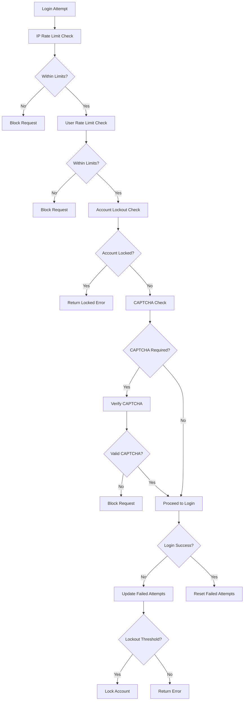

# Account Lockout & Brute Force Protection

## 📋 Overview

The AppEx Affiliation Portal implements a sophisticated account protection system that defends against brute force attacks, credential stuffing, and other malicious activities while maintaining usability for legitimate users. The system uses progressive lockout strategies, intelligent rate limiting, and adaptive security measures.

## 🛡️ Security Protection Architecture

### Protection Flow Diagram



### Protection Layers

| Layer | Protection Type | Scope | Threshold | Duration |
|-------|-----------------|-------|-----------|----------|
| **IP Rate Limiting** | Request frequency | IP address | 100 req/min | 15 minutes |
| **User Rate Limiting** | Login attempts | User account | 5 attempts/15min | 15 minutes |
| **Progressive Lockout** | Account security | User account | 5-100 attempts | 15min - Permanent |
| **CAPTCHA** | Bot protection | Suspicious activity | Dynamic | Variable |
| **Device Tracking** | Anomaly detection | Device fingerprint | - | - |
| **Geolocation** | Location analysis | IP + User | - | - |

## 🔧 Rate Limiting Implementation

### Rate Limiting Service

```typescript
// services/security/rate-limiting.service.ts
import Redis from 'ioredis'

export class RateLimitingService {
  
  static async checkIpRateLimit(ipAddress: string, endpoint: string): Promise<RateLimitResult> {
    const key = `rate_limit:ip:${ipAddress}:${endpoint}`
    const limit = this.getIpLimit(endpoint)
    const window = this.getIpWindow(endpoint)
    
    const current = await redis.incr(key)
    if (current === 1) {
      await redis.expire(key, window)
    }
    
    const isAllowed = current <= limit
    const resetTime = await redis.ttl(key)
    
    if (!isAllowed) {
      await logSecurityEvent({
        eventType: 'IP_RATE_LIMIT_EXCEEDED',
        ipAddress,
        metadata: {
          endpoint,
          current,
          limit,
          window
        }
      })
    }
    
    return {
      allowed: isAllowed,
      current,
      limit,
      resetTime,
      retryAfter: isAllowed ? 0 : resetTime
    }
  }
  
  static async checkUserRateLimit(userId: string, action: string): Promise<RateLimitResult> {
    const key = `rate_limit:user:${userId}:${action}`
    const limit = this.getUserLimit(action)
    const window = this.getUserWindow(action)
    
    const current = await redis.incr(key)
    if (current === 1) {
      await redis.expire(key, window)
    }
    
    const isAllowed = current <= limit
    const resetTime = await redis.ttl(key)
    
    if (!isAllowed) {
      await logSecurityEvent({
        userId,
        eventType: 'USER_RATE_LIMIT_EXCEEDED',
        metadata: {
          action,
          current,
          limit,
          window
        }
      })
    }
    
    return {
      allowed: isAllowed,
      current,
      limit,
      resetTime,
      retryAfter: isAllowed ? 0 : resetTime
    }
  }
  
  static async checkGlobalRateLimit(action: string): Promise<RateLimitResult> {
    const key = `rate_limit:global:${action}`
    const limit = this.getGlobalLimit(action)
    const window = this.getGlobalWindow(action)
    
    const current = await redis.incr(key)
    if (current === 1) {
      await redis.expire(key, window)
    }
    
    const isAllowed = current <= limit
    const resetTime = await redis.ttl(key)
    
    if (!isAllowed) {
      await logSecurityEvent({
        eventType: 'GLOBAL_RATE_LIMIT_EXCEEDED',
        metadata: {
          action,
          current,
          limit,
          window
        }
      })
    }
    
    return {
      allowed: isAllowed,
      current,
      limit,
      resetTime,
      retryAfter: isAllowed ? 0 : resetTime
    }
  }
  
  private static getIpLimit(endpoint: string): number {
    const limits = {
      'login': 5,
      'register': 10,
      'password_reset': 3,
      'mfa_verify': 10,
      'default': 100
    }
    return limits[endpoint] || limits.default
  }
  
  private static getIpWindow(endpoint: string): number {
    const windows = {
      'login': 900, // 15 minutes
      'register': 3600, // 1 hour
      'password_reset': 3600, // 1 hour
      'mfa_verify': 900, // 15 minutes
      'default': 60 // 1 minute
    }
    return windows[endpoint] || windows.default
  }
  
  private static getUserLimit(action: string): number {
    const limits = {
      'login_attempt': 5,
      'password_reset_request': 3,
      'mfa_attempt': 5,
      'otp_request': 3,
      'default': 50
    }
    return limits[action] || limits.default
  }
  
  private static getUserWindow(action: string): number {
    const windows = {
      'login_attempt': 900, // 15 minutes
      'password_reset_request': 3600, // 1 hour
      'mfa_attempt': 900, // 15 minutes
      'otp_request': 900, // 15 minutes
      'default': 300 // 5 minutes
    }
    return windows[action] || windows.default
  }
  
  private static getGlobalLimit(action: string): number {
    const limits = {
      'login_attempt': 1000,
      'registration': 500,
      'password_reset': 200,
      'default': 10000
    }
    return limits[action] || limits.default
  }
  
  private static getGlobalWindow(action: string): number {
    const windows = {
      'login_attempt': 60, // 1 minute
      'registration': 60, // 1 minute
      'password_reset': 60, // 1 minute
      'default': 60 // 1 minute
    }
    return windows[action] || windows.default
  }
}

interface RateLimitResult {
  allowed: boolean
  current: number
  limit: number
  resetTime: number
  retryAfter: number
}
```

### Rate Limiting Middleware

```typescript
// middleware/rateLimiting.ts
export const rateLimitingMiddleware = (type: 'ip' | 'user' | 'global', action: string) => {
  return async (req: Request, res: Response, next: NextFunction) => {
    try {
      let result: RateLimitResult
      
      switch (type) {
        case 'ip':
          result = await RateLimitingService.checkIpRateLimit(req.ip, action)
          break
        case 'user':
          if (!req.user?.id) {
            return next()
          }
          result = await RateLimitingService.checkUserRateLimit(req.user.id, action)
          break
        case 'global':
          result = await RateLimitingService.checkGlobalRateLimit(action)
          break
        default:
          return next()
      }
      
      if (!result.allowed) {
        res.set({
          'X-RateLimit-Limit': result.limit.toString(),
          'X-RateLimit-Remaining': Math.max(0, result.limit - result.current).toString(),
          'X-RateLimit-Reset': result.resetTime.toString(),
          'Retry-After': result.retryAfter.toString()
        })
        
        return res.status(429).json({
          error: 'RATE_LIMIT_EXCEEDED',
          message: 'Too many requests. Please try again later.',
          retryAfter: result.retryAfter
        })
      }
      
      // Set rate limit headers for successful requests
      res.set({
        'X-RateLimit-Limit': result.limit.toString(),
        'X-RateLimit-Remaining': Math.max(0, result.limit - result.current).toString(),
        'X-RateLimit-Reset': result.resetTime.toString()
      })
      
      next()
      
    } catch (error) {
      console.error('Rate limiting error:', error)
      next() // Allow request to proceed if rate limiting fails
    }
  }
}
```

## 🔒 Account Lockout System

### Progressive Lockout Configuration

```typescript
// config/security/lockout.ts
export const ACCOUNT_LOCKOUT_CONFIG = {
  thresholds: [
    { attempts: 5, action: 'CAPTCHA', duration: 0, severity: 'LOW' },
    { attempts: 10, action: 'LOCKOUT_15MIN', duration: 15 * 60, severity: 'MEDIUM' },
    { attempts: 20, action: 'LOCKOUT_1HOUR', duration: 60 * 60, severity: 'HIGH' },
    { attempts: 50, action: 'LOCKOUT_24HOUR', duration: 24 * 60 * 60, severity: 'HIGH' },
    { attempts: 100, action: 'PERMANENT_LOCK', duration: null, severity: 'CRITICAL' }
  ],
  
  // Roles that bypass lockout (with logging)
  adminBypassRoles: ['ADMIN', 'SUPER_ADMIN', 'SECURITY_ADMIN'],
  
  // Lockout policies
  policies: {
    resetOnSuccess: true, // Reset failed attempts on successful login
    notifyUser: true, // Send email notifications
    notifyAdmin: true, // Notify admins of serious lockouts
    allowAppeal: true, // Allow users to appeal lockouts
    autoUnlock: false // Don't automatically unlock permanent locks
  },
  
  // Zimbabwe-specific considerations
  zimbabwe: {
    considerTimezone: true, // Consider Zimbabwe timezone
    businessHoursOnly: false, // Allow lockouts anytime
    smsNotifications: true, // Send SMS for critical lockouts
    localSupport: true // Route to local support team
  }
}
```

### Account Lockout Service

```typescript
// services/security/account-lockout.service.ts
export class AccountLockoutService {
  
  static async checkAccountLockout(userId: string): Promise<LockoutStatus> {
    const user = await prisma.user.findUnique({
      where: { id: userId },
      select: {
        id: true,
        failedLoginAttempts: true,
        lockedUntil: true,
        status: true,
        lockReason: true,
        roles: true
      }
    })
    
    if (!user) {
      return { isLocked: false, reason: 'USER_NOT_FOUND' }
    }
    
    // Check if user has admin bypass
    if (this.hasAdminBypass(user.roles)) {
      return { isLocked: false, reason: 'ADMIN_BYPASS' }
    }
    
    // Check permanent lock
    if (user.status === 'PERMANENTLY_LOCKED') {
      return { 
        isLocked: true, 
        reason: 'PERMANENT_LOCK',
        severity: 'CRITICAL',
        canAppeal: true
      }
    }
    
    // Check temporary lock
    if (user.lockedUntil && user.lockedUntil > new Date()) {
      const remainingSeconds = Math.ceil((user.lockedUntil.getTime() - Date.now()) / 1000)
      const severity = this.getLockoutSeverity(user.failedLoginAttempts)
      
      return { 
        isLocked: true, 
        reason: 'TEMPORARY_LOCK',
        remainingSeconds,
        severity,
        lockedUntil: user.lockedUntil,
        lockReason: user.lockReason
      }
    }
    
    return { isLocked: false }
  }
  
  static async handleFailedLogin(userId: string, ipAddress: string, userAgent: string): Promise<void> {
    const user = await prisma.user.findUnique({
      where: { id: userId },
      select: {
        id: true,
        failedLoginAttempts: true,
        status: true,
        roles: true,
        email: true,
        fullName: true
      }
    })
    
    if (!user) return
    
    // Skip lockout for admin users (but still log)
    if (this.hasAdminBypass(user.roles)) {
      await logSecurityEvent({
        userId,
        eventType: 'FAILED_LOGIN_ADMIN_BYPASS',
        ipAddress,
        userAgent,
        metadata: { attempts: user.failedLoginAttempts + 1 }
      })
      return
    }
    
    const newAttempts = user.failedLoginAttempts + 1
    
    // Update failed attempts
    await prisma.user.update({
      where: { id: userId },
      data: { failedLoginAttempts: newAttempts }
    })
    
    // Check if this triggers a lockout
    const lockoutThreshold = this.getLockoutThreshold(newAttempts)
    
    if (lockoutThreshold) {
      await this.applyLockout(user, lockoutThreshold, ipAddress, userAgent)
    } else {
      // Log failed attempt
      await logSecurityEvent({
        userId,
        eventType: 'LOGIN_FAILED',
        ipAddress,
        userAgent,
        metadata: { attempts: newAttempts }
      })
      
      // Check if CAPTCHA should be required
      if (newAttempts >= 5) {
        await this.requireCaptcha(userId, ipAddress)
      }
    }
  }
  
  static async handleSuccessfulLogin(userId: string, ipAddress: string, userAgent: string): Promise<void> {
    // Reset failed attempts
    await prisma.user.update({
      where: { id: userId },
      data: { 
        failedLoginAttempts: 0,
        lastLoginAt: new Date(),
        lastLoginIp: ipAddress
      }
    })
    
    // Clear any CAPTCHA requirements
    await redis.del(`captcha:required:${userId}`)
    
    // Log successful login
    await logSecurityEvent({
      userId,
      eventType: 'LOGIN_SUCCESS',
      ipAddress,
      userAgent
    })
  }
  
  private static async applyLockout(
    user: any, 
    threshold: LockoutThreshold, 
    ipAddress: string, 
    userAgent: string
  ): Promise<void> {
    const lockedUntil = threshold.duration ? 
      new Date(Date.now() + threshold.duration * 1000) : 
      null
    
    // Update user lock status
    await prisma.user.update({
      where: { id: user.id },
      data: {
        lockedUntil,
        status: threshold.action === 'PERMANENT_LOCK' ? 'PERMANENTLY_LOCKED' : 'ACTIVE',
        lockReason: threshold.action
      }
    })
    
    // Log lockout event
    await logSecurityEvent({
      userId: user.id,
      eventType: 'ACCOUNT_LOCKED',
      severity: threshold.severity,
      ipAddress,
      userAgent,
      metadata: {
        attempts: user.failedLoginAttempts + 1,
        lockAction: threshold.action,
        duration: threshold.duration,
        lockedUntil
      }
    })
    
    // Notify user
    if (ACCOUNT_LOCKOUT_CONFIG.policies.notifyUser) {
      await this.notifyUserLockout(user, threshold, lockedUntil)
    }
    
    // Notify admins for serious lockouts
    if (threshold.severity === 'HIGH' || threshold.severity === 'CRITICAL') {
      await this.notifyAdminsLockout(user, threshold, ipAddress)
    }
    
    // Add to security monitoring
    if (threshold.severity === 'CRITICAL') {
      await this.addToSecurityMonitoring(user, threshold, ipAddress)
    }
  }
  
  private static async notifyUserLockout(user: any, threshold: LockoutThreshold, lockedUntil: Date | null): Promise<void> {
    const lockDuration = lockedUntil ? 
      this.formatDuration(lockedUntil.getTime() - Date.now()) : 
      'permanently'
    
    await emailQueue.add('send-account-locked-notification', {
      to: user.email,
      userName: user.fullName.split(' ')[0],
      lockDuration,
      lockReason: threshold.action,
      attempts: user.failedLoginAttempts + 1,
      canAppeal: ACCOUNT_LOCKOUT_CONFIG.policies.allowAppeal,
      supportEmail: 'support@appex.co.zw',
      supportPhone: '+263 242 123 456'
    })
    
    // Send SMS for critical lockouts
    if (threshold.severity === 'CRITICAL' && ACCOUNT_LOCKOUT_CONFIG.zimbabwe.smsNotifications) {
      await smsQueue.add('send-critical-lockout-sms', {
        to: user.phone,
        message: `Your AppEx account has been ${threshold.action === 'PERMANENT_LOCK' ? 'permanently' : 'temporarily'} locked. Please check your email for details.`
      })
    }
  }
  
  private static async notifyAdminsLockout(user: any, threshold: LockoutThreshold, ipAddress: string): Promise<void> {
    const admins = await prisma.user.findMany({
      where: {
        roles: { hasSome: ['ADMIN', 'SECURITY_ADMIN'] },
        status: 'ACTIVE'
      },
      select: { email: true, fullName: true }
    })
    
    const location = await getLocationFromIp(ipAddress)
    
    for (const admin of admins) {
      await emailQueue.add('send-admin-security-alert', {
        to: admin.email,
        alertType: 'ACCOUNT_LOCKOUT',
        details: {
          user: `${user.fullName} (${user.email})`,
          action: threshold.action,
          severity: threshold.severity,
          attempts: user.failedLoginAttempts + 1,
          ipAddress,
          location: `${location.city}, ${location.country}`,
          timestamp: new Date().toISOString()
        }
      })
    }
  }
  
  static async unlockAccount(userId: string, unlockedBy: string, reason: string): Promise<void> {
    const user = await prisma.user.findUnique({
      where: { id: userId },
      select: { id: true, email: true, fullName: true, status: true }
    })
    
    if (!user) {
      throw new Error('User not found')
    }
    
    await prisma.user.update({
      where: { id: userId },
      data: {
        failedLoginAttempts: 0,
        lockedUntil: null,
        status: 'ACTIVE',
        lockReason: null
      }
    })
    
    // Log account unlock
    await logSecurityEvent({
      userId,
      eventType: 'ACCOUNT_UNLOCKED',
      metadata: {
        unlockedBy,
        reason,
        previousStatus: user.status
      }
    })
    
    // Notify user
    await emailQueue.add('send-account-unlocked-notification', {
      to: user.email,
      userName: user.fullName.split(' ')[0],
      unlockedBy,
      reason,
      timestamp: new Date().toISOString()
    })
  }
  
  private static getLockoutThreshold(attempts: number): LockoutThreshold | null {
    return ACCOUNT_LOCKOUT_CONFIG.thresholds
      .slice()
      .reverse()
      .find(threshold => attempts >= threshold.attempts) || null
  }
  
  private static hasAdminBypass(roles: string[]): boolean {
    return ACCOUNT_LOCKOUT_CONFIG.adminBypassRoles.some(role => roles.includes(role))
  }
  
  private static getLockoutSeverity(attempts: number): 'LOW' | 'MEDIUM' | 'HIGH' | 'CRITICAL' {
    const threshold = this.getLockoutThreshold(attempts)
    return threshold?.severity || 'LOW'
  }
  
  private static async requireCaptcha(userId: string, ipAddress: string): Promise<void> {
    await redis.setex(`captcha:required:${userId}`, 900, 'true') // 15 minutes
    await redis.setex(`captcha:required:${ipAddress}`, 900, 'true')
  }
  
  private static formatDuration(ms: number): string {
    const minutes = Math.floor(ms / 60000)
    const hours = Math.floor(minutes / 60)
    const days = Math.floor(hours / 24)
    
    if (days > 0) return `${days} day${days > 1 ? 's' : ''}`
    if (hours > 0) return `${hours} hour${hours > 1 ? 's' : ''}`
    return `${minutes} minute${minutes > 1 ? 's' : ''}`
  }
  
  private static async addToSecurityMonitoring(user: any, threshold: LockoutThreshold, ipAddress: string): Promise<void> {
    // Add to high-priority security monitoring queue
    await redis.lpush('security:critical', JSON.stringify({
      type: 'ACCOUNT_LOCKOUT',
      userId: user.id,
      email: user.email,
      action: threshold.action,
      attempts: user.failedLoginAttempts + 1,
      ipAddress,
      timestamp: new Date().toISOString()
    }))
    
    // Keep only last 100 critical events
    await redis.ltrim('security:critical', 0, 99)
  }
}

interface LockoutStatus {
  isLocked: boolean
  reason?: string
  remainingSeconds?: number
  severity?: 'LOW' | 'MEDIUM' | 'HIGH' | 'CRITICAL'
  lockedUntil?: Date
  lockReason?: string
  canAppeal?: boolean
}

interface LockoutThreshold {
  attempts: number
  action: string
  duration: number | null
  severity: 'LOW' | 'MEDIUM' | 'HIGH' | 'CRITICAL'
}
```

## 🤖 CAPTCHA Integration

### Cloudflare Turnstile Integration

```typescript
// services/security/captcha.service.ts
export class CaptchaService {
  
  static async isCaptchaRequired(userId: string, ipAddress: string): Promise<boolean> {
    // Check user-specific requirement
    const userRequired = await redis.get(`captcha:required:${userId}`)
    if (userRequired) return true
    
    // Check IP-specific requirement
    const ipRequired = await redis.get(`captcha:required:${ipAddress}`)
    if (ipRequired) return true
    
    // Check global risk factors
    const riskFactors = await this.assessRiskFactors(userId, ipAddress)
    return riskFactors.score >= 50
  }
  
  static async verifyCaptcha(token: string, ipAddress: string): Promise<CaptchaResult> {
    try {
      const response = await fetch('https://challenges.cloudflare.com/turnstile/v0/siteverify', {
        method: 'POST',
        headers: {
          'Content-Type': 'application/x-www-form-urlencoded'
        },
        body: new URLSearchParams({
          secret: process.env.TURNSTILE_SECRET_KEY!,
          response: token,
          remoteip: ipAddress
        })
      })
      
      const result = await response.json()
      
      if (!result.success) {
        await logSecurityEvent({
          eventType: 'CAPTCHA_VERIFICATION_FAILED',
          ipAddress,
          metadata: {
            token,
            errors: result['error-codes'] || []
          }
        })
      }
      
      return {
        success: result.success,
        challengeTs: result.challenge_ts,
        hostname: result.hostname,
        errors: result['error-codes'] || []
      }
      
    } catch (error) {
      console.error('CAPTCHA verification error:', error)
      return {
        success: false,
        errors: ['VERIFICATION_ERROR']
      }
    }
  }
  
  private static async assessRiskFactors(userId: string, ipAddress: string): Promise<RiskAssessment> {
    let score = 0
    const factors: string[] = []
    
    // Check IP reputation
    const ipReputation = await this.checkIpReputation(ipAddress)
    if (ipReputation.isSuspicious) {
      score += 30
      factors.push('SUSPICIOUS_IP')
    }
    
    // Check recent failed attempts
    const recentFailures = await redis.get(`failed_attempts:${userId}`)
    if (recentFailures && parseInt(recentFailures) >= 3) {
      score += 25
      factors.push('RECENT_FAILURES')
    }
    
    // Check geolocation
    const location = await getLocationFromIp(ipAddress)
    if (location.isProxy || location.isVpn) {
      score += 20
      factors.push('PROXY_VPN')
    }
    
    // Check user agent
    const userAgent = await this.getUserAgentForUser(userId)
    if (userAgent && this.isSuspiciousUserAgent(userAgent)) {
      score += 15
      factors.push('SUSPICIOUS_USER_AGENT')
    }
    
    // Check time-based patterns
    const currentHour = new Date().getHours()
    if (currentHour >= 2 && currentHour <= 5) {
      score += 10
      factors.push('UNUSUAL_TIME')
    }
    
    return {
      score,
      factors,
      isHighRisk: score >= 50
    }
  }
  
  private static async checkIpReputation(ipAddress: string): Promise<IpReputation> {
    // Check against known malicious IPs
    const isMalicious = await redis.sismember('security:malicious_ips', ipAddress)
    if (isMalicious) {
      return { isSuspicious: true, reason: 'MALICIOUS_IP' }
    }
    
    // Check for proxy/VPN
    const location = await getLocationFromIp(ipAddress)
    if (location.isProxy || location.isVpn) {
      return { isSuspicious: true, reason: 'PROXY_VPN' }
    }
    
    // Check recent failed attempts from this IP
    const ipFailures = await redis.get(`ip_failures:${ipAddress}`)
    if (ipFailures && parseInt(ipFailures) >= 10) {
      return { isSuspicious: true, reason: 'HIGH_FAILURE_RATE' }
    }
    
    return { isSuspicious: false }
  }
  
  private static isSuspiciousUserAgent(userAgent: string): boolean {
    const suspiciousPatterns = [
      /bot/i, /crawler/i, /spider/i, /scraper/i,
      /curl/i, /wget/i, /python/i, /java/i,
      /automated/i, /script/i
    ]
    
    return suspiciousPatterns.some(pattern => pattern.test(userAgent))
  }
  
  private static async getUserAgentForUser(userId: string): Promise<string | null> {
    const lastSession = await prisma.session.findFirst({
      where: { userId },
      select: { userAgent: true },
      orderBy: { lastUsedAt: 'desc' }
    })
    
    return lastSession?.userAgent || null
  }
}

interface CaptchaResult {
  success: boolean
  challengeTs?: string
  hostname?: string
  errors: string[]
}

interface RiskAssessment {
  score: number
  factors: string[]
  isHighRisk: boolean
}

interface IpReputation {
  isSuspicious: boolean
  reason?: string
}
```

### CAPTCHA Middleware

```typescript
// middleware/captcha.ts
export const captchaMiddleware = async (req: Request, res: Response, next: NextFunction) => {
  try {
    const userId = req.user?.id
    const ipAddress = req.ip
    
    // Check if CAPTCHA is required
    const isRequired = await CaptchaService.isCaptchaRequired(userId || 'anonymous', ipAddress)
    
    if (!isRequired) {
      return next()
    }
    
    const token = req.headers['cf-turnstile-response'] as string
    
    if (!token) {
      return res.status(400).json({
        error: 'CAPTCHA_REQUIRED',
        message: 'CAPTCHA verification is required',
        captchaRequired: true
      })
    }
    
    // Verify CAPTCHA
    const result = await CaptchaService.verifyCaptcha(token, ipAddress)
    
    if (!result.success) {
      return res.status(400).json({
        error: 'INVALID_CAPTCHA',
        message: 'CAPTCHA verification failed',
        captchaRequired: true,
        errors: result.errors
      })
    }
    
    // Clear CAPTCHA requirement on successful verification
    if (userId) {
      await redis.del(`captcha:required:${userId}`)
    }
    await redis.del(`captcha:required:${ipAddress}`)
    
    next()
    
  } catch (error) {
    console.error('CAPTCHA middleware error:', error)
    // Allow request to proceed if CAPTCHA verification fails
    next()
  }
}
```

## 📊 Security Analytics

### Security Monitoring Dashboard

```typescript
// services/security/security-analytics.service.ts
export class SecurityAnalytics {
  
  static async getSecurityMetrics(timeframe: 'hour' | 'day' | 'week' | 'month' = 'day'): Promise<SecurityMetrics> {
    const now = new Date()
    const startDate = this.getStartDate(timeframe, now)
    
    const [
      totalFailedLogins,
      uniqueIpsWithFailures,
      accountsLocked,
      captchaVerifications,
      suspiciousActivities,
      blockedRequests
    ] = await Promise.all([
      this.getTotalFailedLogins(startDate, now),
      this.getUniqueIpsWithFailures(startDate, now),
      this.getAccountsLocked(startDate, now),
      this.getCaptchaVerifications(startDate, now),
      this.getSuspiciousActivities(startDate, now),
      this.getBlockedRequests(startDate, now)
    ])
    
    return {
      timeframe,
      totalFailedLogins,
      uniqueIpsWithFailures,
      accountsLocked,
      captchaVerifications,
      suspiciousActivities,
      blockedRequests,
      lockoutRate: await this.getLockoutRate(startDate, now),
      captchaSuccessRate: await this.getCaptchaSuccessRate(startDate, now)
    }
  }
  
  static async getRealTimeSecurityStats(): Promise<RealTimeSecurityStats> {
    const [
      activeThreats,
      currentLockouts,
      recentSecurityEvents,
      underAttack,
      topMaliciousIps
    ] = await Promise.all([
      this.getActiveThreats(),
      this.getCurrentLockouts(),
      this.getRecentSecurityEvents(),
      this.isUnderAttack(),
      this.getTopMaliciousIps()
    ])
    
    return {
      activeThreats,
      currentLockouts,
      recentSecurityEvents,
      underAttack,
      topMaliciousIps,
      threatLevel: this.calculateThreatLevel(activeThreats, currentLockouts)
    }
  }
  
  static async getSecurityEvents(severity?: 'LOW' | 'MEDIUM' | 'HIGH' | 'CRITICAL'): Promise<SecurityEvent[]> {
    const whereClause: any = {
      createdAt: { gte: new Date(Date.now() - 7 * 24 * 60 * 60 * 1000) } // Last 7 days
    }
    
    if (severity) {
      whereClause.severity = severity
    }
    
    return await prisma.securityEvent.findMany({
      where: whereClause,
      include: {
        user: {
          select: { email: true, fullName: true }
        }
      },
      orderBy: { createdAt: 'desc' },
      take: 100
    })
  }
  
  private static async getActiveThreats(): Promise<number> {
    const threats = await Promise.all([
      redis.scard('security:malicious_ips'),
      redis.lrange('security:critical', 0, -1),
      this.getRecentBruteForceAttempts()
    ])
    
    return threats.reduce((sum, threat) => sum + (Array.isArray(threat) ? threat.length : threat), 0)
  }
  
  private static async getCurrentLockouts(): Promise<number> {
    return await prisma.user.count({
      where: {
        OR: [
          { lockedUntil: { gt: new Date() } },
          { status: 'PERMANENTLY_LOCKED' }
        ]
      }
    })
  }
  
  private static calculateThreatLevel(activeThreats: number, currentLockouts: number): 'LOW' | 'MEDIUM' | 'HIGH' | 'CRITICAL' {
    const score = activeThreats + (currentLockouts * 2)
    
    if (score < 10) return 'LOW'
    if (score < 25) return 'MEDIUM'
    if (score < 50) return 'HIGH'
    return 'CRITICAL'
  }
}

interface SecurityMetrics {
  timeframe: string
  totalFailedLogins: number
  uniqueIpsWithFailures: number
  accountsLocked: number
  captchaVerifications: number
  suspiciousActivities: number
  blockedRequests: number
  lockoutRate: number
  captchaSuccessRate: number
}

interface RealTimeSecurityStats {
  activeThreats: number
  currentLockouts: number
  recentSecurityEvents: SecurityEvent[]
  underAttack: boolean
  topMaliciousIps: Array<{ ip: string; attempts: number }>
  threatLevel: 'LOW' | 'MEDIUM' | 'HIGH' | 'CRITICAL'
}
```

## 📋 Security Protection Checklist

### Security Requirements
- [ ] Progressive account lockout implementation
- [ ] Multi-level rate limiting
- [ ] CAPTCHA integration with Turnstile
- [ ] IP reputation checking
- [ ] Device fingerprinting
- [ ] Geolocation analysis
- [ ] Real-time threat monitoring

### Performance Requirements
- [ ] Sub-10ms rate limit checks
- [ ] Efficient Redis operations
- [ ] Minimal database impact
- [ ] Scalable threat detection
- [ ] Optimized security logging
- [ ] Real-time monitoring capabilities

### Compliance Requirements
- [ ] Zimbabwe Cyber Act compliance
- [ ] User notification requirements
- [ ] Data protection measures
- [ ] Audit trail maintenance
- [ ] Incident response procedures
- [ ] Local support integration

---

**Next**: [Email Verification & Trust Levels](./trust-levels.md) → Verification pipeline and trust system documentation
