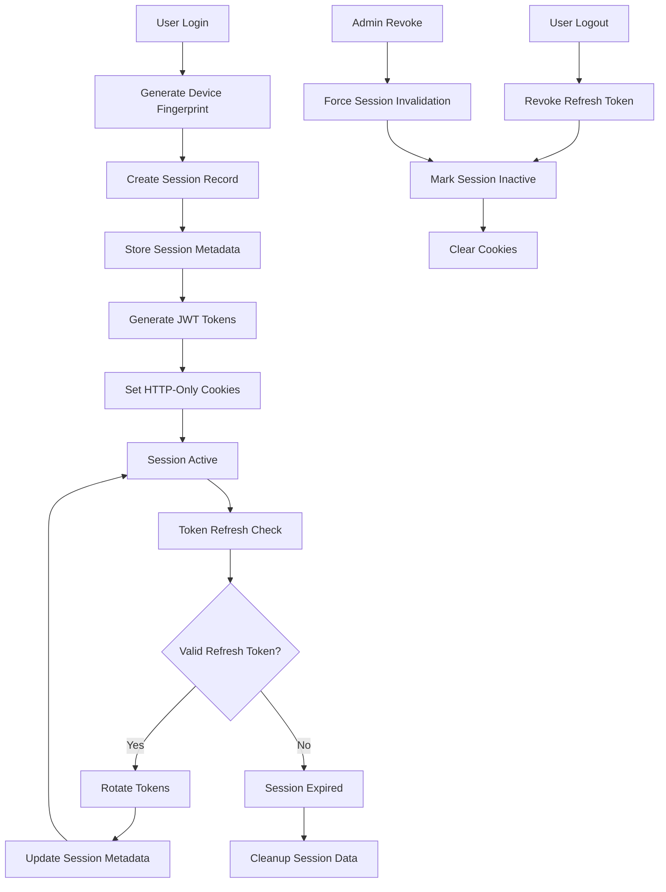

# Session Management & Device Tracking

## 📋 Overview

The AppEx Affiliation Portal implements comprehensive session management with device fingerprinting, real-time monitoring, and granular control over user sessions. This system provides security while maintaining user convenience through trusted device management and intelligent session handling.

## 🔄 Session Architecture

### Session Lifecycle



### Session Components

| Component | Purpose | Storage | TTL |
|-----------|---------|---------|-----|
| **Access Token** | API authentication | HTTP-only cookie | 15 minutes |
| **Refresh Token** | Token renewal | HTTP-only cookie + Redis | 7 days |
| **Session Record** | Device tracking | PostgreSQL | 7 days |
| **Device Fingerprint** | Device identification | Redis + DB | 7 days |
| **Security Events** | Audit trail | PostgreSQL | Permanent |

## 🔧 Session Implementation

### Session Creation Service

```typescript
// services/session/session.service.ts
import { PrismaClient } from '@prisma/client'
import jwt from 'jsonwebtoken'
import crypto from 'crypto'

const prisma = new PrismaClient()

export class SessionService {
  
  static async createSession(data: CreateSessionData): Promise<SessionResult> {
    const {
      userId,
      deviceFingerprint,
      deviceName = 'Unknown Device',
      ipAddress,
      userAgent,
      isNewDevice = false,
      rememberMe = false,
      oauthProvider = null
    } = data
    
    try {
      // Generate token pair
      const jti = crypto.randomUUID()
      const accessToken = this.generateAccessToken({
        sub: userId,
        jti,
        deviceFingerprint
      })
      
      const refreshToken = this.generateRefreshToken({
        sub: userId,
        jti,
        deviceFingerprint
      })
      
      // Store refresh token metadata in Redis
      const refreshTTL = rememberMe ? 30 * 24 * 3600 : 7 * 24 * 3600 // 30 days or 7 days
      await redis.setex(
        `refresh:${jti}`,
        refreshTTL,
        JSON.stringify({
          userId,
          deviceFingerprint,
          ipAddress,
          userAgent,
          createdAt: new Date().toISOString(),
          rememberMe,
          oauthProvider
        })
      )
      
      // Create or update session record
      const expiresAt = new Date(Date.now() + refreshTTL * 1000)
      
      const session = await prisma.session.upsert({
        where: {
          userId_deviceFingerprint: {
            userId,
            deviceFingerprint
          }
        },
        update: {
          refreshTokenJti: jti,
          deviceName,
          ipAddress,
          userAgent,
          isActive: true,
          lastUsedAt: new Date(),
          expiresAt,
          oauthProvider
        },
        create: {
          userId,
          deviceFingerprint,
          refreshTokenJti: jti,
          deviceName,
          ipAddress,
          userAgent,
          isActive: true,
          expiresAt,
          oauthProvider
        }
      })
      
      // Track active user in Redis for real-time metrics
      await redis.sadd('active_users', userId)
      await redis.expire('active_users', 24 * 3600) // 24 hours
      
      // Log session creation
      await logSecurityEvent({
        userId,
        eventType: 'SESSION_CREATED',
        ipAddress,
        userAgent,
        metadata: {
          sessionId: session.id,
          deviceFingerprint,
          isNewDevice,
          rememberMe,
          oauthProvider
        }
      })
      
      return {
        sessionId: session.id,
        accessToken,
        refreshToken,
        expiresIn: 900, // 15 minutes for access token
        isNewDevice
      }
      
    } catch (error) {
      console.error('Session creation error:', error)
      throw new Error('Failed to create session')
    }
  }
  
  static async validateSession(accessToken: string): Promise<SessionValidation> {
    try {
      // Verify JWT token
      const payload = jwt.verify(accessToken, process.env.JWT_ACCESS_SECRET!) as {
        sub: string
        jti: string
        deviceFingerprint: string
      }
      
      // Check if session is still active
      const session = await prisma.session.findFirst({
        where: {
          userId: payload.sub,
          deviceFingerprint: payload.deviceFingerprint,
          refreshTokenJti: payload.jti,
          isActive: true,
          expiresAt: { gt: new Date() }
        },
        include: {
          user: {
            select: {
              id: true,
              email: true,
              status: true,
              trustLevel: true,
              roles: true
            }
          }
        }
      })
      
      if (!session) {
        return {
          valid: false,
          reason: 'SESSION_NOT_FOUND'
        }
      }
      
      if (session.user.status !== 'ACTIVE') {
        return {
          valid: false,
          reason: 'USER_INACTIVE'
        }
      }
      
      // Update last used timestamp
      await prisma.session.update({
        where: { id: session.id },
        data: { lastUsedAt: new Date() }
      })
      
      return {
        valid: true,
        session: {
          id: session.id,
          userId: session.userId,
          user: session.user,
          deviceFingerprint: session.deviceFingerprint,
          deviceName: session.deviceName,
          lastUsedAt: session.lastUsedAt
        }
      }
      
    } catch (error) {
      if (error.name === 'TokenExpiredError') {
        return {
          valid: false,
          reason: 'TOKEN_EXPIRED'
        }
      }
      
      if (error.name === 'JsonWebTokenError') {
        return {
          valid: false,
          reason: 'INVALID_TOKEN'
        }
      }
      
      console.error('Session validation error:', error)
      return {
        valid: false,
        reason: 'VALIDATION_ERROR'
      }
    }
  }
  
  static async revokeSession(sessionId: string, userId: string, reason: string = 'USER_LOGOUT'): Promise<void> {
    try {
      const session = await prisma.session.findFirst({
        where: {
          id: sessionId,
          userId,
          isActive: true
        }
      })
      
      if (!session) {
        throw new Error('Session not found')
      }
      
      // Revoke refresh token in Redis
      if (session.refreshTokenJti) {
        await redis.setex(
          `revoked:${session.refreshTokenJti}`,
          7 * 24 * 3600,
          reason
        )
        await redis.del(`refresh:${session.refreshTokenJti}`)
      }
      
      // Mark session as inactive
      await prisma.session.update({
        where: { id: sessionId },
        data: {
          isActive: false,
          revokedAt: new Date(),
          revokeReason: reason
        }
      })
      
      // Log session revocation
      await logSecurityEvent({
        userId,
        eventType: 'SESSION_REVOKED',
        metadata: {
          sessionId,
          deviceName: session.deviceName,
          reason
        }
      })
      
    } catch (error) {
      console.error('Session revocation error:', error)
      throw error
    }
  }
  
  static async revokeAllUserSessions(userId: string, exceptSessionId?: string): Promise<number> {
    try {
      const sessions = await prisma.session.findMany({
        where: {
          userId,
          isActive: true,
          ...(exceptSessionId && { id: { not: exceptSessionId } })
        },
        select: {
          id: true,
          refreshTokenJti: true,
          deviceName: true
        }
      })
      
      // Revoke all refresh tokens
      const pipeline = redis.pipeline()
      for (const session of sessions) {
        if (session.refreshTokenJti) {
          pipeline.setex(
            `revoked:${session.refreshTokenJti}`,
            7 * 24 * 3600,
            'USER_REVOKED_ALL'
          )
          pipeline.del(`refresh:${session.refreshTokenJti}`)
        }
      }
      await pipeline.exec()
      
      // Mark all sessions as inactive
      const result = await prisma.session.updateMany({
        where: {
          userId,
          isActive: true,
          ...(exceptSessionId && { id: { not: exceptSessionId } })
        },
        data: {
          isActive: false,
          revokedAt: new Date(),
          revokeReason: 'USER_REVOKED_ALL'
        }
      })
      
      // Log mass session revocation
      await logSecurityEvent({
        userId,
        eventType: 'ALL_SESSIONS_REVOKED',
        metadata: {
          revokedCount: sessions.length,
          exceptSessionId
        }
      })
      
      return result.count
      
    } catch (error) {
      console.error('Mass session revocation error:', error)
      throw error
    }
  }
  
  private static generateAccessToken(payload: any): string {
    return jwt.sign(payload, process.env.JWT_ACCESS_SECRET!, {
      expiresIn: '15m',
      issuer: 'appex-affiliation',
      audience: 'appex-users'
    })
  }
  
  private static generateRefreshToken(payload: any): string {
    return jwt.sign(payload, process.env.JWT_REFRESH_SECRET!, {
      expiresIn: '7d',
      issuer: 'appex-affiliation',
      audience: 'appex-users'
    })
  }
}

interface CreateSessionData {
  userId: string
  deviceFingerprint: string
  deviceName?: string
  ipAddress: string
  userAgent: string
  isNewDevice?: boolean
  rememberMe?: boolean
  oauthProvider?: string | null
}

interface SessionResult {
  sessionId: string
  accessToken: string
  refreshToken: string
  expiresIn: number
  isNewDevice: boolean
}

interface SessionValidation {
  valid: boolean
  reason?: string
  session?: {
    id: string
    userId: string
    user: any
    deviceFingerprint: string
    deviceName: string
    lastUsedAt: Date
  }
}
```

### Device Fingerprinting Service

```typescript
// services/session/device-fingerprint.service.ts
import crypto from 'crypto'

export class DeviceFingerprintService {
  
  static generateFingerprint(req: Request): string {
    const signals = {
      // Browser characteristics
      userAgent: req.headers['user-agent'],
      acceptLanguage: req.headers['accept-language'],
      acceptEncoding: req.headers['accept-encoding'],
      
      // Client hints (modern browsers)
      platform: req.headers['sec-ch-ua-platform'],
      mobile: req.headers['sec-ch-ua-mobile'],
      architecture: req.headers['sec-ch-ua-arch'],
      model: req.headers['sec-ch-ua-model'],
      brands: req.headers['sec-ch-ua'],
      
      // Network information
      ipAddress: req.ip,
      timezone: req.headers['timezone'] || 'unknown',
      
      // Screen information (if available)
      screenWidth: req.headers['x-screen-width'],
      screenHeight: req.headers['x-screen-height'],
      colorDepth: req.headers['x-color-depth'],
      
      // Additional security headers
      forwardedFor: req.headers['x-forwarded-for'],
      realIp: req.headers['x-real-ip'],
      clusterClientIp: req.headers['x-cluster-client-ip']
    }
    
    // Create fingerprint hash
    const fingerprint = crypto
      .createHash('sha256')
      .update(JSON.stringify(signals) + process.env.DEVICE_FINGERPRINT_SALT)
      .digest('hex')
    
    return fingerprint
  }
  
  static analyzeDevice(userAgent: string): DeviceAnalysis {
    const ua = userAgent.toLowerCase()
    
    // Detect browser
    let browser = 'unknown'
    let version = 'unknown'
    
    if (ua.includes('chrome')) {
      browser = 'chrome'
      const match = ua.match(/chrome\/(\d+)/)
      version = match ? match[1] : 'unknown'
    } else if (ua.includes('firefox')) {
      browser = 'firefox'
      const match = ua.match(/firefox\/(\d+)/)
      version = match ? match[1] : 'unknown'
    } else if (ua.includes('safari') && !ua.includes('chrome')) {
      browser = 'safari'
      const match = ua.match(/version\/(\d+)/)
      version = match ? match[1] : 'unknown'
    } else if (ua.includes('edge')) {
      browser = 'edge'
      const match = ua.match(/edge\/(\d+)/)
      version = match ? match[1] : 'unknown'
    }
    
    // Detect OS
    let os = 'unknown'
    if (ua.includes('windows')) os = 'windows'
    else if (ua.includes('mac')) os = 'macos'
    else if (ua.includes('linux')) os = 'linux'
    else if (ua.includes('android')) os = 'android'
    else if (ua.includes('ios') || ua.includes('iphone') || ua.includes('ipad')) os = 'ios'
    
    // Detect device type
    let deviceType = 'desktop'
    if (ua.includes('mobile') || ua.includes('android') || ua.includes('iphone')) {
      deviceType = 'mobile'
    } else if (ua.includes('tablet') || ua.includes('ipad')) {
      deviceType = 'tablet'
    }
    
    // Calculate trust score
    const trustScore = this.calculateTrustScore(browser, version, os, deviceType, ua)
    
    return {
      browser,
      version,
      os,
      deviceType,
      trustScore,
      isBot: this.isBot(ua),
      isMobile: deviceType === 'mobile',
      isTablet: deviceType === 'tablet'
    }
  }
  
  private static calculateTrustScore(
    browser: string, 
    version: string, 
    os: string, 
    deviceType: string,
    userAgent: string
  ): number {
    let score = 50 // Base score
    
    // Browser trust
    const trustedBrowsers = ['chrome', 'firefox', 'safari', 'edge']
    if (trustedBrowsers.includes(browser)) {
      score += 20
    }
    
    // Version check (not too old, not too new/unknown)
    const versionNum = parseInt(version)
    if (versionNum > 0 && versionNum < 100) {
      score += 10
    }
    
    // OS trust
    const trustedOS = ['windows', 'macos', 'linux', 'android', 'ios']
    if (trustedOS.includes(os)) {
      score += 10
    }
    
    // Device type
    if (deviceType === 'desktop') score += 5
    else if (deviceType === 'mobile') score += 3
    
    // Penalize suspicious patterns
    if (userAgent.includes('bot') || userAgent.includes('crawler')) {
      score -= 30
    }
    
    if (userAgent.length < 50 || userAgent.length > 500) {
      score -= 10
    }
    
    return Math.max(0, Math.min(100, score))
  }
  
  private static isBot(userAgent: string): boolean {
    const botPatterns = [
      'bot', 'crawler', 'spider', 'scraper', 'curl', 'wget',
      'python', 'java', 'node', 'php', 'ruby', 'perl',
      'googlebot', 'bingbot', 'slurp', 'duckduckbot'
    ]
    
    const ua = userAgent.toLowerCase()
    return botPatterns.some(pattern => ua.includes(pattern))
  }
  
  static async detectAnomalousSession(
    userId: string, 
    deviceFingerprint: string, 
    ipAddress: string
  ): Promise<AnomalyDetection> {
    const recentSessions = await prisma.session.findMany({
      where: {
        userId,
        isActive: true,
        lastUsedAt: { gte: new Date(Date.now() - 30 * 24 * 60 * 60 * 1000) } // Last 30 days
      },
      select: {
        deviceFingerprint: true,
        ipAddress: true,
        userAgent: true,
        lastUsedAt: true
      },
      orderBy: { lastUsedAt: 'desc' },
      take: 10
    })
    
    const anomalies: string[] = []
    let riskScore = 0
    
    // Check if device is new
    const knownDevice = recentSessions.some(s => s.deviceFingerprint === deviceFingerprint)
    if (!knownDevice) {
      anomalies.push('NEW_DEVICE')
      riskScore += 30
    }
    
    // Check IP location
    const currentLocation = await getLocationFromIp(ipAddress)
    const previousLocations = await Promise.all(
      recentSessions.map(async (session) => ({
        location: await getLocationFromIp(session.ipAddress),
        timestamp: session.lastUsedAt
      }))
    )
    
    if (previousLocations.length > 0) {
      const distances = previousLocations.map(prev => 
        calculateDistance(currentLocation, prev.location)
      )
      
      const maxDistance = Math.max(...distances)
      if (maxDistance > 1000) { // More than 1000km
        anomalies.push('UNUSUAL_LOCATION')
        riskScore += 25
      }
      
      // Check for impossible travel
      const lastSession = previousLocations[0]
      if (lastSession) {
        const timeDiff = Date.now() - lastSession.timestamp.getTime()
        const requiredTime = (maxDistance / 900) * 3600 * 1000 // 900km/h max speed
        
        if (timeDiff < requiredTime) {
          anomalies.push('IMPOSSIBLE_TRAVEL')
          riskScore += 40
        }
      }
    }
    
    // Check user agent consistency
    const currentUserAgent = await prisma.session.findFirst({
      where: { userId, deviceFingerprint },
      select: { userAgent: true }
    })
    
    if (currentUserAgent && currentUserAgent.userAgent !== recentSessions[0]?.userAgent) {
      anomalies.push('USER_AGENT_CHANGED')
      riskScore += 15
    }
    
    // Check time patterns
    const currentHour = new Date().getHours()
    const previousHours = recentSessions.map(s => new Date(s.lastUsedAt).getHours())
    
    if (previousHours.length > 0) {
      const hourVariance = this.calculateHourVariance(currentHour, previousHours)
      if (hourVariance > 12) { // More than 12 hours from usual pattern
        anomalies.push('UNUSUAL_TIME')
        riskScore += 10
      }
    }
    
    return {
      anomalies,
      riskScore,
      riskLevel: this.getRiskLevel(riskScore),
      recommendations: this.getRecommendations(anomalies, riskScore)
    }
  }
  
  private static calculateHourVariance(currentHour: number, previousHours: number[]): number {
    if (previousHours.length === 0) return 0
    
    const average = previousHours.reduce((sum, hour) => sum + hour, 0) / previousHours.length
    return Math.abs(currentHour - average)
  }
  
  private static getRiskLevel(score: number): 'LOW' | 'MEDIUM' | 'HIGH' | 'CRITICAL' {
    if (score < 20) return 'LOW'
    if (score < 40) return 'MEDIUM'
    if (score < 60) return 'HIGH'
    return 'CRITICAL'
  }
  
  private static getRecommendations(anomalies: string[], score: number): string[] {
    const recommendations: string[] = []
    
    if (anomalies.includes('NEW_DEVICE')) {
      recommendations.push('Require MFA verification')
      recommendations.push('Send new device alert')
    }
    
    if (anomalies.includes('UNUSUAL_LOCATION')) {
      recommendations.push('Send location verification email')
      recommendations.push('Require additional verification')
    }
    
    if (anomalies.includes('IMPOSSIBLE_TRAVEL')) {
      recommendations.push('Block session and require password reset')
      recommendations.push('Send high-priority security alert')
    }
    
    if (anomalies.includes('USER_AGENT_CHANGED')) {
      recommendations.push('Monitor for suspicious activity')
    }
    
    if (anomalies.includes('UNUSUAL_TIME')) {
      recommendations.push('Send time-based verification')
    }
    
    if (score >= 60) {
      recommendations.push('Consider temporary account lock')
      recommendations.push('Require identity verification')
    }
    
    return recommendations
  }
}

interface DeviceAnalysis {
  browser: string
  version: string
  os: string
  deviceType: string
  trustScore: number
  isBot: boolean
  isMobile: boolean
  isTablet: boolean
}

interface AnomalyDetection {
  anomalies: string[]
  riskScore: number
  riskLevel: 'LOW' | 'MEDIUM' | 'HIGH' | 'CRITICAL'
  recommendations: string[]
}
```

## 📊 Session Analytics

### Session Monitoring Service

```typescript
// services/session/session-analytics.service.ts
export class SessionAnalytics {
  
  static async getSessionMetrics(timeframe: 'hour' | 'day' | 'week' | 'month' = 'day'): Promise<SessionMetrics> {
    const now = new Date()
    const startDate = this.getStartDate(timeframe, now)
    
    const [
      totalSessions,
      activeSessions,
      newSessions,
      expiredSessions,
      revokedSessions,
      topDevices,
      topLocations,
      averageSessionDuration
    ] = await Promise.all([
      this.getTotalSessions(startDate, now),
      this.getActiveSessions(),
      this.getNewSessions(startDate, now),
      this.getExpiredSessions(startDate, now),
      this.getRevokedSessions(startDate, now),
      this.getTopDevices(startDate, now),
      this.getTopLocations(startDate, now),
      this.getAverageSessionDuration(startDate, now)
    ])
    
    return {
      timeframe,
      totalSessions,
      activeSessions,
      newSessions,
      expiredSessions,
      revokedSessions,
      topDevices,
      topLocations,
      averageSessionDuration,
      sessionSuccessRate: await this.getSessionSuccessRate(startDate, now)
    }
  }
  
  static async getRealTimeSessionStats(): Promise<RealTimeSessionStats> {
    const [
      currentActiveUsers,
      recentLogins,
      recentLogouts,
      deviceDistribution,
      geographicDistribution
    ] = await Promise.all([
      redis.scard('active_users'),
      this.getRecentLogins(),
      this.getRecentLogouts(),
      this.getDeviceDistribution(),
      this.getGeographicDistribution()
    ])
    
    return {
      activeUsers: currentActiveUsers,
      recentLogins,
      recentLogouts,
      deviceDistribution,
      geographicDistribution,
      serverLoad: await this.getServerLoad(),
      averageResponseTime: await this.getAverageResponseTime()
    }
  }
  
  static async getSessionSecurityEvents(): Promise<SecurityEvent[]> {
    return await prisma.securityEvent.findMany({
      where: {
        eventType: {
          in: [
            'SESSION_CREATED', 'SESSION_REVOKED', 'ALL_SESSIONS_REVOKED',
            'TOKEN_THEFT_DETECTED', 'DEVICE_MISMATCH', 'NEW_DEVICE_DETECTED'
          ]
        },
        createdAt: { gte: new Date(Date.now() - 7 * 24 * 60 * 60 * 1000) } // Last 7 days
      },
      include: {
        user: {
          select: { email: true, fullName: true }
        }
      },
      orderBy: { createdAt: 'desc' },
      take: 50
    })
  }
  
  static async getUserSessionHistory(userId: string, limit: number = 50): Promise<SessionHistory[]> {
    const sessions = await prisma.session.findMany({
      where: { userId },
      select: {
        id: true,
        deviceName: true,
        deviceFingerprint: true,
        ipAddress: true,
        userAgent: true,
        isActive: true,
        createdAt: true,
        lastUsedAt: true,
        expiresAt: true,
        revokedAt: true,
        revokeReason: true
      },
      orderBy: { createdAt: 'desc' },
      take: limit
    })
    
    // Enrich with additional data
    return await Promise.all(
      sessions.map(async (session) => ({
        ...session,
        location: await getLocationFromIp(session.ipAddress),
        deviceInfo: DeviceFingerprintService.analyzeDevice(session.userAgent),
        duration: session.lastUsedAt.getTime() - session.createdAt.getTime(),
        isCurrentSession: session.isActive && session.expiresAt > new Date()
      }))
    )
  }
  
  private static async getActiveSessions(): Promise<number> {
    return await prisma.session.count({
      where: {
        isActive: true,
        expiresAt: { gt: new Date() }
      }
    })
  }
  
  private static async getTopDevices(startDate: Date, endDate: Date): Promise<Array<{ device: string; count: number }>> {
    const devices = await prisma.session.groupBy({
      by: ['deviceName'],
      where: {
        createdAt: { gte: startDate, lte: endDate }
      },
      _count: { id: true },
      orderBy: { _count: { id: 'desc' } },
      take: 10
    })
    
    return devices.map(device => ({
      device: device.deviceName || 'Unknown Device',
      count: device._count.id
    }))
  }
  
  private static async getTopLocations(startDate: Date, endDate: Date): Promise<Array<{ location: string; count: number }>> {
    const sessions = await prisma.session.findMany({
      where: {
        createdAt: { gte: startDate, lte: endDate }
      },
      select: { ipAddress: true }
    })
    
    const locationCounts = new Map<string, number>()
    
    for (const session of sessions) {
      const location = await getLocationFromIp(session.ipAddress)
      const locationKey = `${location.city}, ${location.country}`
      locationCounts.set(locationKey, (locationCounts.get(locationKey) || 0) + 1)
    }
    
    return Array.from(locationCounts.entries())
      .map(([location, count]) => ({ location, count }))
      .sort((a, b) => b.count - a.count)
      .slice(0, 10)
  }
}

interface SessionMetrics {
  timeframe: string
  totalSessions: number
  activeSessions: number
  newSessions: number
  expiredSessions: number
  revokedSessions: number
  topDevices: Array<{ device: string; count: number }>
  topLocations: Array<{ location: string; count: number }>
  averageSessionDuration: number
  sessionSuccessRate: number
}

interface RealTimeSessionStats {
  activeUsers: number
  recentLogins: Array<{ userId: string; timestamp: string; device: string }>
  recentLogouts: Array<{ userId: string; timestamp: string; reason: string }>
  deviceDistribution: Array<{ type: string; count: number }>
  geographicDistribution: Array<{ location: string; count: number }>
  serverLoad: number
  averageResponseTime: number
}

interface SessionHistory {
  id: string
  deviceName: string
  deviceFingerprint: string
  ipAddress: string
  userAgent: string
  isActive: boolean
  createdAt: Date
  lastUsedAt: Date
  expiresAt: Date
  revokedAt: Date | null
  revokeReason: string | null
  location: Location
  deviceInfo: DeviceAnalysis
  duration: number
  isCurrentSession: boolean
}
```

## 🛡️ Session Security

### Session Security Monitoring

```typescript
// services/session/session-security.service.ts
export class SessionSecurityService {
  
  static async monitorSessionSecurity(): Promise<SecurityAlert[]> {
    const alerts: SecurityAlert[] = []
    
    // Check for concurrent sessions from different locations
    const concurrentLocationAlerts = await this.detectConcurrentLocations()
    alerts.push(...concurrentLocationAlerts)
    
    // Check for rapid session creation
    const rapidCreationAlerts = await this.detectRapidSessionCreation()
    alerts.push(...rapidCreationAlerts)
    
    // Check for unusual session patterns
    const patternAlerts = await this.detectUnusualPatterns()
    alerts.push(...patternAlerts)
    
    // Check for compromised devices
    const compromisedDeviceAlerts = await this.detectCompromisedDevices()
    alerts.push(...compromisedDeviceAlerts)
    
    return alerts
  }
  
  private static async detectConcurrentLocations(): Promise<SecurityAlert[]> {
    const alerts: SecurityAlert[] = []
    
    // Find users with active sessions from multiple locations
    const usersWithMultipleLocations = await prisma.$queryRaw`
      SELECT 
        s.user_id,
        COUNT(DISTINCT s.ip_address) as location_count,
        ARRAY_AGG(DISTINCT s.ip_address) as locations
      FROM sessions s
      WHERE s.is_active = true 
        AND s.expires_at > NOW()
        AND s.last_used_at > NOW() - INTERVAL '1 hour'
      GROUP BY s.user_id
      HAVING COUNT(DISTINCT s.ip_address) > 2
    `
    
    for (const user of usersWithMultipleLocations as any[]) {
      alerts.push({
        type: 'CONCURRENT_LOCATIONS',
        severity: 'HIGH',
        userId: user.user_id,
        description: `User has active sessions from ${user.location_count} different locations`,
        metadata: {
          locations: user.locations,
          locationCount: user.location_count
        },
        recommendation: 'Require additional verification or force logout from suspicious locations'
      })
    }
    
    return alerts
  }
  
  private static async detectRapidSessionCreation(): Promise<SecurityAlert[]> {
    const alerts: SecurityAlert[] = []
    
    // Find users creating multiple sessions in short time
    const rapidSessions = await prisma.$queryRaw`
      SELECT 
        user_id,
        COUNT(*) as session_count,
        MIN(created_at) as first_session,
        MAX(created_at) as last_session
      FROM sessions
      WHERE created_at > NOW() - INTERVAL '1 hour'
      GROUP BY user_id
      HAVING COUNT(*) > 5
        AND (MAX(created_at) - MIN(created_at)) < INTERVAL '10 minutes'
    `
    
    for (const session of rapidSessions as any[]) {
      alerts.push({
        type: 'RAPID_SESSION_CREATION',
        severity: 'MEDIUM',
        userId: session.user_id,
        description: `User created ${session.session_count} sessions in ${Math.round((new Date(session.last_session).getTime() - new Date(session.first_session).getTime()) / 60000)} minutes`,
        metadata: {
          sessionCount: session.session_count,
          timeWindow: '10 minutes'
        },
        recommendation: 'Monitor for automated attacks or compromised credentials'
      })
    }
    
    return alerts
  }
  
  private static async detectCompromisedDevices(): Promise<SecurityAlert[]> {
    const alerts: SecurityAlert[] = []
    
    // Find devices associated with multiple accounts
    const compromisedDevices = await prisma.$queryRaw`
      SELECT 
        device_fingerprint,
        COUNT(DISTINCT user_id) as user_count,
        ARRAY_AGG(DISTINCT user_id) as users
      FROM sessions
      WHERE created_at > NOW() - INTERVAL '24 hours'
        AND is_active = true
      GROUP BY device_fingerprint
      HAVING COUNT(DISTINCT user_id) > 3
    `
    
    for (const device of compromisedDevices as any[]) {
      alerts.push({
        type: 'COMPROMISED_DEVICE',
        severity: 'CRITICAL',
        description: `Device fingerprint used for ${device.user_count} different accounts`,
        metadata: {
          deviceFingerprint: device.device_fingerprint,
          userCount: device.user_count,
          userIds: device.users
        },
        recommendation: 'Immediately revoke all sessions associated with this device'
      })
    }
    
    return alerts
  }
  
  static async handleSecurityAlert(alert: SecurityAlert): Promise<void> {
    switch (alert.type) {
      case 'CONCURRENT_LOCATIONS':
        await this.handleConcurrentLocations(alert)
        break
      case 'RAPID_SESSION_CREATION':
        await this.handleRapidSessionCreation(alert)
        break
      case 'COMPROMISED_DEVICE':
        await this.handleCompromisedDevice(alert)
        break
      default:
        console.warn('Unknown security alert type:', alert.type)
    }
  }
  
  private static async handleConcurrentLocations(alert: SecurityAlert): Promise<void> {
    // Send security alert to user
    const user = await prisma.user.findUnique({
      where: { id: alert.userId },
      select: { email: true, fullName: true }
    })
    
    if (user) {
      await emailQueue.add('send-security-alert', {
        to: user.email,
        alertType: 'CONCURRENT_LOCATIONS',
        details: {
          locations: alert.metadata.locations,
          locationCount: alert.metadata.locationCount
        }
      })
    }
    
    // Log security event
    await logSecurityEvent({
      userId: alert.userId,
      eventType: 'CONCURRENT_LOCATIONS_DETECTED',
      severity: alert.severity,
      metadata: alert.metadata
    })
  }
  
  private static async handleCompromisedDevice(alert: SecurityAlert): Promise<void> {
    // Revoke all sessions for this device
    await prisma.session.updateMany({
      where: {
        deviceFingerprint: alert.metadata.deviceFingerprint,
        isActive: true
      },
      data: {
        isActive: false,
        revokedAt: new Date(),
        revokeReason: 'COMPROMISED_DEVICE'
      }
    })
    
    // Notify affected users
    for (const userId of alert.metadata.userIds) {
      const user = await prisma.user.findUnique({
        where: { id: userId },
        select: { email: true, fullName: true }
      })
      
      if (user) {
        await emailQueue.add('send-security-alert', {
          to: user.email,
          alertType: 'COMPROMISED_DEVICE',
          details: {
            deviceFingerprint: alert.metadata.deviceFingerprint,
            action: 'All sessions revoked'
          }
        })
      }
    }
    
    // Log critical security event
    await logSecurityEvent({
      eventType: 'COMPROMISED_DEVICE_DETECTED',
      severity: 'CRITICAL',
      metadata: alert.metadata
    })
  }
}

interface SecurityAlert {
  type: string
  severity: 'LOW' | 'MEDIUM' | 'HIGH' | 'CRITICAL'
  userId?: string
  description: string
  metadata: any
  recommendation: string
}
```

## 📋 Session Management Checklist

### Security Requirements
- [ ] Device fingerprinting implementation
- [ ] Session anomaly detection
- [ ] Token rotation with theft detection
- [ ] Secure session storage
- [ ] Comprehensive audit logging
- [ ] Real-time security monitoring

### Performance Requirements
- [ ] Sub-50ms session validation
- [ ] Support for 100k+ concurrent sessions
- [ ] Redis caching for session data
- [ ] Database query optimization
- [ ] Efficient session cleanup
- [ ] Load balancing support

### User Experience Requirements
- [ ] Intuitive session management interface
- [ ] Trusted device functionality
- [ ] Session history visibility
- [ ] Security notifications
- [ ] Multi-device support
- [ ] Mobile-responsive design

---

**Next**: [Account Lockout & Brute Force Protection](./security-protection.md) → Progressive lockout and rate limiting documentation
