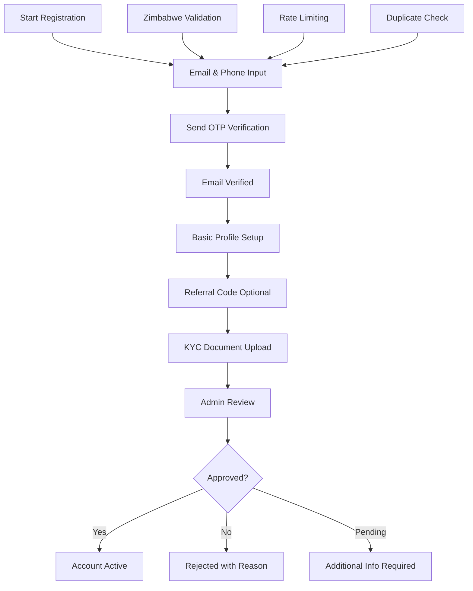

# Sign-Up Flow & Validation

## 📋 Overview

The AppEx Affiliation Portal implements a multi-stage registration pipeline designed for the Zimbabwean market, balancing security requirements with user experience. This system ensures compliance with local regulations while minimizing onboarding friction.

## 🔄 Registration Pipeline Architecture

### Multi-Stage Registration Flow



### Registration Stages

| Stage | Status | Required Actions | Trust Level | Time to Complete |
|-------|--------|------------------|-------------|------------------|
| **INITIATED** | Registration started | Email, phone, password | 0 | 2 minutes |
| **EMAIL_VERIFIED** | OTP confirmed | Basic profile information | 1 | 5 minutes |
| **PROFILE_SET** | Profile completed | KYC documents upload | 1 | 10 minutes |
| **KYC_SUBMITTED** | Documents uploaded | Admin review pending | 2 | 1-3 business days |
| **APPROVED** | Admin approved | Welcome email sent | 3 | Immediate |
| **ACTIVE** | Full access | Can earn commissions | 3 | Immediate |
| **REJECTED** | KYC failed | Appeal process available | 0 | N/A |

## 📝 Registration Data Model

### User Registration Schema

```typescript
// shared/types/auth.ts
import { z } from 'zod'

export const RegistrationSchema = z.object({
  // Basic Information
  email: z.string()
    .email('Invalid email format')
    .regex(/^[a-zA-Z0-9._%+-]+@([a-zA-Z0-9-]+\.)*\.(co\.zw|org\.zw|ac\.zw|com)$/, 
      'Must use Zimbabwe-registered domain or international email'),
  
  phone: z.string()
    .regex(/^(077|071|078|079)\d{7}$/, 
      'Must be valid Zimbabwe mobile number (077/071/078/079 followed by 7 digits)'),
  
  fullName: z.string()
    .min(3, 'Full name must be at least 3 characters')
    .max(100, 'Full name must be less than 100 characters')
    .regex(/^[a-zA-Z\s\-']+$/, 
      'Name can only contain letters, spaces, hyphens, and apostrophes'),
  
  // Security
  password: z.string()
    .min(12, 'Password must be at least 12 characters')
    .regex(/[A-Z]/, 'Must contain at least one uppercase letter')
    .regex(/[a-z]/, 'Must contain at least one lowercase letter')
    .regex(/[0-9]/, 'Must contain at least one number')
    .regex(/[^A-Za-z0-9]/, 'Must contain at least one special character'),
  
  confirmPassword: z.string(),
  
  // Zimbabwe-Specific
  nationalId: z.string()
    .regex(/^\d{8,10}[A-Z]$/, 
      'Zimbabwe national ID format: 8-10 digits followed by letter (e.g., 631234567K)')
    .optional(),
  
  idDocumentType: z.enum(['NATIONAL_ID', 'PASSPORT', 'DRIVERS_LICENSE']).optional(),
  
  // Business Information
  businessName: z.string().optional(),
  businessType: z.enum(['INDIVIDUAL', 'SOLE_PROPRIETOR', 'COMPANY']).optional(),
  businessRegistrationNumber: z.string().optional(),
  
  // Referral System
  referralCode: z.string()
    .regex(/^[A-Z0-9]{8}$/, 'Invalid referral code format')
    .optional(),
  
  // Consent & Compliance
  acceptTerms: z.boolean().refine(val => val === true, 'Must accept Terms & Conditions'),
  acceptPrivacyPolicy: z.boolean().refine(val => val === true, 'Must accept Privacy Policy'),
  marketingConsent: z.boolean().default(false),
  dataProcessingConsent: z.boolean().refine(val => val === true, 'Must consent to data processing'),
  
  // Address Information
  residentialAddress: z.object({
    street: z.string(),
    city: z.string(),
    province: z.enum(['Harare', 'Bulawayo', 'Masvingo', 'Mutare', 'Gweru', 'Kwekwe', 'Kadoma', 'Hwange', 'Kariba', 'Chinhoyi', 'Marondera', 'Bindura', 'Victoria Falls']),
    postalCode: z.string().optional()
  }).optional(),
  
  // Communication Preferences
  preferredLanguage: z.enum(['en', 'sn', 'nd']).default('en'),
  preferredCommunicationChannel: z.enum(['email', 'sms', 'whatsapp']).default('email')
}).refine(data => data.password === data.confirmPassword, {
  message: "Passwords don't match",
  path: ["confirmPassword"]
})

export type RegistrationInput = z.infer<typeof RegistrationSchema>
```

### Extended Profile Schema

```typescript
export const ProfileCompletionSchema = z.object({
  // Personal Details
  dateOfBirth: z.string().refine(date => {
    const birthDate = new Date(date)
    const minAge = new Date()
    minAge.setFullYear(minAge.getFullYear() - 18)
    return birthDate <= minAge
  }, 'Must be at least 18 years old'),
  
  gender: z.enum(['MALE', 'FEMALE', 'OTHER', 'PREFER_NOT_TO_SAY']),
  
  // Professional Information
  occupation: z.string(),
  employer: z.string().optional(),
  workExperience: z.enum(['LESS_THAN_1', '1_3', '3_5', '5_10', 'MORE_THAN_10']),
  
  // Financial Information
  bankName: z.string(),
  bankAccountNumber: z.string(),
  bankAccountType: z.enum(['SAVINGS', 'CURRENT', 'BUSINESS']),
  bankBranch: z.string(),
  
  // EcoCash Integration (Zimbabwe-specific)
  ecocashNumber: z.string().regex(/^(077|071|078|079)\d{7}$/).optional(),
  ecocashRegisteredName: z.string().optional(),
  
  // Marketing Preferences
  areasOfInterest: z.array(z.enum([
    'REAL_ESTATE', 'INSURANCE', 'FINANCIAL_SERVICES', 
    'EDUCATION', 'HEALTHCARE', 'TECHNOLOGY', 'RETAIL'
  ])),
  
  targetMarket: z.array(z.enum([
    'INDIVIDUALS', 'SMALL_BUSINESSES', 'CORPORATES', 'GOVERNMENT', 'NGOS'
  ]))
})

export type ProfileCompletionInput = z.infer<typeof ProfileCompletionSchema>
```

## 🔧 Registration Implementation

### Registration Handler

```typescript
// api/src/routes/auth/register.ts
import { PrismaClient } from '@prisma/client'
import bcrypt from 'bcrypt'
import crypto from 'crypto'
import { z } from 'zod'
import { emailQueue } from '@/queues/email.queue'
import { smsQueue } from '@/queues/sms.queue'
import { logSecurityEvent } from '@/services/security-logging.service'

const prisma = new PrismaClient()

export const registerHandler = async (req: Request, res: Response) => {
  const startTime = Date.now()
  
  try {
    // Parse and validate input
    const registrationData = RegistrationSchema.parse(req.body)
    
    // Rate limiting check
    const rateKey = `register:${req.ip}`
    const attempts = await redis.incr(rateKey)
    if (attempts === 1) await redis.expire(rateKey, 3600) // 1 hour
    if (attempts > 10) {
      await logSecurityEvent({
        eventType: 'REGISTRATION_RATE_LIMIT_EXCEEDED',
        ipAddress: req.ip,
        userAgent: req.headers['user-agent'],
        metadata: { attempts }
      })
      return res.status(429).json({ 
        error: 'TOO_MANY_ATTEMPTS', 
        message: 'Too many registration attempts. Please try again later.' 
      })
    }
    
    // Check for existing email/phone
    const existingUser = await prisma.user.findFirst({
      where: {
        OR: [
          { email: registrationData.email },
          { phone: registrationData.phone }
        ]
      },
      select: { id: true, email: true, phone: true, status: true, registrationStage: true }
    })
    
    if (existingUser) {
      if (existingUser.status === 'ACTIVE') {
        return res.status(409).json({ 
          error: 'ACCOUNT_EXISTS', 
          message: 'An account with this email or phone already exists. Please login.' 
        })
      }
      
      if (existingUser.registrationStage === 'EMAIL_VERIFIED') {
        // Resume registration from existing stage
        return res.status(200).json({
          userId: existingUser.id,
          stage: existingUser.registrationStage,
          message: 'Please complete your profile to continue'
        })
      }
      
      // Clean up incomplete registration and start fresh
      await prisma.user.delete({ where: { id: existingUser.id } })
    }
    
    // Validate referral code if provided
    let referredBy: string | null = null
    if (registrationData.referralCode) {
      const referrer = await prisma.user.findUnique({
        where: { 
          referralCode: registrationData.referralCode,
          status: 'ACTIVE'
        },
        select: { id: true, fullName: true }
      })
      
      if (!referrer) {
        return res.status(400).json({ 
          error: 'INVALID_REFERRAL_CODE', 
          message: 'Invalid referral code' 
        })
      }
      
      referredBy = referrer.id
    }
    
    // Hash password with bcrypt (cost factor 12 for security)
    const passwordHash = await bcrypt.hash(registrationData.password, 12)
    
    // Generate unique referral code for this user
    const userReferralCode = generateReferralCode()
    
    // Create user in INITIATED state
    const user = await prisma.user.create({
      data: {
        email: registrationData.email.toLowerCase(),
        phone: registrationData.phone,
        passwordHash,
        fullName: registrationData.fullName,
        referralCode: userReferralCode,
        referredBy,
        nationalId: registrationData.nationalId,
        idDocumentType: registrationData.idDocumentType,
        businessName: registrationData.businessName,
        businessType: registrationData.businessType,
        businessRegistrationNumber: registrationData.businessRegistrationNumber,
        residentialAddress: registrationData.residentialAddress,
        preferredLanguage: registrationData.preferredLanguage,
        preferredCommunicationChannel: registrationData.preferredCommunicationChannel,
        status: 'PENDING',
        registrationStage: 'INITIATED',
        affiliateTier: 'BRONZE',
        roles: ['AFFILIATE'],
        trustLevel: 0,
        termsAcceptedAt: new Date(),
        privacyPolicyAcceptedAt: new Date(),
        marketingConsent: registrationData.marketingConsent,
        dataProcessingConsent: registrationData.dataProcessingConsent,
        emailVerified: false,
        phoneVerified: false
      }
    })
    
    // Generate and store email verification OTP
    const emailOtp = crypto.randomInt(100000, 999999).toString()
    const phoneOtp = crypto.randomInt(100000, 999999).toString()
    
    await prisma.$transaction([
      // Email verification token
      prisma.verificationToken.create({
        data: {
          userId: user.id,
          token: await bcrypt.hash(emailOtp, 10),
          type: 'EMAIL_VERIFICATION',
          expiresAt: new Date(Date.now() + 15 * 60 * 1000) // 15 minutes
        }
      }),
      
      // Phone verification token
      prisma.verificationToken.create({
        data: {
          userId: user.id,
          token: await bcrypt.hash(phoneOtp, 10),
          type: 'PHONE_VERIFICATION',
          expiresAt: new Date(Date.now() + 15 * 60 * 1000)
        }
      })
    ])
    
    // Queue email verification
    await emailQueue.add('send-verification-email', {
      to: user.email,
      otp: emailOtp,
      userName: user.fullName.split(' ')[0],
      preferredLanguage: user.preferredLanguage
    }, {
      attempts: 3,
      backoff: { type: 'exponential', delay: 2000 }
    })
    
    // Queue SMS verification
    await smsQueue.add('send-verification-sms', {
      to: user.phone,
      otp: phoneOtp,
      preferredLanguage: user.preferredLanguage
    }, {
      attempts: 3,
      backoff: { type: 'exponential', delay: 2000 }
    })
    
    // Log security event
    await logSecurityEvent({
      userId: user.id,
      eventType: 'REGISTRATION_INITIATED',
      ipAddress: req.ip,
      userAgent: req.headers['user-agent'],
      metadata: {
        email: user.email,
        phone: user.phone,
        referralCode: registrationData.referralCode,
        processingTime: Date.now() - startTime
      }
    })
    
    res.status(201).json({
      userId: user.id,
      stage: 'INITIATED',
      message: 'Verification codes sent to email and phone',
      nextStep: 'verify-email-phone',
      expiresIn: 900 // 15 minutes
    })
    
  } catch (error) {
    if (error instanceof z.ZodError) {
      return res.status(400).json({
        error: 'VALIDATION_ERROR',
        message: 'Invalid input data',
        details: error.errors
      })
    }
    
    console.error('Registration error:', error)
    await logSecurityEvent({
      eventType: 'REGISTRATION_ERROR',
      ipAddress: req.ip,
      userAgent: req.headers['user-agent'],
      metadata: { error: error.message }
    })
    
    res.status(500).json({
      error: 'INTERNAL_ERROR',
      message: 'Registration failed. Please try again.'
    })
  }
}

// Generate unique 8-character referral code
function generateReferralCode(): string {
  const chars = 'ABCDEFGHIJKLMNOPQRSTUVWXYZ0123456789'
  let result = ''
  for (let i = 0; i < 8; i++) {
    result += chars.charAt(Math.floor(Math.random() * chars.length))
  }
  return result
}
```

### Email Verification Handler

```typescript
// api/src/routes/auth/verify-email.ts
export const verifyEmailHandler = async (req: Request, res: Response) => {
  const { otp, userId } = req.body
  
  // Rate limiting verification attempts
  const rateKey = `verify:email:${userId}`
  const attempts = await redis.incr(rateKey)
  if (attempts === 1) await redis.expire(rateKey, 3600) // 1 hour
  if (attempts > 5) {
    return res.status(429).json({ 
      error: 'TOO_MANY_ATTEMPTS', 
      message: 'Too many verification attempts. Please request a new code.' 
    })
  }
  
  // Find valid verification token
  const verification = await prisma.verificationToken.findFirst({
    where: {
      userId,
      type: 'EMAIL_VERIFICATION',
      expiresAt: { gt: new Date() },
      used: false
    },
    include: { user: true }
  })
  
  if (!verification) {
    return res.status(400).json({ 
      error: 'INVALID_OR_EXPIRED_CODE', 
      message: 'Verification code is invalid or has expired' 
    })
  }
  
  // Verify OTP
  const isValid = await bcrypt.compare(otp, verification.token)
  if (!isValid) {
    await logSecurityEvent({
      userId,
      eventType: 'EMAIL_VERIFICATION_FAILED',
      ipAddress: req.ip,
      userAgent: req.headers['user-agent'],
      metadata: { attempts }
    })
    
    return res.status(400).json({ 
      error: 'INVALID_CODE', 
      message: 'Incorrect verification code' 
    })
  }
  
  // Mark as used and update user
  await prisma.$transaction([
    prisma.verificationToken.update({
      where: { id: verification.id },
      data: { used: true, usedAt: new Date() }
    }),
    prisma.user.update({
      where: { id: userId },
      data: { 
        emailVerified: true,
        emailVerifiedAt: new Date(),
        trustLevel: 1, // Basic trust level
        registrationStage: 'EMAIL_VERIFIED'
      }
    })
  ])
  
  // Send welcome email
  await emailQueue.add('send-welcome-email', {
    to: verification.user.email,
    userName: verification.user.fullName.split(' ')[0],
    nextStep: 'complete-profile'
  })
  
  // Log successful verification
  await logSecurityEvent({
    userId,
    eventType: 'EMAIL_VERIFIED',
    ipAddress: req.ip,
    userAgent: req.headers['user-agent']
  })
  
  res.json({
    success: true,
    message: 'Email verified successfully',
    trustLevel: 1,
    nextStep: 'complete-profile'
  })
}
```

### Profile Completion Handler

```typescript
// api/src/routes/auth/complete-profile.ts
export const completeProfileHandler = async (req: Request, res: Response) => {
  const userId = req.user.id
  const profileData = ProfileCompletionSchema.parse(req.body)
  
  // Verify user is at correct stage
  const user = await prisma.user.findUnique({
    where: { id: userId },
    select: { registrationStage: true, emailVerified: true }
  })
  
  if (!user || user.registrationStage !== 'EMAIL_VERIFIED') {
    return res.status(400).json({
      error: 'INVALID_STAGE',
      message: 'Please verify your email first'
    })
  }
  
  // Update user profile
  const updatedUser = await prisma.user.update({
    where: { id: userId },
    data: {
      ...profileData,
      registrationStage: 'PROFILE_SET',
      profileCompletedAt: new Date()
    }
  })
  
  // Log profile completion
  await logSecurityEvent({
    userId,
    eventType: 'PROFILE_COMPLETED',
    ipAddress: req.ip,
    userAgent: req.headers['user-agent'],
    metadata: { profileFields: Object.keys(profileData) }
  })
  
  res.json({
    success: true,
    message: 'Profile completed successfully',
    nextStep: user.emailVerified ? 'upload-kyc-documents' : 'verify-email'
  })
}
```

## 📄 KYC Document Upload

### KYC Document Handler

```typescript
// api/src/routes/auth/upload-kyc.ts
import multer from 'multer'
import { CloudinaryService } from '@/services/cloudinary.service'

// Configure multer for file uploads
const upload = multer({
  storage: multer.memoryStorage(),
  limits: {
    fileSize: 10 * 1024 * 1024, // 10MB limit
    files: 5 // Maximum 5 files
  },
  fileFilter: (req, file, cb) => {
    const allowedTypes = ['image/jpeg', 'image/png', 'application/pdf']
    if (allowedTypes.includes(file.mimetype)) {
      cb(null, true)
    } else {
      cb(new Error('Invalid file type. Only JPEG, PNG, and PDF files are allowed.'))
    }
  }
})

export const uploadKycHandler = async (req: Request, res: Response) => {
  const userId = req.user.id
  const cloudinaryService = new CloudinaryService()
  
  try {
    const files = req.files as Express.Multer.File[]
    const { documentType, idNumber, expiryDate } = req.body
    
    // Verify user stage
    const user = await prisma.user.findUnique({
      where: { id: userId },
      select: { registrationStage: true }
    })
    
    if (!user || user.registrationStage !== 'PROFILE_SET') {
      return res.status(400).json({
        error: 'INVALID_STAGE',
        message: 'Please complete your profile first'
      })
    }
    
    // Upload documents to Cloudinary
    const uploadedDocuments = []
    
    for (const file of files) {
      const result = await cloudinaryService.uploadBuffer(file.buffer, {
        folder: `kyc-documents/${userId}`,
        resource_type: file.mimetype === 'application/pdf' ? 'raw' : 'image',
        public_id: `${documentType}_${Date.now()}`,
        format: file.mimetype === 'application/pdf' ? 'pdf' : undefined
      })
      
      uploadedDocuments.push({
        type: documentType,
        url: result.secure_url,
        publicId: result.public_id,
        originalName: file.originalname,
        mimeType: file.mimetype,
        size: file.size
      })
    }
    
    // Store KYC data
    await prisma.$transaction([
      prisma.kycSubmission.create({
        data: {
          userId,
          documentType,
          idNumber,
          expiryDate: expiryDate ? new Date(expiryDate) : null,
          documents: uploadedDocuments,
          status: 'PENDING',
          submittedAt: new Date()
        }
      }),
      
      prisma.user.update({
        where: { id: userId },
        data: {
          registrationStage: 'KYC_SUBMITTED',
          kycStatus: 'PENDING',
          trustLevel: 2 // Verified trust level
        }
      })
    ])
    
    // Queue for admin review
    await kycQueue.add('review-kyc-submission', {
      userId,
      kycId: uploadedDocuments[0].publicId
    })
    
    // Log KYC submission
    await logSecurityEvent({
      userId,
      eventType: 'KYC_SUBMITTED',
      ipAddress: req.ip,
      userAgent: req.headers['user-agent'],
      metadata: {
        documentType,
        documentCount: uploadedDocuments.length
      }
    })
    
    res.json({
      success: true,
      message: 'KYC documents uploaded successfully',
      status: 'PENDING_REVIEW',
      expectedReviewTime: '1-3 business days'
    })
    
  } catch (error) {
    console.error('KYC upload error:', error)
    res.status(500).json({
      error: 'UPLOAD_FAILED',
      message: 'Failed to upload documents. Please try again.'
    })
  }
}
```

## 🔍 Validation Rules

### Zimbabwe-Specific Validations

```typescript
// validators/zimbabwe.ts
export class ZimbabweValidators {
  
  // Phone number validation for Zimbabwean networks
  static validatePhoneNumber(phone: string): boolean {
    const zimbabweRegex = /^(077|071|078|079)\d{7}$/
    return zimbabweRegex.test(phone)
  }
  
  // National ID validation (Zimbabwe format)
  static validateNationalId(nationalId: string): boolean {
    const idRegex = /^\d{8,10}[A-Z]$/
    return idRegex.test(nationalId)
  }
  
  // Email validation with Zimbabwe domain preference
  static validateEmail(email: string): boolean {
    const emailRegex = /^[a-zA-Z0-9._%+-]+@([a-zA-Z0-9-]+\.)*\.(co\.zw|org\.zw|ac\.zw|com)$/
    return emailRegex.test(email)
  }
  
  // Province validation
  static validateProvince(province: string): boolean {
    const validProvinces = [
      'Harare', 'Bulawayo', 'Masvingo', 'Mutare', 'Gweru', 
      'Kwekwe', 'Kadoma', 'Hwange', 'Kariba', 'Chinhoyi', 
      'Marondera', 'Bindura', 'Victoria Falls'
    ]
    return validProvinces.includes(province)
  }
  
  // Business registration number validation
  static validateBusinessRegistrationNumber(regNumber: string): boolean {
    // Zimbabwean business registration format
    const businessRegex = /^[A-Z]{2}\d{6}[A-Z]?$/
    return businessRegex.test(regNumber)
  }
  
  // Bank account validation (Zimbabwean banks)
  static validateBankAccount(accountNumber: string, bankCode: string): boolean {
    const bankFormats = {
      'CBZ': /^\d{10}$/,
      'STANBIC': /^\d{11}$/,
      'FBC': /^\d{9}$/,
      'POCB': /^\d{10}$/,
      'NBS': /^\d{9}$/,
      'METBANK': /^\d{10}$/,
      'ZBANK': /^\d{10}$/,
      'AGRICBANK': /^\d{9}$/,
      'CABS': /^\d{8}$/,
      'ECOBANK': /^\d{12}$/
    }
    
    return bankFormats[bankCode]?.test(accountNumber) || false
  }
}
```

### Password Strength Validation

```typescript
// validators/password.ts
export class PasswordValidator {
  
  static async validatePasswordStrength(password: string): Promise<{
    isValid: boolean
    score: number // 0-5
    feedback: string[]
    requirements: string[]
  }> {
    const feedback: string[] = []
    const requirements: string[] = []
    let score = 0
    
    // Length requirement
    if (password.length >= 12) {
      score++
    } else {
      requirements.push('At least 12 characters')
      feedback.push('Password should be at least 12 characters long')
    }
    
    // Uppercase letter
    if (/[A-Z]/.test(password)) {
      score++
    } else {
      requirements.push('At least one uppercase letter')
      feedback.push('Include at least one uppercase letter')
    }
    
    // Lowercase letter
    if (/[a-z]/.test(password)) {
      score++
    } else {
      requirements.push('At least one lowercase letter')
      feedback.push('Include at least one lowercase letter')
    }
    
    // Number
    if (/[0-9]/.test(password)) {
      score++
    } else {
      requirements.push('At least one number')
      feedback.push('Include at least one number')
    }
    
    // Special character
    if (/[^A-Za-z0-9]/.test(password)) {
      score++
    } else {
      requirements.push('At least one special character')
      feedback.push('Include at least one special character')
    }
    
    // Check against common passwords
    const isCommon = await this.checkCommonPassword(password)
    if (isCommon) {
      score = 0
      feedback.push('This password is too common. Please choose a more unique password.')
    }
    
    // Check for personal information
    const containsPersonalInfo = await this.checkPersonalInfo(password)
    if (containsPersonalInfo) {
      score = Math.max(0, score - 1)
      feedback.push('Password should not contain personal information')
    }
    
    return {
      isValid: score >= 4 && !isCommon && !containsPersonalInfo,
      score,
      feedback,
      requirements
    }
  }
  
  private static async checkCommonPassword(password: string): Promise<boolean> {
    // Check against HaveIBeenPwned API or local common password list
    const commonPasswords = [
      'password', '123456', 'qwerty', 'password123', 'admin',
      'zimbabwe', 'harare', '2023', '2024', '123456789'
    ]
    
    return commonPasswords.includes(password.toLowerCase())
  }
  
  private static async checkPersonalInfo(password: string): Promise<boolean> {
    // This would check against user's personal information
    // Implementation depends on context
    return false
  }
}
```

## 📊 Registration Analytics

### Conversion Tracking

```typescript
// services/registration-analytics.service.ts
export class RegistrationAnalytics {
  
  static async trackRegistrationStage(userId: string, stage: string, metadata?: any): Promise<void> {
    await prisma.registrationAnalytics.create({
      data: {
        userId,
        stage,
        timestamp: new Date(),
        metadata,
        conversionRate: await this.calculateConversionRate(stage)
      }
    })
  }
  
  static async calculateConversionRate(stage: string): Promise<number> {
    const total = await prisma.user.count({
      where: { registrationStage: { gte: stage } }
    })
    
    const completed = await prisma.user.count({
      where: { registrationStage: 'ACTIVE' }
    })
    
    return total > 0 ? completed / total : 0
  }
  
  static async getFunnelMetrics(): Promise<RegistrationFunnel> {
    const stages = ['INITIATED', 'EMAIL_VERIFIED', 'PROFILE_SET', 'KYC_SUBMITTED', 'APPROVED', 'ACTIVE']
    
    const metrics = await Promise.all(
      stages.map(async (stage) => ({
        stage,
        count: await prisma.user.count({ where: { registrationStage: stage } }),
        conversionRate: await this.calculateConversionRate(stage)
      }))
    )
    
    return {
      stages: metrics,
      overallConversion: await this.calculateConversionRate('INITIATED'),
      averageTimeToComplete: await this.getAverageCompletionTime()
    }
  }
}

interface RegistrationFunnel {
  stages: Array<{
    stage: string
    count: number
    conversionRate: number
  }>
  overallConversion: number
  averageTimeToComplete: number
}
```

## 🔔 Email Templates

### Verification Email Template

```html
<!-- templates/email-verification.html -->
<!DOCTYPE html>
<html>
<head>
    <meta charset="utf-8">
    <title>Email Verification - AppEx Affiliation Portal</title>
    <style>
        body { font-family: Arial, sans-serif; max-width: 600px; margin: 0 auto; }
        .header { background: #2563eb; color: white; padding: 20px; text-align: center; }
        .content { padding: 20px; }
        .otp { font-size: 24px; font-weight: bold; background: #f3f4f6; padding: 15px; text-align: center; letter-spacing: 5px; }
        .footer { background: #f9fafb; padding: 20px; text-align: center; font-size: 12px; color: #6b7280; }
    </style>
</head>
<body>
    <div class="header">
        <h1>AppEx Affiliation Portal</h1>
        <p>Email Verification</p>
    </div>
    
    <div class="content">
        <h2>Hello {{userName}},</h2>
        <p>Thank you for registering with AppEx Affiliation Portal. Please use the verification code below to complete your email verification:</p>
        
        <div class="otp">{{otp}}</div>
        
        <p><strong>This code will expire in 15 minutes.</strong></p>
        <p>If you didn't request this verification, please ignore this email.</p>
        
        <p>After verifying your email, you'll need to:</p>
        <ol>
            <li>Complete your profile information</li>
            <li>Upload KYC documents for verification</li>
            <li>Wait for admin approval (1-3 business days)</li>
        </ol>
    </div>
    
    <div class="footer">
        <p>© 2026 AppEx Affiliation Portal | Built for Zimbabwean entrepreneurs</p>
        <p>Need help? Contact support@appex.co.zw | Call +263 242 123 456</p>
    </div>
</body>
</html>
```

## 📋 Registration Checklist

### Pre-Registration Requirements
- [ ] Email validation (Zimbabwe domains preferred)
- [ ] Phone number validation (Zimbabwean networks)
- [ ] Password strength requirements
- [ ] Terms and conditions acceptance
- [ ] Privacy policy consent
- [ ] Data processing consent

### Registration Process
- [ ] Initial data capture and validation
- [ ] Email and phone verification
- [ ] Profile completion
- [ ] KYC document upload
- [ ] Admin review and approval
- [ ] Account activation

### Security Measures
- [ ] Rate limiting on registration attempts
- [ ] Duplicate email/phone prevention
- [ ] OTP expiration and rate limiting
- [ ] Secure file upload for KYC documents
- [ ] Comprehensive audit logging
- [ ] Fraud detection mechanisms

---

**Next**: [Login & Session Management](./login.md) → Authentication flow and session handling documentation
