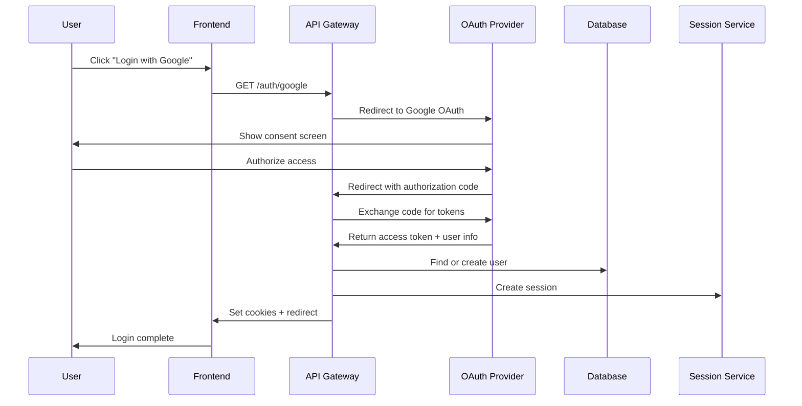

# Social Authentication

## 📋 Overview

The AppEx Affiliation Portal supports social authentication through OAuth providers, allowing users to register and login using their existing social media accounts. This reduces registration friction while maintaining security and compliance with Zimbabwean requirements.

## 🔄 Social Authentication Architecture

### OAuth Flow Diagram



### Supported OAuth Providers

| Provider | Status | Zimbabwe Usage | Implementation | Scopes |
|----------|--------|----------------|----------------|--------|
| **Google** | ✅ Active | High | OAuth 2.0 | email, profile |
| **Facebook** | ✅ Active | Medium | OAuth 2.0 | email, public_profile |
| **Microsoft** | 🔄 Planned | Low | OAuth 2.0 | email, profile |
| **LinkedIn** | 🔄 Planned | Medium | OAuth 2.0 | email, profile |

### OAuth Configuration Schema

```typescript
// shared/types/oauth.ts
export const OAuthConfigSchema = z.object({
  provider: z.enum(['google', 'facebook', 'microsoft', 'linkedin']),
  clientId: z.string(),
  clientSecret: z.string(),
  redirectUri: z.string().url(),
  scope: z.array(z.string()),
  enabled: z.boolean().default(true)
})

export const OAuthProfileSchema = z.object({
  id: z.string(),
  email: z.string().email(),
  name: z.string(),
  firstName: z.string(),
  lastName: z.string(),
  avatar: z.string().url().optional(),
  verified: z.boolean().default(false),
  provider: z.string(),
  raw: z.any()
})

export type OAuthConfig = z.infer<typeof OAuthConfigSchema>
export type OAuthProfile = z.infer<typeof OAuthProfileSchema>
```

## 🔧 Google OAuth Implementation

### Google OAuth Configuration

```typescript
// config/oauth/google.ts
export const googleOAuthConfig = {
  clientId: process.env.GOOGLE_CLIENT_ID!,
  clientSecret: process.env.GOOGLE_CLIENT_SECRET!,
  redirectUri: process.env.GOOGLE_REDIRECT_URI || 'https://api.appex.co.zw/auth/google/callback',
  scope: ['email', 'profile'],
  responseType: 'code',
  grantType: 'authorization_code',
  accessType: 'offline',
  prompt: 'consent'
}

// Google OAuth URLs
export const googleOAuthUrls = {
  authUrl: 'https://accounts.google.com/o/oauth2/v2/auth',
  tokenUrl: 'https://oauth2.googleapis.com/token',
  userInfoUrl: 'https://www.googleapis.com/oauth2/v3/userinfo',
  revokeUrl: 'https://oauth2.googleapis.com/revoke'
}
```

### Google OAuth Handler

```typescript
// api/src/routes/auth/oauth/google.ts
import axios from 'axios'
import { PrismaClient } from '@prisma/client'
import jwt from 'jsonwebtoken'
import crypto from 'crypto'

const prisma = new PrismaClient()

export const googleAuthHandler = async (req: Request, res: Response) => {
  const { state } = req.query
  
  try {
    // Generate OAuth URL
    const authUrl = new URL(googleOAuthUrls.authUrl)
    authUrl.searchParams.set('client_id', googleOAuthConfig.clientId)
    authUrl.searchParams.set('redirect_uri', googleOAuthConfig.redirectUri)
    authUrl.searchParams.set('scope', googleOAuthConfig.scope.join(' '))
    authUrl.searchParams.set('response_type', googleOAuthConfig.responseType)
    authUrl.searchParams.set('access_type', googleOAuthConfig.accessType)
    authUrl.searchParams.set('prompt', googleOAuthConfig.prompt)
    authUrl.searchParams.set('state', state || crypto.randomUUID())
    
    // Store state in Redis for security
    await redis.setex(
      `oauth_state:${authUrl.searchParams.get('state')}`,
      600, // 10 minutes
      JSON.stringify({
        provider: 'google',
        redirectUri: req.headers.referer || '/',
        createdAt: new Date().toISOString()
      })
    )
    
    res.redirect(authUrl.toString())
    
  } catch (error) {
    console.error('Google OAuth error:', error)
    res.status(500).json({
      error: 'OAUTH_ERROR',
      message: 'Failed to initiate Google authentication'
    })
  }
}

export const googleCallbackHandler = async (req: Request, res: Response) => {
  const { code, state, error } = req.query
  
  try {
    // Handle OAuth errors
    if (error) {
      console.error('Google OAuth error:', error)
      return res.redirect(`${process.env.FRONTEND_URL}/login?error=oauth_failed&provider=google`)
    }
    
    if (!code || !state) {
      return res.redirect(`${process.env.FRONTEND_URL}/login?error=invalid_callback`)
    }
    
    // Verify state
    const stateData = await redis.get(`oauth_state:${state}`)
    if (!stateData) {
      return res.redirect(`${process.env.FRONTEND_URL}/login?error=invalid_state`)
    }
    
    const oauthState = JSON.parse(stateData)
    await redis.del(`oauth_state:${state}`)
    
    // Exchange authorization code for tokens
    const tokenResponse = await axios.post(googleOAuthUrls.tokenUrl, {
      code,
      client_id: googleOAuthConfig.clientId,
      client_secret: googleOAuthConfig.clientSecret,
      redirect_uri: googleOAuthConfig.redirectUri,
      grant_type: googleOAuthConfig.grantType
    }, {
      headers: {
        'Content-Type': 'application/x-www-form-urlencoded'
      }
    })
    
    const { access_token, refresh_token, id_token } = tokenResponse.data
    
    // Get user profile information
    const userInfoResponse = await axios.get(googleOAuthUrls.userInfoUrl, {
      headers: {
        'Authorization': `Bearer ${access_token}`
      }
    })
    
    const googleProfile = parseGoogleProfile(userInfoResponse.data)
    
    // Find or create user
    const user = await findOrCreateOAuthUser(googleProfile, 'google')
    
    if (!user) {
      return res.redirect(`${process.env.FRONTEND_URL}/login?error=user_creation_failed`)
    }
    
    // Create OAuth identity link
    await linkOAuthIdentity(user.id, googleProfile, 'google')
    
    // Generate session tokens
    const tokens = await generateTokens({
      userId: user.id,
      email: user.email,
      tier: user.affiliateTier,
      roles: user.roles,
      trustLevel: user.trustLevel,
      deviceFingerprint: req.deviceFingerprint
    })
    
    // Create session
    await createSession({
      userId: user.id,
      refreshTokenJti: tokens.refreshTokenJti,
      deviceFingerprint: req.deviceFingerprint,
      deviceName: 'Google OAuth Login',
      ipAddress: req.ip,
      userAgent: req.headers['user-agent'],
      oauthProvider: 'google'
    })
    
    // Set cookies
    const cookieOptions = {
      httpOnly: true,
      secure: process.env.NODE_ENV === 'production',
      sameSite: 'strict' as const,
      domain: process.env.COOKIE_DOMAIN || '.appex.co.zw'
    }
    
    res.cookie('access_token', tokens.accessToken, {
      ...cookieOptions,
      maxAge: 15 * 60 * 1000
    })
    
    res.cookie('refresh_token', tokens.refreshToken, {
      ...cookieOptions,
      maxAge: 7 * 24 * 3600 * 1000,
      path: '/auth/refresh'
    })
    
    // Log successful OAuth login
    await logSecurityEvent({
      userId: user.id,
      eventType: 'OAUTH_LOGIN_SUCCESS',
      ipAddress: req.ip,
      userAgent: req.headers['user-agent'],
      metadata: {
        provider: 'google',
        email: googleProfile.email,
        verified: googleProfile.verified
      }
    })
    
    // Redirect to intended destination
    const redirectUri = oauthState.redirectUri || '/dashboard'
    res.redirect(`${process.env.FRONTEND_URL}${redirectUri}`)
    
  } catch (error) {
    console.error('Google OAuth callback error:', error)
    res.redirect(`${process.env.FRONTEND_URL}/login?error=callback_failed`)
  }
}

function parseGoogleProfile(data: any): OAuthProfile {
  return {
    id: data.sub,
    email: data.email,
    name: data.name,
    firstName: data.given_name,
    lastName: data.family_name,
    avatar: data.picture,
    verified: data.email_verified,
    provider: 'google',
    raw: data
  }
}
```

## 🔧 Facebook OAuth Implementation

### Facebook OAuth Configuration

```typescript
// config/oauth/facebook.ts
export const facebookOAuthConfig = {
  appId: process.env.FACEBOOK_APP_ID!,
  appSecret: process.env.FACEBOOK_APP_SECRET!,
  redirectUri: process.env.FACEBOOK_REDIRECT_URI || 'https://api.appex.co.zw/auth/facebook/callback',
  scope: ['email', 'public_profile'],
  responseType: 'code',
  display: 'popup'
}

// Facebook OAuth URLs
export const facebookOAuthUrls = {
  authUrl: 'https://www.facebook.com/v18.0/dialog/oauth',
  tokenUrl: 'https://graph.facebook.com/v18.0/oauth/access_token',
  userInfoUrl: 'https://graph.facebook.com/v18.0/me',
  revokeUrl: 'https://graph.facebook.com/v18.0/me/permissions'
}
```

### Facebook OAuth Handler

```typescript
// api/src/routes/auth/oauth/facebook.ts
export const facebookAuthHandler = async (req: Request, res: Response) => {
  const { state } = req.query
  
  try {
    // Generate OAuth URL
    const authUrl = new URL(facebookOAuthUrls.authUrl)
    authUrl.searchParams.set('client_id', facebookOAuthConfig.appId)
    authUrl.searchParams.set('redirect_uri', facebookOAuthConfig.redirectUri)
    authUrl.searchParams.set('scope', facebookOAuthConfig.scope.join(','))
    authUrl.searchParams.set('response_type', facebookOAuthConfig.responseType)
    authUrl.searchParams.set('display', facebookOAuthConfig.display)
    authUrl.searchParams.set('state', state || crypto.randomUUID())
    
    // Store state in Redis
    await redis.setex(
      `oauth_state:${authUrl.searchParams.get('state')}`,
      600,
      JSON.stringify({
        provider: 'facebook',
        redirectUri: req.headers.referer || '/',
        createdAt: new Date().toISOString()
      })
    )
    
    res.redirect(authUrl.toString())
    
  } catch (error) {
    console.error('Facebook OAuth error:', error)
    res.status(500).json({
      error: 'OAUTH_ERROR',
      message: 'Failed to initiate Facebook authentication'
    })
  }
}

export const facebookCallbackHandler = async (req: Request, res: Response) => {
  const { code, state, error } = req.query
  
  try {
    if (error) {
      console.error('Facebook OAuth error:', error)
      return res.redirect(`${process.env.FRONTEND_URL}/login?error=oauth_failed&provider=facebook`)
    }
    
    if (!code || !state) {
      return res.redirect(`${process.env.FRONTEND_URL}/login?error=invalid_callback`)
    }
    
    // Verify state
    const stateData = await redis.get(`oauth_state:${state}`)
    if (!stateData) {
      return res.redirect(`${process.env.FRONTEND_URL}/login?error=invalid_state`)
    }
    
    const oauthState = JSON.parse(stateData)
    await redis.del(`oauth_state:${state}`)
    
    // Exchange authorization code for tokens
    const tokenResponse = await axios.get(facebookOAuthUrls.tokenUrl, {
      params: {
        code,
        client_id: facebookOAuthConfig.appId,
        client_secret: facebookOAuthConfig.appSecret,
        redirect_uri: facebookOAuthConfig.redirectUri
      }
    })
    
    const { access_token } = tokenResponse.data
    
    // Get user profile information
    const userInfoResponse = await axios.get(facebookOAuthUrls.userInfoUrl, {
      params: {
        fields: 'id,email,name,first_name,last_name,picture',
        access_token
      }
    })
    
    const facebookProfile = parseFacebookProfile(userInfoResponse.data)
    
    // Find or create user
    const user = await findOrCreateOAuthUser(facebookProfile, 'facebook')
    
    if (!user) {
      return res.redirect(`${process.env.FRONTEND_URL}/login?error=user_creation_failed`)
    }
    
    // Create OAuth identity link
    await linkOAuthIdentity(user.id, facebookProfile, 'facebook')
    
    // Generate session tokens and create session
    const tokens = await generateTokens({
      userId: user.id,
      email: user.email,
      tier: user.affiliateTier,
      roles: user.roles,
      trustLevel: user.trustLevel,
      deviceFingerprint: req.deviceFingerprint
    })
    
    await createSession({
      userId: user.id,
      refreshTokenJti: tokens.refreshTokenJti,
      deviceFingerprint: req.deviceFingerprint,
      deviceName: 'Facebook OAuth Login',
      ipAddress: req.ip,
      userAgent: req.headers['user-agent'],
      oauthProvider: 'facebook'
    })
    
    // Set cookies
    const cookieOptions = {
      httpOnly: true,
      secure: process.env.NODE_ENV === 'production',
      sameSite: 'strict' as const,
      domain: process.env.COOKIE_DOMAIN || '.appex.co.zw'
    }
    
    res.cookie('access_token', tokens.accessToken, {
      ...cookieOptions,
      maxAge: 15 * 60 * 1000
    })
    
    res.cookie('refresh_token', tokens.refreshToken, {
      ...cookieOptions,
      maxAge: 7 * 24 * 3600 * 1000,
      path: '/auth/refresh'
    })
    
    // Log successful OAuth login
    await logSecurityEvent({
      userId: user.id,
      eventType: 'OAUTH_LOGIN_SUCCESS',
      ipAddress: req.ip,
      userAgent: req.headers['user-agent'],
      metadata: {
        provider: 'facebook',
        email: facebookProfile.email,
        verified: facebookProfile.verified
      }
    })
    
    const redirectUri = oauthState.redirectUri || '/dashboard'
    res.redirect(`${process.env.FRONTEND_URL}${redirectUri}`)
    
  } catch (error) {
    console.error('Facebook OAuth callback error:', error)
    res.redirect(`${process.env.FRONTEND_URL}/login?error=callback_failed`)
  }
}

function parseFacebookProfile(data: any): OAuthProfile {
  return {
    id: data.id,
    email: data.email,
    name: data.name,
    firstName: data.first_name,
    lastName: data.last_name,
    avatar: data.picture?.data?.url,
    verified: true, // Facebook accounts are verified by default
    provider: 'facebook',
    raw: data
  }
}
```

## 🔗 OAuth User Management

### Find or Create OAuth User

```typescript
// services/oauth/oauth-user.service.ts
export class OAuthUserService {
  
  static async findOrCreateOAuthUser(profile: OAuthProfile, provider: string): Promise<User | null> {
    try {
      // First, check if OAuth identity already exists
      const existingIdentity = await prisma.oauthIdentity.findUnique({
        where: {
          provider_providerId: {
            provider,
            providerId: profile.id
          }
        },
        include: { user: true }
      })
      
      if (existingIdentity) {
        // Update existing identity
        await prisma.oauthIdentity.update({
          where: { id: existingIdentity.id },
          data: {
            email: profile.email,
            lastUsedAt: new Date(),
            profileData: profile.raw
          }
        })
        
        // Update user's last login
        await prisma.user.update({
          where: { id: existingIdentity.user.id },
          data: {
            lastLoginAt: new Date(),
            lastLoginIp: null // Will be set by session creation
          }
        })
        
        return existingIdentity.user
      }
      
      // Check if user exists with same email
      const existingUser = await prisma.user.findUnique({
        where: { email: profile.email.toLowerCase() }
      })
      
      if (existingUser) {
        // Link OAuth identity to existing user
        await prisma.oauthIdentity.create({
          data: {
            userId: existingUser.id,
            provider,
            providerId: profile.id,
            email: profile.email,
            profileData: profile.raw,
            createdAt: new Date(),
            lastUsedAt: new Date()
          }
        })
        
        return existingUser
      }
      
      // Create new user from OAuth profile
      const newUser = await this.createUserFromOAuthProfile(profile, provider)
      
      return newUser
      
    } catch (error) {
      console.error('Error finding/creating OAuth user:', error)
      return null
    }
  }
  
  private static async createUserFromOAuthProfile(profile: OAuthProfile, provider: string): Promise<User> {
    // Generate unique referral code
    const referralCode = generateReferralCode()
    
    // Determine initial trust level based on provider verification
    const initialTrustLevel = profile.verified ? 1 : 0
    const initialStatus = profile.verified ? 'ACTIVE' : 'PENDING'
    
    const userData = {
      email: profile.email.toLowerCase(),
      fullName: profile.name,
      passwordHash: '', // OAuth users don't have passwords
      referralCode,
      affiliateTier: 'BRONZE',
      roles: ['AFFILIATE'],
      status: initialStatus,
      registrationStage: profile.verified ? 'EMAIL_VERIFIED' : 'INITIATED',
      trustLevel: initialTrustLevel,
      emailVerified: profile.verified,
      emailVerifiedAt: profile.verified ? new Date() : null,
      termsAcceptedAt: new Date(),
      privacyPolicyAcceptedAt: new Date(),
      marketingConsent: false,
      dataProcessingConsent: true,
      preferredLanguage: 'en',
      preferredCommunicationChannel: 'email',
      oauthOnly: true, // Flag to indicate OAuth-only account
      createdAt: new Date(),
      updatedAt: new Date()
    }
    
    const user = await prisma.user.create({
      data: userData
    })
    
    // Create OAuth identity
    await prisma.oauthIdentity.create({
      data: {
        userId: user.id,
        provider,
        providerId: profile.id,
        email: profile.email,
        profileData: profile.raw,
        createdAt: new Date(),
        lastUsedAt: new Date()
      }
    })
    
    // Log user creation
    await logSecurityEvent({
      userId: user.id,
      eventType: 'OAUTH_USER_CREATED',
      metadata: {
        provider,
        email: profile.email,
        verified: profile.verified,
        initialTrustLevel
      }
    })
    
    // Send welcome email for OAuth users
    if (profile.verified) {
      await emailQueue.add('send-oauth-welcome-email', {
        to: user.email,
        userName: profile.firstName,
        provider,
        nextStep: 'complete-profile'
      })
    } else {
      // Send email verification for unverified OAuth accounts
      await emailQueue.add('send-oauth-verification-email', {
        to: user.email,
        userName: profile.firstName,
        provider
      })
    }
    
    return user
  }
  
  static async linkOAuthIdentity(userId: string, profile: OAuthProfile, provider: string): Promise<void> {
    try {
      // Check if identity already exists
      const existingIdentity = await prisma.oauthIdentity.findUnique({
        where: {
          provider_providerId: {
            provider,
            providerId: profile.id
          }
        }
      })
      
      if (existingIdentity) {
        // Update existing identity
        await prisma.oauthIdentity.update({
          where: { id: existingIdentity.id },
          data: {
            userId,
            email: profile.email,
            lastUsedAt: new Date(),
            profileData: profile.raw
          }
        })
      } else {
        // Create new identity
        await prisma.oauthIdentity.create({
          data: {
            userId,
            provider,
            providerId: profile.id,
            email: profile.email,
            profileData: profile.raw,
            createdAt: new Date(),
            lastUsedAt: new Date()
          }
        })
      }
      
      // Log identity linking
      await logSecurityEvent({
        userId,
        eventType: 'OAUTH_IDENTITY_LINKED',
        metadata: {
          provider,
          providerId: profile.id,
          email: profile.email
        }
      })
      
    } catch (error) {
      console.error('Error linking OAuth identity:', error)
      throw error
    }
  }
  
  static async unlinkOAuthIdentity(userId: string, provider: string): Promise<void> {
    try {
      const identity = await prisma.oauthIdentity.findFirst({
        where: {
          userId,
          provider
        }
      })
      
      if (!identity) {
        throw new Error('OAuth identity not found')
      }
      
      // Check if user has other OAuth identities or password
      const otherIdentities = await prisma.oauthIdentity.count({
        where: {
          userId,
          provider: { not: provider }
        }
      })
      
      const user = await prisma.user.findUnique({
        where: { id: userId },
        select: { passwordHash: true, oauthOnly: true }
      })
      
      if (otherIdentities === 0 && user?.oauthOnly) {
        throw new Error('Cannot unlink the only authentication method')
      }
      
      // Delete OAuth identity
      await prisma.oauthIdentity.delete({
        where: { id: identity.id }
      })
      
      // Log identity unlinking
      await logSecurityEvent({
        userId,
        eventType: 'OAUTH_IDENTITY_UNLINKED',
        metadata: {
          provider,
          providerId: identity.providerId
        }
      })
      
    } catch (error) {
      console.error('Error unlinking OAuth identity:', error)
      throw error
    }
  }
  
  static async getOAuthIdentities(userId: string): Promise<OAuthIdentity[]> {
    return await prisma.oauthIdentity.findMany({
      where: { userId },
      select: {
        id: true,
        provider: true,
        providerId: true,
        email: true,
        createdAt: true,
        lastUsedAt: true
      },
      orderBy: { lastUsedAt: 'desc' }
    })
  }
}
```

### OAuth Account Management

```typescript
// api/src/routes/auth/oauth/accounts.ts
export const getLinkedAccountsHandler = async (req: Request, res: Response) => {
  const userId = req.user.id
  
  try {
    const identities = await OAuthUserService.getOAuthIdentities(userId)
    
    // Get user info to check if they have password
    const user = await prisma.user.findUnique({
      where: { id: userId },
      select: { passwordHash: true, oauthOnly: true }
    })
    
    res.json({
      identities,
      hasPassword: !!user?.passwordHash,
      oauthOnly: user?.oauthOnly || false
    })
    
  } catch (error) {
    console.error('Get linked accounts error:', error)
    res.status(500).json({
      error: 'FETCH_FAILED',
      message: 'Failed to fetch linked accounts'
    })
  }
}

export const linkAccountHandler = async (req: Request, res: Response) => {
  const userId = req.user.id
  const { provider, code } = req.body
  
  try {
    // Verify OAuth code and get profile
    const profile = await verifyOAuthCode(provider, code)
    
    if (!profile) {
      return res.status(400).json({
        error: 'INVALID_OAUTH_CODE',
        message: 'Invalid OAuth authorization code'
      })
    }
    
    // Link the account
    await OAuthUserService.linkOAuthIdentity(userId, profile, provider)
    
    res.json({
      success: true,
      message: `${provider} account linked successfully`,
      provider,
      email: profile.email
    })
    
  } catch (error) {
    console.error('Link account error:', error)
    
    if (error.message === 'OAuth identity not found') {
      return res.status(404).json({
        error: 'IDENTITY_NOT_FOUND',
        message: 'OAuth identity not found'
      })
    }
    
    res.status(500).json({
      error: 'LINK_FAILED',
      message: 'Failed to link account'
    })
  }
}

export const unlinkAccountHandler = async (req: Request, res: Response) => {
  const userId = req.user.id
  const { provider } = req.params
  
  try {
    await OAuthUserService.unlinkOAuthIdentity(userId, provider)
    
    res.json({
      success: true,
      message: `${provider} account unlinked successfully`
    })
    
  } catch (error) {
    console.error('Unlink account error:', error)
    
    if (error.message === 'OAuth identity not found') {
      return res.status(404).json({
        error: 'IDENTITY_NOT_FOUND',
        message: 'OAuth identity not found'
      })
    }
    
    if (error.message === 'Cannot unlink the only authentication method') {
      return res.status(400).json({
        error: 'CANNOT_UNLINK_ONLY_METHOD',
        message: 'Cannot unlink the only authentication method. Please add a password or link another account first.'
      })
    }
    
    res.status(500).json({
      error: 'UNLINK_FAILED',
      message: 'Failed to unlink account'
    })
  }
}

export const setPasswordHandler = async (req: Request, res: Response) => {
  const userId = req.user.id
  const { password, confirmPassword } = req.body
  
  try {
    if (password !== confirmPassword) {
      return res.status(400).json({
        error: 'PASSWORDS_MISMATCH',
        message: 'Passwords do not match'
      })
    }
    
    // Validate password strength
    const passwordValidation = await PasswordValidator.validatePasswordStrength(password, userId)
    if (!passwordValidation.isValid) {
      return res.status(400).json({
        error: 'WEAK_PASSWORD',
        message: 'Password does not meet security requirements',
        requirements: passwordValidation.requirements
      })
    }
    
    // Hash password
    const passwordHash = await PasswordHashingService.hashPassword(password)
    
    // Update user
    await prisma.user.update({
      where: { id: userId },
      data: {
        passwordHash,
        oauthOnly: false,
        passwordChangedAt: new Date()
      }
    })
    
    // Save to password history
    await PasswordHashingService.savePasswordHistory(userId, passwordHash)
    
    // Log password addition
    await logSecurityEvent({
      userId,
      eventType: 'PASSWORD_ADDED_TO_OAUTH_ACCOUNT',
      metadata: {
        passwordStrength: passwordValidation.strength
      }
    })
    
    res.json({
      success: true,
      message: 'Password added successfully. You can now login with email and password.'
    })
    
  } catch (error) {
    console.error('Set password error:', error)
    res.status(500).json({
      error: 'SET_PASSWORD_FAILED',
      message: 'Failed to set password'
    })
  }
}
```

## 📊 OAuth Analytics

### OAuth Usage Analytics

```typescript
// services/oauth/oauth-analytics.service.ts
export class OAuthAnalytics {
  
  static async getOAuthMetrics(timeframe: 'day' | 'week' | 'month' = 'day'): Promise<OAuthMetrics> {
    const now = new Date()
    const startDate = this.getStartDate(timeframe, now)
    
    const [
      totalOAuthUsers,
      oauthByProvider,
      oauthLogins,
      oauthRegistrations,
      linkedAccounts
    ] = await Promise.all([
      this.getTotalOAuthUsers(),
      this.getOAuthByProvider(startDate, now),
      this.getOAuthLogins(startDate, now),
      this.getOAuthRegistrations(startDate, now),
      this.getLinkedAccounts(startDate, now)
    ])
    
    return {
      timeframe,
      totalOAuthUsers,
      oauthByProvider,
      logins: oauthLogins,
      registrations: oauthRegistrations,
      linkedAccounts,
      conversionRate: await this.getOAuthConversionRate(startDate, now)
    }
  }
  
  static async getOAuthProviderStats(): Promise<ProviderStats[]> {
    const providers = ['google', 'facebook']
    
    return await Promise.all(
      providers.map(async (provider) => {
        const [
          totalUsers,
          activeUsers,
          totalLogins,
          successfulLogins,
          averageSessionDuration
        ] = await Promise.all([
          this.getProviderTotalUsers(provider),
          this.getProviderActiveUsers(provider),
          this.getProviderTotalLogins(provider),
          this.getProviderSuccessfulLogins(provider),
          this.getProviderAverageSessionDuration(provider)
        ])
        
        return {
          provider,
          totalUsers,
          activeUsers,
          totalLogins,
          successfulLogins,
          successRate: totalLogins > 0 ? successfulLogins / totalLogins : 0,
          averageSessionDuration
        }
      })
    )
  }
  
  static async getOAuthSecurityEvents(): Promise<SecurityEvent[]> {
    return await prisma.securityEvent.findMany({
      where: {
        eventType: {
          in: [
            'OAUTH_LOGIN_SUCCESS', 'OAUTH_LOGIN_FAILED',
            'OAUTH_USER_CREATED', 'OAUTH_IDENTITY_LINKED',
            'OAUTH_IDENTITY_UNLINKED', 'PASSWORD_ADDED_TO_OAUTH_ACCOUNT'
          ]
        },
        createdAt: { gte: new Date(Date.now() - 7 * 24 * 60 * 60 * 1000) } // Last 7 days
      },
      include: {
        user: {
          select: { email: true, fullName: true }
        }
      },
      orderBy: { createdAt: 'desc' },
      take: 50
    })
  }
}

interface OAuthMetrics {
  timeframe: string
  totalOAuthUsers: number
  oauthByProvider: Array<{ provider: string; count: number }>
  logins: number
  registrations: number
  linkedAccounts: number
  conversionRate: number
}

interface ProviderStats {
  provider: string
  totalUsers: number
  activeUsers: number
  totalLogins: number
  successfulLogins: number
  successRate: number
  averageSessionDuration: number
}
```

## 📋 OAuth Database Schema

### OAuth Tables

```sql
-- OAuth Identities table
CREATE TABLE oauth_identities (
    id UUID PRIMARY KEY DEFAULT gen_random_uuid(),
    user_id UUID NOT NULL REFERENCES users(id) ON DELETE CASCADE,
    provider TEXT NOT NULL, -- google, facebook, microsoft, linkedin
    provider_id TEXT NOT NULL, -- Provider-specific user ID
    email TEXT NOT NULL,
    profile_data JSONB, -- Raw profile data from provider
    created_at TIMESTAMP DEFAULT NOW(),
    last_used_at TIMESTAMP DEFAULT NOW(),
    
    UNIQUE(provider, provider_id)
);

-- OAuth Sessions table (for tracking OAuth-specific sessions)
CREATE TABLE oauth_sessions (
    id UUID PRIMARY KEY DEFAULT gen_random_uuid(),
    user_id UUID NOT NULL REFERENCES users(id) ON DELETE CASCADE,
    provider TEXT NOT NULL,
    state TEXT NOT NULL,
    redirect_uri TEXT,
    created_at TIMESTAMP DEFAULT NOW(),
    expires_at TIMESTAMP NOT NULL,
    used_at TIMESTAMP,
    
    UNIQUE(state)
);

-- Indexes for performance
CREATE INDEX idx_oauth_identities_user ON oauth_identities(user_id);
CREATE INDEX idx_oauth_identities_provider ON oauth_identities(provider);
CREATE INDEX idx_oauth_identities_email ON oauth_identities(email);
CREATE INDEX idx_oauth_sessions_state ON oauth_sessions(state);
CREATE INDEX idx_oauth_sessions_expires ON oauth_sessions(expires_at);
```

## 📧 OAuth Email Templates

### OAuth Welcome Email Template

```html
<!-- templates/email/oauth-welcome.html -->
<!DOCTYPE html>
<html>
<head>
    <meta charset="utf-8">
    <title>Welcome - AppEx Affiliation Portal</title>
    <style>
        body { font-family: Arial, sans-serif; max-width: 600px; margin: 0 auto; line-height: 1.6; }
        .header { background: #3b82f6; color: white; padding: 20px; text-align: center; }
        .content { padding: 20px; }
        .button { display: inline-block; background: #3b82f6; color: white; padding: 12px 24px; text-decoration: none; border-radius: 4px; margin: 20px 0; }
        .info { background: #eff6ff; border: 1px solid #3b82f6; padding: 15px; border-radius: 4px; margin: 20px 0; }
        .footer { background: #f9fafb; padding: 20px; text-align: center; font-size: 12px; color: #6b7280; }
    </style>
</head>
<body>
    <div class="header">
        <h1>AppEx Affiliation Portal</h1>
        <p>Welcome via {{provider}}!</p>
    </div>
    
    <div class="content">
        <h2>Welcome {{userName}}!</h2>
        
        <p>Thank you for joining the AppEx Affiliation Portal using your {{provider}} account!</p>
        
        <div class="info">
            <strong>🎉 Your account is ready!</strong>
            <p>Your email has been verified through {{provider}} and you can start earning commissions right away.</p>
        </div>
        
        <p>Here's what you can do next:</p>
        <ol>
            <li><strong>Complete your profile</strong> - Add your business information</li>
            <li><strong>Upload KYC documents</strong> - Required for commission payouts</li>
            <li><strong>Get your referral link</strong> - Start sharing and earning</li>
            <li><strong>Explore the dashboard</strong> - Track your performance</li>
        </ol>
        
        <div style="text-align: center;">
            <a href="https://appex.co.zw/dashboard" class="button">Go to Dashboard</a>
        </div>
        
        <p><strong>Account Information:</strong></p>
        <ul>
            <li><strong>Email:</strong> {{email}}</li>
            <li><strong>Login Method:</strong> {{provider}}</li>
            <li><strong>Trust Level:</strong> Verified</li>
            <li><strong>Account Status:</strong> Active</li>
        </ul>
        
        <p><strong>Security Tips:</strong></p>
        <ul>
            <li>You can add a password for additional security</li>
            <li>Link multiple social accounts for backup login options</li>
            <li>Enable multi-factor authentication for enhanced security</li>
        </ul>
        
        <p>If you have any questions, our support team is here to help:</p>
        <p>
            📧 Email: support@appex.co.zw<br>
            📞 Phone: +263 242 123 456<br>
            📍 Address: 123 Samora Machel Ave, Harare, Zimbabwe
        </p>
    </div>
    
    <div class="footer">
        <p>© 2026 AppEx Affiliation Portal | Built for Zimbabwean entrepreneurs</p>
        <p>This is an automated message. Please do not reply to this email.</p>
    </div>
</body>
</html>
```

## 📋 OAuth Implementation Checklist

### Security Requirements
- [ ] OAuth 2.0 implementation
- [ ] State parameter validation
- [ ] PKCE (Proof Key for Code Exchange) support
- [ ] Token secure storage
- [ ] Identity verification
- [ ] Account linking security
- [ ] Comprehensive audit logging

### Usability Requirements
- [ ] Multiple provider support
- [ ] Seamless user experience
- [ ] Account management interface
- [ ] Password addition for OAuth users
- [ ] Account unlinking with safety checks
- [ ] Multi-language support

### Integration Requirements
- [ ] Google OAuth 2.0 integration
- [ ] Facebook OAuth 2.0 integration
- [ ] Email notification system
- [ ] Analytics and monitoring
- [ ] Error handling and fallbacks
- [ ] Zimbabwe compliance considerations

---

**Next**: [Session Management & Device Tracking](./session-management.md) → Device fingerprinting and session control documentation
