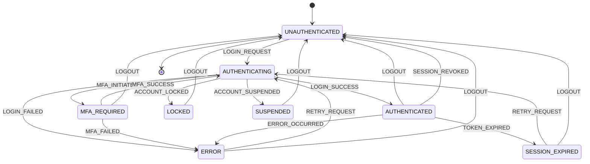

# Auth State Machine

## 📋 Overview

The AppEx Affiliation Portal implements a comprehensive authentication state machine using React Context API and Zustand for state management. This system handles complex authentication flows, session management, and security events while maintaining a smooth user experience.

## 🔄 State Machine Architecture

### Authentication States

```typescript
// shared/types/auth-state.ts
export type AuthState = 
  | 'UNAUTHENTICATED'
  | 'AUTHENTICATING'
  | 'AUTHENTICATED'
  | 'MFA_REQUIRED'
  | 'SESSION_EXPIRED'
  | 'ERROR'
  | 'LOCKED'
  | 'SUSPENDED'

export type AuthEvent = 
  | 'LOGIN_REQUEST'
  | 'LOGIN_SUCCESS'
  | 'LOGIN_FAILED'
  | 'MFA_INITIATED'
  | 'MFA_SUCCESS'
  | 'MFA_FAILED'
  | 'TOKEN_EXPIRED'
  | 'SESSION_REVOKED'
  | 'LOGOUT'
  | 'ACCOUNT_LOCKED'
  | 'ACCOUNT_SUSPENDED'
  | 'ERROR_OCCURRED'
  | 'RETRY_REQUEST'
```

### State Transition Diagram



## 🔧 React Context Implementation

### Auth Context Provider

```typescript
// contexts/AuthContext.tsx
import React, { createContext, useContext, useReducer, useEffect, ReactNode } from 'react'
import { AuthState, AuthEvent, User, Session } from '@/types/auth'
import { authService } from '@/services/auth.service'
import { toast } from 'react-hot-toast'

interface AuthContextType {
  state: AuthState
  user: User | null
  session: Session | null
  isLoading: boolean
  error: string | null
  dispatch: React.Dispatch<AuthAction>
  login: (credentials: LoginCredentials) => Promise<void>
  logout: () => Promise<void>
  refreshToken: () => Promise<void>
  verifyMfa: (code: string) => Promise<void>
  resendVerification: (type: 'email' | 'phone') => Promise<void>
}

interface AuthAction {
  type: AuthEvent
  payload?: any
}

const AuthContext = createContext<AuthContextType | undefined>(undefined)

// State reducer
const authReducer = (state: AuthState, action: AuthAction): AuthState => {
  switch (action.type) {
    case 'LOGIN_REQUEST':
      return 'AUTHENTICATING'
    
    case 'LOGIN_SUCCESS':
      return 'AUTHENTICATED'
    
    case 'LOGIN_FAILED':
      return 'ERROR'
    
    case 'MFA_INITIATED':
      return 'MFA_REQUIRED'
    
    case 'MFA_SUCCESS':
      return 'AUTHENTICATED'
    
    case 'MFA_FAILED':
      return 'ERROR'
    
    case 'TOKEN_EXPIRED':
      return 'SESSION_EXPIRED'
    
    case 'SESSION_REVOKED':
      return 'UNAUTHENTICATED'
    
    case 'LOGOUT':
      return 'UNAUTHENTICATED'
    
    case 'ACCOUNT_LOCKED':
      return 'LOCKED'
    
    case 'ACCOUNT_SUSPENDED':
      return 'SUSPENDED'
    
    case 'ERROR_OCCURRED':
      return 'ERROR'
    
    case 'RETRY_REQUEST':
      return 'AUTHENTICATING'
    
    default:
      return state
  }
}

export const AuthProvider: React.FC<{ children: ReactNode }> = ({ children }) => {
  const [state, dispatch] = useReducer(authReducer, 'UNAUTHENTICATED')
  const [user, setUser] = React.useState<User | null>(null)
  const [session, setSession] = React.useState<Session | null>(null)
  const [isLoading, setIsLoading] = React.useState(true)
  const [error, setError] = React.useState<string | null>(null)

  // Initialize auth state on mount
  useEffect(() => {
    initializeAuth()
  }, [])

  // Handle state changes
  useEffect(() => {
    switch (state) {
      case 'AUTHENTICATED':
        setError(null)
        break
      case 'ERROR':
        setError('Authentication failed. Please try again.')
        break
      case 'LOCKED':
        setError('Your account has been locked. Please contact support.')
        break
      case 'SUSPENDED':
        setError('Your account has been suspended. Please contact support.')
        break
      case 'SESSION_EXPIRED':
        setError('Your session has expired. Please login again.')
        break
      default:
        setError(null)
    }
  }, [state])

  const initializeAuth = async () => {
    try {
      setIsLoading(true)
      
      // Check for existing session
      const { user, session } = await authService.getCurrentSession()
      
      if (user && session) {
        setUser(user)
        setSession(session)
        dispatch({ type: 'LOGIN_SUCCESS' })
        
        // Start token refresh timer
        startTokenRefreshTimer()
      } else {
        dispatch({ type: 'LOGOUT' })
      }
    } catch (error) {
      console.error('Auth initialization failed:', error)
      dispatch({ type: 'LOGOUT' })
    } finally {
      setIsLoading(false)
    }
  }

  const login = async (credentials: LoginCredentials) => {
    try {
      dispatch({ type: 'LOGIN_REQUEST' })
      setError(null)
      
      const result = await authService.login(credentials)
      
      if (result.requiresMfa) {
        // Store MFA session data
        localStorage.setItem('mfa_session', JSON.stringify({
          sessionId: result.mfaSessionId,
          availableMethods: result.availableMethods,
          email: credentials.email
        }))
        dispatch({ type: 'MFA_INITIATED' })
      } else {
        setUser(result.user)
        setSession(result.session)
        dispatch({ type: 'LOGIN_SUCCESS' })
        startTokenRefreshTimer()
        
        toast.success('Login successful!')
      }
    } catch (error: any) {
      console.error('Login failed:', error)
      
      if (error.response?.status === 423) {
        const lockData = error.response.data
        if (lockData.error === 'ACCOUNT_LOCKED') {
          dispatch({ type: 'ACCOUNT_LOCKED' })
        } else if (lockData.error === 'ACCOUNT_SUSPENDED') {
          dispatch({ type: 'ACCOUNT_SUSPENDED' })
        }
      } else {
        dispatch({ type: 'LOGIN_FAILED' })
        toast.error(error.response?.data?.message || 'Login failed')
      }
    }
  }

  const logout = async () => {
    try {
      await authService.logout()
    } catch (error) {
      console.error('Logout error:', error)
    } finally {
      setUser(null)
      setSession(null)
      dispatch({ type: 'LOGOUT' })
      stopTokenRefreshTimer()
      
      // Clear any stored MFA session
      localStorage.removeItem('mfa_session')
      
      toast.success('Logged out successfully')
    }
  }

  const refreshToken = async () => {
    try {
      const { user: updatedUser, session: updatedSession } = await authService.refreshToken()
      
      setUser(updatedUser)
      setSession(updatedSession)
      
      // Restart refresh timer
      startTokenRefreshTimer()
    } catch (error) {
      console.error('Token refresh failed:', error)
      dispatch({ type: 'TOKEN_EXPIRED' })
      setUser(null)
      setSession(null)
      stopTokenRefreshTimer()
    }
  }

  const verifyMfa = async (code: string) => {
    try {
      const mfaSession = JSON.parse(localStorage.getItem('mfa_session') || '{}')
      
      const result = await authService.verifyMfa({
        sessionId: mfaSession.sessionId,
        code,
        rememberDevice: false
      })
      
      setUser(result.user)
      setSession(result.session)
      dispatch({ type: 'MFA_SUCCESS' })
      
      // Clear MFA session
      localStorage.removeItem('mfa_session')
      
      startTokenRefreshTimer()
      toast.success('MFA verification successful!')
    } catch (error: any) {
      console.error('MFA verification failed:', error)
      dispatch({ type: 'MFA_FAILED' })
      toast.error(error.response?.data?.message || 'MFA verification failed')
    }
  }

  const resendVerification = async (type: 'email' | 'phone') => {
    try {
      await authService.resendVerification(type)
      toast.success(`Verification code sent to your ${type}`)
    } catch (error: any) {
      console.error('Resend verification failed:', error)
      toast.error(error.response?.data?.message || 'Failed to send verification code')
    }
  }

  let refreshTimer: NodeJS.Timeout | null = null

  const startTokenRefreshTimer = () => {
    // Clear existing timer
    if (refreshTimer) {
      clearInterval(refreshTimer)
    }
    
    // Set timer to refresh token 14 minutes after login (tokens expire after 15)
    refreshTimer = setInterval(() => {
      refreshToken()
    }, 14 * 60 * 1000) // 14 minutes
  }

  const stopTokenRefreshTimer = () => {
    if (refreshTimer) {
      clearInterval(refreshTimer)
      refreshTimer = null
    }
  }

  const value: AuthContextType = {
    state,
    user,
    session,
    isLoading,
    error,
    dispatch,
    login,
    logout,
    refreshToken,
    verifyMfa,
    resendVerification
  }

  return (
    <AuthContext.Provider value={value}>
      {children}
    </AuthContext.Provider>
  )
}

export const useAuth = () => {
  const context = useContext(AuthContext)
  if (context === undefined) {
    throw new Error('useAuth must be used within an AuthProvider')
  }
  return context
}
```

## 🏪 Zustand Store Implementation

### Auth Store

```typescript
// stores/authStore.ts
import { create } from 'zustand'
import { devtools, subscribeWithSelector } from 'zustand/middleware'
import { AuthState, User, Session } from '@/types/auth'

interface AuthStore {
  // State
  authState: AuthState
  user: User | null
  session: Session | null
  isLoading: boolean
  error: string | null
  mfaSession: MfaSession | null
  
  // Actions
  setAuthState: (state: AuthState) => void
  setUser: (user: User | null) => void
  setSession: (session: Session | null) => void
  setLoading: (loading: boolean) => void
  setError: (error: string | null) => void
  setMfaSession: (session: MfaSession | null) => void
  
  // Reset
  reset: () => void
  
  // Computed
  isAuthenticated: () => boolean
  isMfaRequired: () => boolean
  hasError: () => boolean
  getTrustLevel: () => number
  canAccessFeature: (feature: string) => boolean
}

interface MfaSession {
  sessionId: string
  availableMethods: string[]
  email: string
}

export const useAuthStore = create<AuthStore>()(
  devtools(
    subscribeWithSelector((set, get) => ({
      // Initial state
      authState: 'UNAUTHENTICATED',
      user: null,
      session: null,
      isLoading: false,
      error: null,
      mfaSession: null,
      
      // Actions
      setAuthState: (authState) => set({ authState }),
      
      setUser: (user) => set({ user }),
      
      setSession: (session) => set({ session }),
      
      setLoading: (isLoading) => set({ isLoading }),
      
      setError: (error) => set({ error }),
      
      setMfaSession: (mfaSession) => set({ mfaSession }),
      
      reset: () => set({
        authState: 'UNAUTHENTICATED',
        user: null,
        session: null,
        isLoading: false,
        error: null,
        mfaSession: null
      }),
      
      // Computed selectors
      isAuthenticated: () => {
        const { authState, user } = get()
        return authState === 'AUTHENTICATED' && user !== null
      },
      
      isMfaRequired: () => {
        const { authState, mfaSession } = get()
        return authState === 'MFA_REQUIRED' && mfaSession !== null
      },
      
      hasError: () => {
        const { authState, error } = get()
        return authState === 'ERROR' && error !== null
      },
      
      getTrustLevel: () => {
        const { user } = get()
        return user?.trustLevel || 0
      },
      
      canAccessFeature: (feature: string) => {
        const { user } = get()
        if (!user) return false
        
        const trustLevel = user.trustLevel
        const requiredLevel = getRequiredTrustLevel(feature)
        return trustLevel >= requiredLevel
      }
    })),
    {
      name: 'auth-store'
    }
  )
)

// Subscribe to auth state changes for side effects
useAuthStore.subscribe(
  (state) => state.authState,
  (authState, previousAuthState) => {
    console.log(`Auth state changed: ${previousAuthState} -> ${authState}`)
    
    // Handle specific state transitions
    if (authState === 'AUTHENTICATED' && previousAuthState !== 'AUTHENTICATED') {
      // User just logged in
      console.log('User authenticated successfully')
    }
    
    if (authState === 'UNAUTHENTICATED' && previousAuthState === 'AUTHENTICATED') {
      // User just logged out
      console.log('User logged out')
    }
    
    if (authState === 'SESSION_EXPIRED') {
      // Session expired, handle refresh
      console.log('Session expired, attempting refresh')
    }
  }
)

// Subscribe to user changes for analytics
useAuthStore.subscribe(
  (state) => state.user,
  (user, previousUser) => {
    if (user && !previousUser) {
      // User logged in
      analytics.track('user_logged_in', {
        userId: user.id,
        trustLevel: user.trustLevel,
        mfaEnabled: user.mfaEnabled
      })
    } else if (!user && previousUser) {
      // User logged out
      analytics.track('user_logged_out', {
        userId: previousUser.id
      })
    }
  }
)

function getRequiredTrustLevel(feature: string): number {
  const featureRequirements: Record<string, number> = {
    'VIEW_DASHBOARD': 1,
    'REQUEST_PAYOUT': 2,
    'INSTANT_PAYOUT': 3,
    'API_ACCESS': 4,
    'DEDICATED_ACCOUNT_MANAGER': 5
  }
  
  return featureRequirements[feature] || 0
}
```

## 🎯 Custom Hooks

### Use Authentication Hook

```typescript
// hooks/useAuthentication.ts
import { useCallback, useEffect } from 'react'
import { useAuthStore } from '@/stores/authStore'
import { authService } from '@/services/auth.service'

export const useAuthentication = () => {
  const {
    authState,
    user,
    session,
    isLoading,
    error,
    setAuthState,
    setUser,
    setSession,
    setLoading,
    setError,
    reset,
    isAuthenticated,
    isMfaRequired,
    hasError,
    getTrustLevel,
    canAccessFeature
  } = useAuthStore()

  // Initialize authentication on mount
  useEffect(() => {
    initializeAuth()
  }, [])

  const initializeAuth = useCallback(async () => {
    try {
      setLoading(true)
      
      const { user: currentUser, session: currentSession } = await authService.getCurrentSession()
      
      if (currentUser && currentSession) {
        setUser(currentUser)
        setSession(currentSession)
        setAuthState('AUTHENTICATED')
      } else {
        setAuthState('UNAUTHENTICATED')
      }
    } catch (error) {
      console.error('Auth initialization failed:', error)
      setAuthState('UNAUTHENTICATED')
    } finally {
      setLoading(false)
    }
  }, [setLoading, setUser, setSession, setAuthState])

  const login = useCallback(async (credentials: LoginCredentials) => {
    try {
      setLoading(true)
      setError(null)
      setAuthState('AUTHENTICATING')
      
      const result = await authService.login(credentials)
      
      if (result.requiresMfa) {
        setAuthState('MFA_REQUIRED')
        // Store MFA session data
        localStorage.setItem('mfa_session', JSON.stringify({
          sessionId: result.mfaSessionId,
          availableMethods: result.availableMethods,
          email: credentials.email
        }))
      } else {
        setUser(result.user)
        setSession(result.session)
        setAuthState('AUTHENTICATED')
      }
    } catch (error: any) {
      console.error('Login failed:', error)
      
      if (error.response?.status === 423) {
        const lockData = error.response.data
        if (lockData.error === 'ACCOUNT_LOCKED') {
          setAuthState('LOCKED')
        } else if (lockData.error === 'ACCOUNT_SUSPENDED') {
          setAuthState('SUSPENDED')
        }
      } else {
        setAuthState('ERROR')
        setError(error.response?.data?.message || 'Login failed')
      }
    } finally {
      setLoading(false)
    }
  }, [setLoading, setError, setAuthState, setUser, setSession])

  const logout = useCallback(async () => {
    try {
      await authService.logout()
    } catch (error) {
      console.error('Logout error:', error)
    } finally {
      reset()
      localStorage.removeItem('mfa_session')
    }
  }, [reset])

  const verifyMfa = useCallback(async (code: string) => {
    try {
      setLoading(true)
      setError(null)
      
      const mfaSession = JSON.parse(localStorage.getItem('mfa_session') || '{}')
      
      const result = await authService.verifyMfa({
        sessionId: mfaSession.sessionId,
        code,
        rememberDevice: false
      })
      
      setUser(result.user)
      setSession(result.session)
      setAuthState('AUTHENTICATED')
      
      localStorage.removeItem('mfa_session')
    } catch (error: any) {
      console.error('MFA verification failed:', error)
      setAuthState('ERROR')
      setError(error.response?.data?.message || 'MFA verification failed')
    } finally {
      setLoading(false)
    }
  }, [setLoading, setError, setAuthState, setUser, setSession])

  const refreshToken = useCallback(async () => {
    try {
      const { user: updatedUser, session: updatedSession } = await authService.refreshToken()
      
      setUser(updatedUser)
      setSession(updatedSession)
    } catch (error) {
      console.error('Token refresh failed:', error)
      setAuthState('SESSION_EXPIRED')
      setUser(null)
      setSession(null)
    }
  }, [setUser, setSession, setAuthState])

  return {
    // State
    authState,
    user,
    session,
    isLoading,
    error,
    
    // Computed
    isAuthenticated,
    isMfaRequired,
    hasError,
    trustLevel: getTrustLevel(),
    
    // Actions
    login,
    logout,
    verifyMfa,
    refreshToken,
    
    // Utilities
    canAccessFeature,
    reset
  }
}
```

### Use Protected Route Hook

```typescript
// hooks/useProtectedRoute.ts
import { useEffect } from 'react'
import { useRouter } from 'next/router'
import { useAuthentication } from './useAuthentication'

export const useProtectedRoute = (requiredTrustLevel: number = 0) => {
  const { isAuthenticated, user, isLoading, authState } = useAuthentication()
  const router = useRouter()

  useEffect(() => {
    if (isLoading) return

    if (!isAuthenticated) {
      router.push('/login')
      return
    }

    if (user && user.trustLevel < requiredTrustLevel) {
      router.push('/unauthorized')
      return
    }

    // Handle specific auth states
    switch (authState) {
      case 'LOCKED':
        router.push('/account-locked')
        break
      case 'SUSPENDED':
        router.push('/account-suspended')
        break
      case 'SESSION_EXPIRED':
        router.push('/login?session=expired')
        break
    }
  }, [isAuthenticated, user, isLoading, authState, requiredTrustLevel, router])

  return {
    isAuthorized: isAuthenticated && user && user.trustLevel >= requiredTrustLevel,
    isLoading,
    user
  }
}
```

## 🛡️ Protected Route Component

### ProtectedRoute HOC

```typescript
// components/ProtectedRoute.tsx
import React from 'react'
import { useRouter } from 'next/router'
import { useAuthentication } from '@/hooks/useAuthentication'
import { LoadingSpinner } from '@/components/ui/LoadingSpinner'
import { UnauthorizedPage } from '@/pages/unauthorized'
import { AccountLockedPage } from '@/pages/account-locked'

interface ProtectedRouteProps {
  children: React.ReactNode
  requiredTrustLevel?: number
  requiredFeatures?: string[]
  fallback?: React.ComponentType
  redirectTo?: string
}

export const ProtectedRoute: React.FC<ProtectedRouteProps> = ({
  children,
  requiredTrustLevel = 0,
  requiredFeatures = [],
  fallback: FallbackComponent = LoadingSpinner,
  redirectTo
}) => {
  const { isAuthenticated, user, isLoading, authState, canAccessFeature } = useAuthentication()
  const router = useRouter()

  // Show loading spinner while checking authentication
  if (isLoading) {
    return <FallbackComponent />
  }

  // Not authenticated - redirect to login
  if (!isAuthenticated) {
    if (redirectTo) {
      router.push(redirectTo)
    } else {
      router.push(`/login?redirect=${encodeURIComponent(router.asPath)}`)
    }
    return <FallbackComponent />
  }

  // Account locked
  if (authState === 'LOCKED') {
    return <AccountLockedPage />
  }

  // Account suspended
  if (authState === 'SUSPENDED') {
    return <AccountSuspendedPage />
  }

  // Check trust level requirement
  if (user && user.trustLevel < requiredTrustLevel) {
    return <UnauthorizedPage requiredLevel={requiredTrustLevel} currentLevel={user.trustLevel} />
  }

  // Check feature access requirements
  if (requiredFeatures.length > 0) {
    const hasAllFeatures = requiredFeatures.every(feature => canAccessFeature(feature))
    if (!hasAllFeatures) {
      return <UnauthorizedPage requiredFeatures={requiredFeatures} />
    }
  }

  // User is authorized
  return <>{children}</>
}

// Higher-order component for pages
export const withAuth = <P extends object>(
  Component: React.ComponentType<P>,
  options: Omit<ProtectedRouteProps, 'children'> = {}
) => {
  return function AuthenticatedComponent(props: P) {
    return (
      <ProtectedRoute {...options}>
        <Component {...props} />
      </ProtectedRoute>
    )
  }
}
```

## 🔄 State Persistence

### Local Storage Sync

```typescript
// utils/authPersistence.ts
import { useAuthStore } from '@/stores/authStore'
import { persist, createJSONStorage } from 'zustand/middleware'

const storage = {
  getItem: (name: string) => {
    const item = localStorage.getItem(name)
    return item ? JSON.parse(item) : null
  },
  setItem: (name: string, value: any) => {
    localStorage.setItem(name, JSON.stringify(value))
  },
  removeItem: (name: string) => {
    localStorage.removeItem(name)
  }
}

export const usePersistedAuthStore = create<AuthStore>()(
  devtools(
    persist(
      (set, get) => ({
        // ... store implementation
        authState: 'UNAUTHENTICATED',
        user: null,
        session: null,
        isLoading: false,
        error: null,
        mfaSession: null,
        
        // ... actions
        setAuthState: (authState) => set({ authState }),
        setUser: (user) => set({ user }),
        setSession: (session) => set({ session }),
        setLoading: (isLoading) => set({ isLoading }),
        setError: (error) => set({ error }),
        setMfaSession: (mfaSession) => set({ mfaSession }),
        reset: () => set({
          authState: 'UNAUTHENTICATED',
          user: null,
          session: null,
          isLoading: false,
          error: null,
          mfaSession: null
        }),
        
        // ... computed
        isAuthenticated: () => {
          const { authState, user } = get()
          return authState === 'AUTHENTICATED' && user !== null
        },
        isMfaRequired: () => {
          const { authState, mfaSession } = get()
          return authState === 'MFA_REQUIRED' && mfaSession !== null
        },
        hasError: () => {
          const { authState, error } = get()
          return authState === 'ERROR' && error !== null
        },
        getTrustLevel: () => {
          const { user } = get()
          return user?.trustLevel || 0
        },
        canAccessFeature: (feature: string) => {
          const { user } = get()
          if (!user) return false
          
          const trustLevel = user.trustLevel
          const requiredLevel = getRequiredTrustLevel(feature)
          return trustLevel >= requiredLevel
        }
      }),
      {
        name: 'auth-storage',
        storage: createJSONStorage(() => localStorage),
        partialize: (state) => ({
          // Only persist non-sensitive data
          authState: state.authState,
          user: state.user ? {
            id: state.user.id,
            email: state.user.email,
            fullName: state.user.fullName,
            trustLevel: state.user.trustLevel,
            mfaEnabled: state.user.mfaEnabled
          } : null,
          // Don't persist session, loading state, or errors
        }),
        onRehydrateStorage: () => (state) => {
          // Reset loading state on rehydration
          if (state) {
            state.isLoading = false
            state.error = null
          }
        }
      }
    ),
    {
      name: 'auth-store'
    }
  )
)
```

## 📊 State Analytics

### Auth State Analytics

```typescript
// utils/authAnalytics.ts
import { useAuthStore } from '@/stores/authStore'

export const useAuthAnalytics = () => {
  const { authState, user, session } = useAuthStore()

  // Track state changes
  useEffect(() => {
    analytics.track('auth_state_change', {
      fromState: previousState,
      toState: authState,
      userId: user?.id,
      timestamp: new Date().toISOString()
    })
  }, [authState])

  // Track user session duration
  useEffect(() => {
    if (authState === 'AUTHENTICATED' && session) {
      const startTime = Date.now()
      
      return () => {
        const sessionDuration = Date.now() - startTime
        analytics.track('session_duration', {
          duration: sessionDuration,
          userId: user?.id,
          sessionId: session.id
        })
      }
    }
  }, [authState, session, user?.id])

  // Track MFA usage
  useEffect(() => {
    if (user && user.mfaEnabled) {
      analytics.track('mfa_enabled_user', {
        userId: user.id,
        trustLevel: user.trustLevel
      })
    }
  }, [user])

  const trackAuthEvent = (event: string, properties?: any) => {
    analytics.track(event, {
      userId: user?.id,
      authState,
      trustLevel: user?.trustLevel,
      timestamp: new Date().toISOString(),
      ...properties
    })
  }

  const trackFeatureAccess = (feature: string, granted: boolean) => {
    analytics.track('feature_access_check', {
      feature,
      granted,
      userId: user?.id,
      trustLevel: user?.trustLevel,
      requiredLevel: getRequiredTrustLevel(feature)
    })
  }

  return {
    trackAuthEvent,
    trackFeatureAccess
  }
}
```

## 🧪 Testing Utilities

### Auth State Testing

```typescript
// __tests__/authState.test.ts
import { renderHook, act } from '@testing-library/react'
import { useAuthentication } from '@/hooks/useAuthentication'
import { authService } from '@/services/auth.service'

// Mock authService
jest.mock('@/services/auth.service')
const mockAuthService = authService as jest.Mocked<typeof authService>

describe('useAuthentication', () => {
  beforeEach(() => {
    jest.clearAllMocks()
    localStorage.clear()
  })

  it('should initialize with unauthenticated state', () => {
    mockAuthService.getCurrentSession.mockRejectedValue(new Error('No session'))
    
    const { result } = renderHook(() => useAuthentication())
    
    expect(result.current.authState).toBe('UNAUTHENTICATED')
    expect(result.current.isAuthenticated).toBe(false)
    expect(result.current.isLoading).toBe(false)
  })

  it('should handle successful login', async () => {
    const mockUser = { id: '1', email: 'test@example.com', trustLevel: 2 }
    const mockSession = { id: 'session1' }
    
    mockAuthService.login.mockResolvedValue({
      user: mockUser,
      session: mockSession,
      requiresMfa: false
    })

    const { result } = renderHook(() => useAuthentication())
    
    await act(async () => {
      await result.current.login({
        email: 'test@example.com',
        password: 'password123'
      })
    })

    expect(result.current.authState).toBe('AUTHENTICATED')
    expect(result.current.user).toEqual(mockUser)
    expect(result.current.session).toEqual(mockSession)
    expect(result.current.isAuthenticated).toBe(true)
  })

  it('should handle MFA requirement', async () => {
    mockAuthService.login.mockResolvedValue({
      requiresMfa: true,
      mfaSessionId: 'mfa123',
      availableMethods: ['TOTP', 'SMS']
    })

    const { result } = renderHook(() => useAuthentication())
    
    await act(async () => {
      await result.current.login({
        email: 'test@example.com',
        password: 'password123'
      })
    })

    expect(result.current.authState).toBe('MFA_REQUIRED')
    expect(result.current.isMfaRequired).toBe(true)
    expect(localStorage.getItem('mfa_session')).toBeTruthy()
  })

  it('should handle account lockout', async () => {
    const error = new Error('Account locked')
    error.response = {
      status: 423,
      data: { error: 'ACCOUNT_LOCKED' }
    }
    
    mockAuthService.login.mockRejectedValue(error)

    const { result } = renderHook(() => useAuthentication())
    
    await act(async () => {
      await result.current.login({
        email: 'test@example.com',
        password: 'password123'
      })
    })

    expect(result.current.authState).toBe('LOCKED')
    expect(result.current.error).toBeTruthy()
  })
})
```

---

**Next**: [Security Event Logging](./security-logging.md) → Audit trails and monitoring documentation
