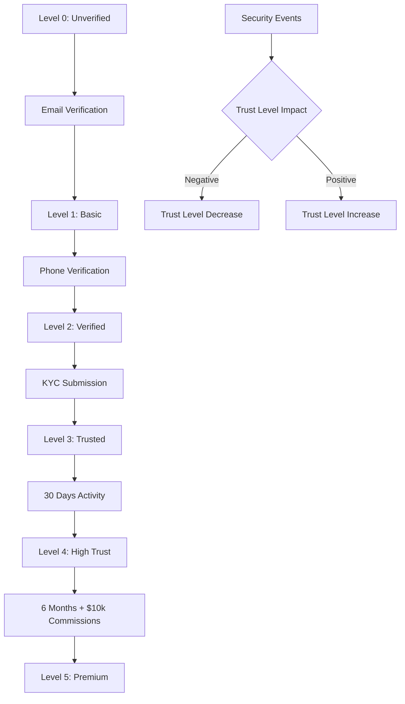

# Email Verification & Trust Levels

## 📋 Overview

The AppEx Affiliation Portal implements a sophisticated trust level system that progressively grants users access to features based on their verification status and account activity. This system balances security requirements with user experience while complying with Zimbabwean regulations.

## 🏆 Trust Level Architecture

### Trust Level Progression



### Trust Level Definitions

| Level | Name | Requirements | Features Access | Commission Rate | Withdrawal Limit |
|-------|------|--------------|-----------------|-----------------|------------------|
| **0** | Unverified | Email/phone not verified | View public pages | 0% | $0 |
| **1** | Basic | Email verified | Basic dashboard, view stats | 5% | $50/day |
| **2** | Verified | Email + phone + ID submitted | Request payouts, detailed stats | 10% | $200/day |
| **3** | Trusted | KYC approved + 30 days active | Higher rates, referral program | 15% | $500/day |
| **4** | High Trust | 6+ months + >$10k commissions | Bulk payouts, API access | 20% | $2,000/day |
| **5** | Premium | 12+ months + >$50k commissions | Priority support, custom terms | 25% | $10,000/day |

## 🔐 Email Verification System

### Email Verification Handler

```typescript
// api/src/routes/auth/verify-email.ts
export const verifyEmailHandler = async (req: Request, res: Response) => {
  const { otp, userId } = req.body
  
  try {
    // Rate limiting verification attempts
    const rateKey = `verify:email:${userId}`
    const attempts = await redis.incr(rateKey)
    if (attempts === 1) await redis.expire(rateKey, 3600) // 1 hour
    if (attempts > 5) {
      return res.status(429).json({ 
        error: 'TOO_MANY_ATTEMPTS', 
        message: 'Too many verification attempts. Please request a new code.' 
      })
    }
    
    // Find valid verification token
    const verification = await prisma.verificationToken.findFirst({
      where: {
        userId,
        type: 'EMAIL_VERIFICATION',
        expiresAt: { gt: new Date() },
        used: false
      },
      include: { user: true }
    })
    
    if (!verification) {
      return res.status(400).json({ 
        error: 'INVALID_OR_EXPIRED_CODE', 
        message: 'Verification code is invalid or has expired' 
      })
    }
    
    // Verify OTP
    const isValid = await bcrypt.compare(otp, verification.token)
    if (!isValid) {
      await logSecurityEvent({
        userId,
        eventType: 'EMAIL_VERIFICATION_FAILED',
        ipAddress: req.ip,
        userAgent: req.headers['user-agent'],
        metadata: { attempts }
      })
      
      return res.status(400).json({ 
        error: 'INVALID_CODE', 
        message: 'Incorrect verification code' 
      })
    }
    
    // Calculate new trust level
    const currentTrustLevel = verification.user.trustLevel
    const newTrustLevel = Math.max(currentTrustLevel, 1) // Basic trust level
    
    // Mark as used and update user
    await prisma.$transaction([
      prisma.verificationToken.update({
        where: { id: verification.id },
        data: { used: true, usedAt: new Date() }
      }),
      prisma.user.update({
        where: { id: userId },
        data: { 
          emailVerified: true,
          emailVerifiedAt: new Date(),
          trustLevel: newTrustLevel,
          registrationStage: 'EMAIL_VERIFIED'
        }
      })
    ])
    
    // Log successful verification
    await logSecurityEvent({
      userId,
      eventType: 'EMAIL_VERIFIED',
      ipAddress: req.ip,
      userAgent: req.headers['user-agent'],
      metadata: { 
        previousTrustLevel: currentTrustLevel,
        newTrustLevel
      }
    })
    
    // Send welcome email
    await emailQueue.add('send-email-verified-welcome', {
      to: verification.user.email,
      userName: verification.user.fullName.split(' ')[0],
      trustLevel: newTrustLevel,
      nextStep: 'complete-profile'
    })
    
    res.json({
      success: true,
      message: 'Email verified successfully',
      trustLevel: newTrustLevel,
      nextStep: 'complete-profile',
      unlockedFeatures: getFeaturesForTrustLevel(newTrustLevel)
    })
    
  } catch (error) {
    console.error('Email verification error:', error)
    res.status(500).json({
      error: 'VERIFICATION_FAILED',
      message: 'Email verification failed. Please try again.'
    })
  }
}

export const resendEmailVerificationHandler = async (req: Request, res: Response) => {
  const userId = req.user.id
  
  try {
    // Rate limiting resend requests
    const rateKey = `resend:email:${userId}`
    const lastSent = await redis.get(rateKey)
    
    if (lastSent) {
      const timeSinceLastSent = Date.now() - parseInt(lastSent)
      const cooldownPeriod = 2 * 60 * 1000 // 2 minutes
      
      if (timeSinceLastSent < cooldownPeriod) {
        const remainingTime = Math.ceil((cooldownPeriod - timeSinceLastSent) / 1000)
        return res.status(429).json({
          error: 'RESEND_COOLDOWN',
          message: `Please wait ${remainingTime} seconds before requesting another code.`,
          retryAfter: remainingTime
        })
      }
    }
    
    const user = await prisma.user.findUnique({
      where: { id: userId },
      select: { email: true, fullName: true, emailVerified: true }
    })
    
    if (!user) {
      return res.status(404).json({
        error: 'USER_NOT_FOUND',
        message: 'User not found'
      })
    }
    
    if (user.emailVerified) {
      return res.status(400).json({
        error: 'ALREADY_VERIFIED',
        message: 'Email is already verified'
      })
    }
    
    // Invalidate existing verification tokens
    await prisma.verificationToken.updateMany({
      where: {
        userId,
        type: 'EMAIL_VERIFICATION',
        used: false
      },
      data: { used: true, usedAt: new Date() }
    })
    
    // Generate new OTP
    const otp = crypto.randomInt(100000, 999999).toString()
    
    // Store new verification token
    await prisma.verificationToken.create({
      data: {
        userId,
        token: await bcrypt.hash(otp, 10),
        type: 'EMAIL_VERIFICATION',
        expiresAt: new Date(Date.now() + 15 * 60 * 1000) // 15 minutes
      }
    })
    
    // Send verification email
    await emailQueue.add('send-verification-email', {
      to: user.email,
      otp,
      userName: user.fullName.split(' ')[0],
      language: user.preferredLanguage || 'en'
    }, {
      attempts: 3,
      backoff: { type: 'exponential', delay: 2000 }
    })
    
    // Update resend timestamp
    await redis.setex(rateKey, 300, Date.now().toString()) // 5 minutes
    
    // Log resend request
    await logSecurityEvent({
      userId,
      eventType: 'EMAIL_VERIFICATION_RESENT',
      ipAddress: req.ip,
      userAgent: req.headers['user-agent']
    })
    
    res.json({
      success: true,
      message: 'Verification code sent to your email',
      expiresIn: 900 // 15 minutes
    })
    
  } catch (error) {
    console.error('Resend email verification error:', error)
    res.status(500).json({
      error: 'RESEND_FAILED',
      message: 'Failed to resend verification code'
    })
  }
}
```

## 📱 Phone Verification System

### Phone Verification Handler

```typescript
// api/src/routes/auth/verify-phone.ts
export const verifyPhoneHandler = async (req: Request, res: Response) => {
  const { otp, userId } = req.body
  
  try {
    // Rate limiting
    const rateKey = `verify:phone:${userId}`
    const attempts = await redis.incr(rateKey)
    if (attempts === 1) await redis.expire(rateKey, 3600)
    if (attempts > 5) {
      return res.status(429).json({ 
        error: 'TOO_MANY_ATTEMPTS', 
        message: 'Too many verification attempts. Please request a new code.' 
      })
    }
    
    // Find valid verification token
    const verification = await prisma.verificationToken.findFirst({
      where: {
        userId,
        type: 'PHONE_VERIFICATION',
        expiresAt: { gt: new Date() },
        used: false
      },
      include: { user: true }
    })
    
    if (!verification) {
      return res.status(400).json({ 
        error: 'INVALID_OR_EXPIRED_CODE', 
        message: 'Verification code is invalid or has expired' 
      })
    }
    
    // Verify OTP
    const isValid = await bcrypt.compare(otp, verification.token)
    if (!isValid) {
      await logSecurityEvent({
        userId,
        eventType: 'PHONE_VERIFICATION_FAILED',
        ipAddress: req.ip,
        userAgent: req.headers['user-agent'],
        metadata: { attempts }
      })
      
      return res.status(400).json({ 
        error: 'INVALID_CODE', 
        message: 'Incorrect verification code' 
      })
    }
    
    // Calculate new trust level
    const currentTrustLevel = verification.user.trustLevel
    const newTrustLevel = Math.max(currentTrustLevel, 2) // Verified trust level
    
    // Update user
    await prisma.$transaction([
      prisma.verificationToken.update({
        where: { id: verification.id },
        data: { used: true, usedAt: new Date() }
      }),
      prisma.user.update({
        where: { id: userId },
        data: { 
          phoneVerified: true,
          phoneVerifiedAt: new Date(),
          trustLevel: newTrustLevel
        }
      })
    ])
    
    // Log successful verification
    await logSecurityEvent({
      userId,
      eventType: 'PHONE_VERIFIED',
      ipAddress: req.ip,
      userAgent: req.headers['user-agent'],
      metadata: { 
        previousTrustLevel: currentTrustLevel,
        newTrustLevel
      }
    })
    
    // Send confirmation SMS
    await smsQueue.add('send-phone-verified-sms', {
      to: verification.user.phone,
      message: `Your AppEx phone number has been verified. Trust level increased to ${newTrustLevel}.`
    })
    
    res.json({
      success: true,
      message: 'Phone number verified successfully',
      trustLevel: newTrustLevel,
      unlockedFeatures: getFeaturesForTrustLevel(newTrustLevel)
    })
    
  } catch (error) {
    console.error('Phone verification error:', error)
    res.status(500).json({
      error: 'VERIFICATION_FAILED',
      message: 'Phone verification failed. Please try again.'
    })
  }
}
```

## 📈 Trust Level Management

### Trust Level Service

```typescript
// services/trust/trust-level.service.ts
export class TrustLevelService {
  
  static async calculateTrustLevel(userId: string): Promise<TrustLevelCalculation> {
    const user = await prisma.user.findUnique({
      where: { id: userId },
      include: {
        kycSubmissions: {
          where: { status: 'APPROVED' },
          orderBy: { createdAt: 'desc' },
          take: 1
        },
        commissions: {
          select: { amount: true, createdAt: true }
        },
        securityEvents: {
          where: {
            eventType: { in: ['LOGIN_SUCCESS', 'MFA_ENABLED', 'PASSWORD_CHANGED'] },
            createdAt: { gte: new Date(Date.now() - 365 * 24 * 60 * 60 * 1000) }
          }
        }
      }
    })
    
    if (!user) {
      throw new Error('User not found')
    }
    
    let trustLevel = 0
    const factors: TrustFactor[] = []
    
    // Email verification (Level 1)
    if (user.emailVerified) {
      trustLevel = Math.max(trustLevel, 1)
      factors.push({
        type: 'EMAIL_VERIFIED',
        weight: 20,
        achieved: true,
        description: 'Email address verified'
      })
    }
    
    // Phone verification (Level 2)
    if (user.phoneVerified) {
      trustLevel = Math.max(trustLevel, 2)
      factors.push({
        type: 'PHONE_VERIFIED',
        weight: 20,
        achieved: true,
        description: 'Phone number verified'
      })
    }
    
    // KYC approval (Level 3)
    if (user.kycSubmissions.length > 0) {
      trustLevel = Math.max(trustLevel, 3)
      factors.push({
        type: 'KYC_APPROVED',
        weight: 30,
        achieved: true,
        description: 'Identity verification approved'
      })
      
      // Check 30-day activity requirement
      const thirtyDaysAgo = new Date(Date.now() - 30 * 24 * 60 * 60 * 1000)
      if (user.createdAt < thirtyDaysAgo) {
        trustLevel = Math.max(trustLevel, 3)
        factors.push({
          type: 'THIRTY_DAY_ACTIVITY',
          weight: 10,
          achieved: true,
          description: 'Account active for 30+ days'
        })
      }
    }
    
    // Commission thresholds (Level 4)
    const totalCommissions = user.commissions.reduce((sum, commission) => sum + commission.amount, 0)
    if (totalCommissions >= 10000) { // $10,000
      trustLevel = Math.max(trustLevel, 4)
      factors.push({
        type: 'COMMISSION_THRESHOLD',
        weight: 25,
        achieved: true,
        description: 'Earned $10,000+ in commissions'
      })
    }
    
    // Account age for Level 4
    const sixMonthsAgo = new Date(Date.now() - 180 * 24 * 60 * 60 * 1000)
    if (user.createdAt < sixMonthsAgo) {
      trustLevel = Math.max(trustLevel, 4)
      factors.push({
        type: 'SIX_MONTH_AGE',
        weight: 15,
        achieved: true,
        description: 'Account active for 6+ months'
      })
    }
    
    // Premium level (Level 5)
    const twelveMonthsAgo = new Date(Date.now() - 365 * 24 * 60 * 60 * 1000)
    if (user.createdAt < twelveMonthsAgo && totalCommissions >= 50000) { // $50,000
      trustLevel = Math.max(trustLevel, 5)
      factors.push({
        type: 'PREMIUM_STATUS',
        weight: 35,
        achieved: true,
        description: 'Premium partner status achieved'
      })
    }
    
    // Security behavior factors
    const securityScore = this.calculateSecurityScore(user.securityEvents)
    if (securityScore >= 80) {
      factors.push({
        type: 'SECURITY_CONSCIOUS',
        weight: 10,
        achieved: true,
        description: 'Excellent security practices'
      })
    }
    
    // Negative factors
    const negativeFactors = await this.checkNegativeFactors(userId)
    factors.push(...negativeFactors)
    
    return {
      currentLevel: user.trustLevel,
      calculatedLevel: trustLevel,
      factors,
      canUpgrade: trustLevel > user.trustLevel,
      nextLevelRequirements: this.getNextLevelRequirements(trustLevel),
      totalCommissions
    }
  }
  
  static async updateTrustLevel(userId: string, reason: string): Promise<TrustLevelUpdate> {
    const calculation = await this.calculateTrustLevel(userId)
    
    if (calculation.calculatedLevel > calculation.currentLevel) {
      // Upgrade trust level
      const user = await prisma.user.update({
        where: { id: userId },
        data: { 
          trustLevel: calculation.calculatedLevel,
          trustLevelUpdatedAt: new Date()
        }
      })
      
      // Log trust level upgrade
      await logSecurityEvent({
        userId,
        eventType: 'TRUST_LEVEL_UPGRADED',
        metadata: {
          previousLevel: calculation.currentLevel,
          newLevel: calculation.calculatedLevel,
          reason,
          factors: calculation.factors.filter(f => f.achieved)
        }
      })
      
      // Send notification
      await emailQueue.add('send-trust-level-upgrade-notification', {
        to: user.email,
        userName: user.fullName.split(' ')[0],
        previousLevel: calculation.currentLevel,
        newLevel: calculation.calculatedLevel,
        unlockedFeatures: getFeaturesForTrustLevel(calculation.calculatedLevel)
      })
      
      return {
        updated: true,
        previousLevel: calculation.currentLevel,
        newLevel: calculation.calculatedLevel,
        reason
      }
    }
    
    return {
      updated: false,
      currentLevel: calculation.currentLevel
    }
  }
  
  static async downgradeTrustLevel(userId: string, reason: string): Promise<TrustLevelUpdate> {
    const user = await prisma.user.findUnique({
      where: { id: userId },
      select: { trustLevel: true, email: true, fullName: true }
    })
    
    if (!user) {
      throw new Error('User not found')
    }
    
    let newLevel = user.trustLevel
    
    // Determine new level based on reason
    switch (reason) {
      case 'KYC_REVOKED':
        newLevel = Math.min(newLevel, 2) // Downgrade to Verified
        break
      case 'SECURITY_VIOLATION':
        newLevel = Math.min(newLevel, 1) // Downgrade to Basic
        break
      case 'SUSPICIOUS_ACTIVITY':
        newLevel = Math.max(0, newLevel - 1) // Downgrade by 1 level
        break
      default:
        newLevel = Math.max(0, newLevel - 1)
    }
    
    if (newLevel < user.trustLevel) {
      await prisma.user.update({
        where: { id: userId },
        data: { 
          trustLevel: newLevel,
          trustLevelUpdatedAt: new Date()
        }
      })
      
      // Log trust level downgrade
      await logSecurityEvent({
        userId,
        eventType: 'TRUST_LEVEL_DOWNGRADED',
        severity: 'HIGH',
        metadata: {
          previousLevel: user.trustLevel,
          newLevel,
          reason
        }
      })
      
      // Send notification
      await emailQueue.add('send-trust-level-downgrade-notification', {
        to: user.email,
        userName: user.fullName.split(' ')[0],
        previousLevel: user.trustLevel,
        newLevel,
        reason,
        affectedFeatures: getFeaturesForTrustLevel(user.trustLevel).filter(
          f => !getFeaturesForTrustLevel(newLevel).includes(f)
        )
      })
      
      return {
        updated: true,
        previousLevel: user.trustLevel,
        newLevel,
        reason
      }
    }
    
    return {
      updated: false,
      currentLevel: user.trustLevel
    }
  }
  
  private static calculateSecurityScore(events: any[]): number {
    if (events.length === 0) return 50
    
    let score = 50 // Base score
    
    // Positive security behaviors
    if (events.some(e => e.eventType === 'MFA_ENABLED')) score += 20
    if (events.some(e => e.eventType === 'PASSWORD_CHANGED')) score += 10
    if (events.length >= 10) score += 10 // Regular login activity
    
    return Math.min(100, score)
  }
  
  private static async checkNegativeFactors(userId: string): Promise<TrustFactor[]> {
    const factors: TrustFactor[] = []
    
    // Check for recent security events
    const recentSecurityEvents = await prisma.securityEvent.count({
      where: {
        userId,
        severity: { in: ['HIGH', 'CRITICAL'] },
        createdAt: { gte: new Date(Date.now() - 30 * 24 * 60 * 60 * 1000) }
      }
    })
    
    if (recentSecurityEvents > 0) {
      factors.push({
        type: 'RECENT_SECURITY_INCIDENTS',
        weight: -15,
        achieved: false,
        description: `${recentSecurityEvents} recent security incidents`
      })
    }
    
    // Check for failed login attempts
    const user = await prisma.user.findUnique({
      where: { id: userId },
      select: { failedLoginAttempts: true }
    })
    
    if (user && user.failedLoginAttempts > 5) {
      factors.push({
        type: 'MULTIPLE_FAILED_LOGINS',
        weight: -10,
        achieved: false,
        description: 'Multiple failed login attempts'
      })
    }
    
    return factors
  }
  
  private static getNextLevelRequirements(currentLevel: number): string[] {
    const requirements = {
      0: ['Verify email address'],
      1: ['Verify phone number'],
      2: ['Complete KYC verification', 'Wait 30 days'],
      3: ['Earn $10,000 in commissions', 'Wait 6 months'],
      4: ['Earn $50,000 in commissions', 'Wait 12 months']
    }
    
    return requirements[currentLevel] || []
  }
}

interface TrustLevelCalculation {
  currentLevel: number
  calculatedLevel: number
  factors: TrustFactor[]
  canUpgrade: boolean
  nextLevelRequirements: string[]
  totalCommissions: number
}

interface TrustFactor {
  type: string
  weight: number
  achieved: boolean
  description: string
}

interface TrustLevelUpdate {
  updated: boolean
  previousLevel?: number
  newLevel?: number
  currentLevel?: number
  reason?: string
}
```

## 🎯 Feature Access Control

### Feature Access Service

```typescript
// services/trust/feature-access.service.ts
export class FeatureAccessService {
  
  static readonly TRUST_LEVEL_FEATURES = {
    0: [], // Unverified - no features
    1: [
      'VIEW_DASHBOARD',
      'VIEW_BASIC_STATS',
      'VIEW_LEADERBOARD',
      'UPDATE_PROFILE'
    ],
    2: [
      'VIEW_DASHBOARD',
      'VIEW_BASIC_STATS',
      'VIEW_LEADERBOARD',
      'UPDATE_PROFILE',
      'REQUEST_PAYOUT',
      'VIEW_COMMISSION_DETAILS',
      'GENERATE_REFERRAL_LINK',
      'VIEW_PAYMENT_HISTORY'
    ],
    3: [
      'VIEW_DASHBOARD',
      'VIEW_BASIC_STATS',
      'VIEW_LEADERBOARD',
      'UPDATE_PROFILE',
      'REQUEST_PAYOUT',
      'VIEW_COMMISSION_DETAILS',
      'GENERATE_REFERRAL_LINK',
      'VIEW_PAYMENT_HISTORY',
      'INSTANT_PAYOUT',
      'HIGHER_COMMISSION_RATES',
      'REFERRAL_PROGRAM',
      'BULK_REFERRAL_LINKS',
      'CUSTOM_BRANDING'
    ],
    4: [
      'VIEW_DASHBOARD',
      'VIEW_BASIC_STATS',
      'VIEW_LEADERBOARD',
      'UPDATE_PROFILE',
      'REQUEST_PAYOUT',
      'VIEW_COMMISSION_DETAILS',
      'GENERATE_REFERRAL_LINK',
      'VIEW_PAYMENT_HISTORY',
      'INSTANT_PAYOUT',
      'HIGHER_COMMISSION_RATES',
      'REFERRAL_PROGRAM',
      'BULK_REFERRAL_LINKS',
      'CUSTOM_BRANDING',
      'BULK_PAYOUT',
      'API_ACCESS',
      'PRIORITY_SUPPORT',
      'ADVANCED_ANALYTICS',
      'CUSTOM_REPORTS'
    ],
    5: [
      'VIEW_DASHBOARD',
      'VIEW_BASIC_STATS',
      'VIEW_LEADERBOARD',
      'UPDATE_PROFILE',
      'REQUEST_PAYOUT',
      'VIEW_COMMISSION_DETAILS',
      'GENERATE_REFERRAL_LINK',
      'VIEW_PAYMENT_HISTORY',
      'INSTANT_PAYOUT',
      'HIGHER_COMMISSION_RATES',
      'REFERRAL_PROGRAM',
      'BULK_REFERRAL_LINKS',
      'CUSTOM_BRANDING',
      'BULK_PAYOUT',
      'API_ACCESS',
      'PRIORITY_SUPPORT',
      'ADVANCED_ANALYTICS',
      'CUSTOM_REPORTS',
      'DEDICATED_ACCOUNT_MANAGER',
      'CUSTOM_COMMISSION_RATES',
      'WHITE_LABEL_OPTIONS',
      'BETA_FEATURES',
      'PARTNER_PROGRAM'
    ]
  }
  
  static hasFeatureAccess(trustLevel: number, feature: string): boolean {
    const features = this.TRUST_LEVEL_FEATURES[trustLevel] || []
    return features.includes(feature)
  }
  
  static getFeaturesForTrustLevel(trustLevel: number): string[] {
    return this.TRUST_LEVEL_FEATURES[trustLevel] || []
  }
  
  static getRequiredTrustLevel(feature: string): number | null {
    for (const [level, features] of Object.entries(this.TRUST_LEVEL_FEATURES)) {
      if (features.includes(feature)) {
        return parseInt(level)
      }
    }
    return null
  }
  
  static async checkFeatureAccess(userId: string, feature: string): Promise<FeatureAccessResult> {
    const user = await prisma.user.findUnique({
      where: { id: userId },
      select: { trustLevel: true, status: true }
    })
    
    if (!user) {
      return {
        hasAccess: false,
        reason: 'USER_NOT_FOUND',
        requiredLevel: null
      }
    }
    
    if (user.status !== 'ACTIVE') {
      return {
        hasAccess: false,
        reason: 'ACCOUNT_INACTIVE',
        requiredLevel: null
      }
    }
    
    const hasAccess = this.hasFeatureAccess(user.trustLevel, feature)
    const requiredLevel = this.getRequiredTrustLevel(feature)
    
    return {
      hasAccess,
      reason: hasAccess ? null : 'INSUFFICIENT_TRUST_LEVEL',
      currentLevel: user.trustLevel,
      requiredLevel
    }
  }
}

// Middleware for feature access control
export const requireFeatureAccess = (feature: string) => {
  return async (req: Request, res: Response, next: NextFunction) => {
    try {
      const userId = req.user?.id
      
      if (!userId) {
        return res.status(401).json({
          error: 'UNAUTHORIZED',
          message: 'Authentication required'
        })
      }
      
      const accessResult = await FeatureAccessService.checkFeatureAccess(userId, feature)
      
      if (!accessResult.hasAccess) {
        return res.status(403).json({
          error: 'INSUFFICIENT_TRUST_LEVEL',
          message: `This feature requires trust level ${accessResult.requiredLevel}`,
          currentLevel: accessResult.currentLevel,
          requiredLevel: accessResult.requiredLevel
        })
      }
      
      next()
      
    } catch (error) {
      console.error('Feature access check error:', error)
      res.status(500).json({
        error: 'ACCESS_CHECK_FAILED',
        message: 'Failed to verify feature access'
      })
    }
  }
}

interface FeatureAccessResult {
  hasAccess: boolean
  reason?: string
  currentLevel?: number
  requiredLevel?: number | null
}
```

## 📊 Trust Level Analytics

### Trust Level Analytics Service

```typescript
// services/trust/trust-analytics.service.ts
export class TrustLevelAnalytics {
  
  static async getTrustLevelMetrics(): Promise<TrustLevelMetrics> {
    const [
      totalUsers,
      usersByLevel,
      levelProgressions,
      upgradeRequests,
      downgradeEvents
    ] = await Promise.all([
      this.getTotalUsers(),
      this.getUsersByTrustLevel(),
      this.getLevelProgressions(),
      this.getUpgradeRequests(),
      this.getDowngradeEvents()
    ])
    
    return {
      totalUsers,
      usersByLevel,
      levelProgressions,
      upgradeRequests,
      downgradeEvents,
      averageTrustLevel: this.calculateAverageTrustLevel(usersByLevel),
      upgradeRate: this.calculateUpgradeRate(levelProgressions)
    }
  }
  
  static async getTrustLevelDistribution(): Promise<LevelDistribution[]> {
    const distribution = await prisma.user.groupBy({
      by: ['trustLevel'],
      _count: { id: true },
      orderBy: { trustLevel: 'asc' }
    })
    
    const total = distribution.reduce((sum, level) => sum + level._count.id, 0)
    
    return distribution.map(level => ({
      level: level.trustLevel,
      count: level._count.id,
      percentage: total > 0 ? (level._count.id / total) * 100 : 0,
      label: this.getTrustLevelLabel(level.trustLevel)
    }))
  }
  
  static async getTrustLevelTrends(timeframe: 'week' | 'month' | 'quarter' = 'month'): Promise<TrustLevelTrend[]> {
    const startDate = this.getStartDate(timeframe)
    const endDate = new Date()
    
    const trends = await prisma.$queryRaw`
      SELECT 
        DATE_TRUNC('day', created_at) as date,
        trust_level,
        COUNT(*) as count
      FROM users 
      WHERE created_at >= ${startDate} AND created_at <= ${endDate}
      GROUP BY DATE_TRUNC('day', created_at), trust_level
      ORDER BY date, trust_level
    `
    
    return trends.map((trend: any) => ({
      date: trend.date,
      trustLevel: trend.trust_level,
      count: parseInt(trend.count)
    }))
  }
  
  static async getVerificationFunnel(): Promise<VerificationFunnel> {
    const [
      totalUsers,
      emailVerified,
      phoneVerified,
      kycSubmitted,
      kycApproved,
      trustedUsers
    ] = await Promise.all([
      prisma.user.count(),
      prisma.user.count({ where: { emailVerified: true } }),
      prisma.user.count({ where: { phoneVerified: true } }),
      prisma.kycSubmission.count({ where: { status: 'SUBMITTED' } }),
      prisma.kycSubmission.count({ where: { status: 'APPROVED' } }),
      prisma.user.count({ where: { trustLevel: { gte: 3 } } })
    ])
    
    return {
      totalUsers,
      emailVerified,
      phoneVerified,
      kycSubmitted,
      kycApproved,
      trustedUsers,
      conversionRates: {
        emailVerification: totalUsers > 0 ? (emailVerified / totalUsers) * 100 : 0,
        phoneVerification: emailVerified > 0 ? (phoneVerified / emailVerified) * 100 : 0,
        kycSubmission: phoneVerified > 0 ? (kycSubmitted / phoneVerified) * 100 : 0,
        kycApproval: kycSubmitted > 0 ? (kycApproved / kycSubmitted) * 100 : 0,
        trustedStatus: kycApproved > 0 ? (trustedUsers / kycApproved) * 100 : 0
      }
    }
  }
  
  private static async getUsersByTrustLevel(): Promise<Array<{ level: number; count: number }>> {
    const result = await prisma.user.groupBy({
      by: ['trustLevel'],
      _count: { id: true },
      orderBy: { trustLevel: 'asc' }
    })
    
    return result.map(level => ({
      level: level.trustLevel,
      count: level._count.id
    }))
  }
  
  private static getTrustLevelLabel(level: number): string {
    const labels = {
      0: 'Unverified',
      1: 'Basic',
      2: 'Verified',
      3: 'Trusted',
      4: 'High Trust',
      5: 'Premium'
    }
    return labels[level] || 'Unknown'
  }
  
  private static calculateAverageTrustLevel(usersByLevel: Array<{ level: number; count: number }>): number {
    const totalUsers = usersByLevel.reduce((sum, level) => sum + level.count, 0)
    const weightedSum = usersByLevel.reduce((sum, level) => sum + (level.level * level.count), 0)
    
    return totalUsers > 0 ? weightedSum / totalUsers : 0
  }
}

interface TrustLevelMetrics {
  totalUsers: number
  usersByLevel: Array<{ level: number; count: number }>
  levelProgressions: any[]
  upgradeRequests: any[]
  downgradeEvents: any[]
  averageTrustLevel: number
  upgradeRate: number
}

interface LevelDistribution {
  level: number
  count: number
  percentage: number
  label: string
}

interface TrustLevelTrend {
  date: Date
  trustLevel: number
  count: number
}

interface VerificationFunnel {
  totalUsers: number
  emailVerified: number
  phoneVerified: number
  kycSubmitted: number
  kycApproved: number
  trustedUsers: number
  conversionRates: {
    emailVerification: number
    phoneVerification: number
    kycSubmission: number
    kycApproval: number
    trustedStatus: number
  }
}
```

## 📋 Trust Level Implementation Checklist

### Security Requirements
- [ ] Progressive trust level system
- [ ] Email and phone verification
- [ ] KYC integration
- [ ] Feature access control
- [ ] Trust level monitoring
- [ ] Automated level adjustments
- [ ] Comprehensive audit logging

### Performance Requirements
- [ ] Efficient trust level calculations
- [ ] Fast feature access checks
- [ ] Optimized database queries
- [ ] Real-time level updates
- [ ] Scalable verification system
- [ ] Minimal impact on user experience

### Compliance Requirements
- [ ] Zimbabwe KYC requirements
- [ ] Data protection compliance
- [ ] User consent management
- [ ] Audit trail maintenance
- [ ] Regulatory reporting
- [ ] Local verification methods

---

**Next**: [Authentication API Reference](./api-reference.md) → Complete API documentation
